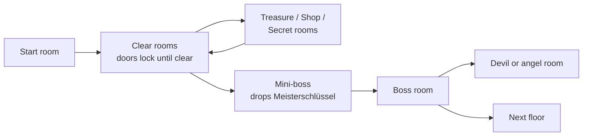

# Kellerbier — Game Design Document

Sep 24, 2026 · @Simon

## Overview

Kellerbier is a Bavarian roguelite twin-stick shooter built on the skeleton of *The Binding of Isaac*: procedurally generated floors of locked rooms, items that stack into emergent builds, and a seven-floor run of 45–65 minutes. What makes it its own game is **Promille**, a drunkenness meter that trades sight for damage.

**Premise.** Alois goes down to Opa's cellar for a bottle of Pfeitinger and finds it brewed under a *new* Reinheitsgebot: water, malt, hops — and raisins. He loads Opa's Trink-Rucksack with the tainted crate, flips it from *trinken* to *schießen*, and heads south to find who is responsible. The arc runs cellar → village → forest → Alps → castle → industrial brewery → Wiesn, ending at Die Bavaria.

**Two beer rules hold the premise together.** What Alois *shoots* is the tainted batch; what he *drinks* (every Maß pickup) is the old, clean batch. Tainted beer never appears as a drinkable pickup.

### Pillars

Every feature is judged against these four; anything serving none is cut.

1. **It feels good to move and shoot.** Knockback, hitstop, screenshake, particles and audio come before content.
2. **Combinations, not lists.** Items are hooks and projectile tags; the best outcomes are ones nobody hand-authored.
3. **Risk you choose.** Promille, devil pacts, curses, raisin items — the player talks themselves into bad decisions.
4. **Tongue firmly in cheek.** Bavarian folklore, charming and crooked. Never a tourist brochure, never mean-spirited, never a lecture.

### Isaac mapping

| Isaac | Kellerbier |
| --- | --- |
| Isaac, tears | Alois, tainted Pfeitinger from the Trink-Rucksack |
| Red / soul / eternal hearts | Bratwurst / Weißwurst / Blutwurst |
| Coins, bombs, keys | Biermarken, Bierfassl, Kellerschlüssel |
| Devil / angel rooms | Teufelspakt / Klostersegen |
| Curse of the Lost, Darkness | Nebel, Blaue Stunde (plus Föhn, Kater) |
| — | Promille meter and Kater hangover |
| — | Mini-boss gating the boss door (Der Meisterschlüssel) |

## Core loop

A run is 7 floors, 45–65 minutes for a competent player. Each floor is a procedural grid of rooms: clear rooms, collect pickups and items, beat a mini-boss for the key, then beat the boss to descend.

Rooms lock on entry while enemies live and stay cleared once cleared. The loop is deliberately Isaac-familiar so the novelty lives in items and Promille.

### Floor rules

- **Boss distance.** The boss room sits at maximum walking distance, at least `minBossDistance` doors out (5 on floors 1–2). Floor plans that fall short are rejected and regenerated.
- **Mini-boss gate.** One per floor (two on XL), off the critical path in the last third. It drops **Der Meisterschlüssel**, the only key to the boss door. A floor without an authored mini-boss simply has no lock.
- **XL floors.** A floor can roll 1.7× rooms (0% on floor 1 until a boss has been beaten, then 15%; 25% from floor 2). The title card announces it.
- **Special rooms.** Treasure, Shop, Boss, Mini-boss, Secret, Super-secret, and Devil or Angel after a boss. Treasure and Shop are dead-ends where possible.
- **Validation.** Every floor must be fully connected with a reachable boss; failures retry, then hard-fail in tests.

### Measured floor size

| Floor | Rooms (mean) | Doors to boss (mean) |
| --- | --- | --- |
| 1 — Cellar | 13.9 | 5.4 |
| 2 — Village | 16.2 | 5.7 |

Means over 500 seeds, non-XL, from the generator's own measurements.

### Between floors and runs

- A short transition per floor; an illustrated story card at chapter breaks. Nothing longer than a few seconds, nothing that blocks a replay.
- After a run: a results screen with stats, unlocks, and remaining goals. Every boss defeated unlocks something.
- **Seeded runs** (identical seed = identical run), a **daily run**, **challenge runs**, and **Wiesn-Orden** achievements as festival medals. Saves are one versioned JSON blob in `localStorage`.

## Player

Alois is the baseline character; three others are authored in `src/content/characters/` and two more are designed. Each character is a different *verb*, not a stat spread.

### Controls

Eight-way twin-stick: WASD or left stick to move, arrow keys or right stick to fire (snapped to eight directions, no mouse aim). Moving and shooting are independent. Alois's full verb list is **Fire, Bomb, Use, Map, Pause**.

There is deliberately **no dodge, roll, parry or block**. The answer to pressure is positioning, Promille and the active slot. The only thing that reopens this is a player saying "I could see the hit coming and had nothing to do about it."

### Characters

| Character | Unlock | Health (half-Maß) | Shot | Identity |
| --- | --- | --- | --- | --- |
| **Alois** | Start | 6 | Tainted Pfeitinger, straight stream | Balanced baseline, no stat modifiers |
| **Resi** | Beat Die Große Kellerassel | 4 | Brezn, arcing and returning | Move ×1.3, faster fire, damage ×0.75; starts with the Brezn orbital |
| **König Ludwig II** | Beat Der Stier 3 times (placeholder for floor 6) | 4 | Normal, plus homing swan familiar | Flies over furniture and hazards; costs a Biermarke per tick interval; starts with 40 |
| **Der Wolpertinger** | Secret (designed) | — | Randomised each room | Stats reroll on floor entry |
| **D'Sennerin** | Challenge (designed) | — | Thrown Kuhglocken, ricochet | Shots bounce off walls, dangerous to herself |

### Stats

Six stats, named in plain English everywhere: **Damage, Fire Rate, Range, Shot Speed, Move Speed, Luck.** The pipeline is a pure function: base → flat adds → multipliers → caps → final. Fire Rate is stored as a delay in ticks to avoid divide-by-zero. Every modifier records its source, so the debug overlay can explain any number.

### Promille

A second meter from 0.0 to 5.0 that trades sight for damage. It is **locked on a new save** and unlocks when the player first beats Die Große Kellerassel; before that, runs are fully sober with no meter and no beer drops.

| Tier | Promille | Damage | Fire rate | Cost |
| --- | --- | --- | --- | --- |
| Nüchtern | 0.0–0.4 | — | — | Baseline; sober items live here |
| Angeheitert | 0.5–1.4 | +25% | +12% | Vignette closes slightly. The sweet spot |
| Beduselt | 1.5–2.9 | +60% | +30% | Movement drift, aim wobble, world blur |
| Vollrausch | 3.0–4.4 | +120% | +55% | Tunnel at a third of sober width, grey world; Rausch items activate |
| Umgfalln | 4.5+ | — | — | Knockdown, wake at 1.5 with a Kater hangover |

- **Up:** Maß pickups, some items, boss rewards, devil pacts.
- **Down:** being hit (0.7, always the biggest drop), eating Wurst (up to 0.5), water fountains, slow time bleed.
- **Self-limiting by design.** A drunk player sees less and plays forward, gets hit more, and sobers up. No hitbox penalty is added on top.
- **Kater** drops damage and speed until the player eats.
- **Guardrails:** the HUD is never impaired; camera sway is a whisper by default; sight penalties soften but never switch off in reduced-motion; an optional "Rausch/Power" relabel for storefronts.

### Pickups and economy

| Thing | Name | Notes |
| --- | --- | --- |
| Red heart | **Bratwurst** | Full / half. Heals and lowers Promille |
| Soul heart | **Weißwurst** | Spent before red |
| Eternal heart | **Blutwurst** | Heals and lowers Promille |
| Promille | **Maß** | Full / half mug; the only Promille pickup, no heal |
| Coin | **Biermarke** | Festival beer token |
| Bomb | **Bierfassl** | Small keg that bursts |
| Key | **Kellerschlüssel** | Opens locked treasure rooms |
| Boss key | **Der Meisterschlüssel** | Dropped by the mini-boss only |

## Items

62 items are live in `src/content/items/`: 60 passives and 2 actives, 14 tagged `rosinen` and 5 tagged `impure`. The v1 target is 120+. The roster was cut from 139 to 51 by hand, then rebuilt to 62 with raisin items.

### Rules

- **One sentence, changes how you play.** No "+1 damage" filler unless it is a deliberately basic stat item.
- **Every item is visible** — on the shot, in the room, or as a HUD status row.
- **Data plus hooks:** `modifyStats`, `onShoot`, `onProjectileSpawn`, `onHit`, `onKill`, `onDamageTaken`, `onRoomClear`, `onFloorStart`, `onTick`.
- **Synergies emerge from projectile tags** (`homing`, `piercing`, `bouncing`, `splitting`, `poison`, `burning`, `freezing`, `sticky`, `arcing`, size, count), not an authored N×N table.
- **Promille requirement** per item: Any, Sober, or Rausch. Promille items leave the pools until the meter unlocks.
- **A drawback is never Range to zero.** Two raisin items drafted as "no range, huge damage" softlocked about 25 of 30 fuzz seeds.
- **Pools:** Treasure, Shop, Boss, Devil, Angel, Secret, Curse. A taken item leaves the pool for the run.

### Corruption tags

- **`impure`** — beer cut with soft drinks (Radler, Spezi, Colaweizen). A matter of taste.
- **`rosinen`** — the adulteration the run is about. Shape: *a clean item, plus an upgrade, plus one legible cost.* Never a hidden or delayed penalty.

Tag key below: **R** = `rosinen`, **I** = `impure`. Quality runs 0–3.

### Shot modifiers (22)

| Item | Tag | Effect | Q | Pools |
| --- | --- | --- | --- | --- |
| Almabtrieb |  | Shots fired while moving deal 2× and change colour | 2 | Treasure, Shop, Boss |
| Apfelstrudel | R | Shots split on impact; Damage −25% | 2 | Treasure, Shop, Boss |
| Bauern-Mistgabel |  | Short pitchfork jab: three piercing prongs, 2× damage, minimal range | 2 | Shop, Boss, Secret |
| Bierbank |  | Two shots side by side; Damage −20% | 1 | Treasure, Shop |
| Bierdeckel |  | Shots ricochet off walls | 1 | Treasure, Shop |
| Braumeister-Schürze |  | Fan of three shots; Damage −30% | 2 | Treasure, Shop, Boss |
| Braumeister-Visier |  | Every 5th shot fires an extra piercing volley | 2 | Shop, Boss |
| Colaweizen | I | Shots stick and slow; Damage −20% | 1 | Treasure, Shop |
| Feuerwehrhelm |  | Hose-water shots knock back; Shot Speed +25% | 1 | Treasure, Shop |
| Gugelhupf | R | Shots ring back and hit again; Shot Speed −25% | 2 | Treasure, Shop, Boss |
| Kartoffelsalat |  | Shots split in two on impact; Range +15% | 1 | Treasure, Shop |
| Kletzenbrot | R | Shots poison; Damage −15% | 2 | Shop, Boss, Secret |
| Luftballon |  | Shots return after full range | 1 | Treasure, Shop |
| Maß |  | One huge slow shot; Damage +200%, Fire Rate −66% | 2 | Shop, Boss |
| Radler | I | Damage −50%, Fire Rate +100% | 0 | Treasure, Shop |
| Rosinenbrot | R | Pierce one extra enemy; Range −20% | 1 | Treasure, Shop |
| Rosinenschnecke | R | Shots curl toward the nearest enemy; Damage −20% | 2 | Treasure, Shop, Boss |
| Sauwetter |  | Each shot carries burning, freezing or poison | 2 | Shop, Boss, Secret, Curse |
| Semmelknödel | R | Shots hit for 2× and drop heavily; Shot Speed −40% | 2 | Treasure, Shop, Boss |
| Spezi | I | A second, diverging shot | 1 | Treasure, Shop |
| Steckerlfisch |  | Shots burn | 1 | Treasure, Shop |
| Steinkrug |  | Shots arc over obstacles and splash | 1 | Treasure, Shop |

### Orbitals, familiars and auras (11)

| Item | Effect | Q | Pools |
| --- | --- | --- | --- |
| Blaskapelle | Sound ring damages everything around you every few seconds | 2 | Treasure, Shop, Boss |
| Braumeister-Hammer | A kill sends a shockwave through nearby enemies | 2 | Boss, Secret |
| Brezn | Orbiting pretzel damages on contact | 1 | Treasure, Shop |
| Der Ordner | Familiar that shoves enemies away | 1 | Treasure, Shop, Boss |
| Hendlgeruch | Constantly pulls distant enemies toward you | 1 | Treasure, Shop, Secret |
| Karussell | Moving pushes nearby enemies along with you | 1 | Treasure, Shop |
| Ludwigs Schwan | Familiar fires homing feathers; costs Biermarken per floor | 1 | Treasure, Shop, Secret |
| Obazda | Slows enemies near you | 1 | Treasure, Shop |
| Riesenrad | Slow orbiting gondola damages and freezes | 2 | Treasure, Shop, Boss |
| Schuhplattler | Stand still briefly to release a shockwave | 2 | Shop, Boss |
| Traktor-Auspuff | Poison exhaust trail behind you; Move Speed +15% | 1 | Shop, Boss, Secret, Curse |

### Stats, defence and sustain (16)

| Item | Tag | Effect | Q | Pools |
| --- | --- | --- | --- | --- |
| Apfelkuchen |  | Heals 4; Damage +5% | 0 | Treasure, Shop |
| Apfelkuchen (mit Rosinen) | R | Same cake, plus permanent Range −15% | 1 | Treasure, Shop |
| Bierkrug |  | Damage +1 per stack | 0 | Treasure, Shop |
| Blutwurz |  | A death does not end the run if you walk back to the corpse | 3 | Treasure, Shop, Boss |
| Brotzeitbrett |  | Room clear heals 1 and gives a Biermarke | 0 | Treasure, Shop |
| Gartenzwerg-Hut |  | Every 5 s unhit adds a shot (max 3); a hit resets it | 2 | Treasure, Shop, Boss |
| Haferlschuh |  | Move Speed +15%, immune to slick puddles | 0 | Treasure, Shop |
| Kraftbier |  | Damage +40%, Move Speed −20% | 1 | Treasure, Shop |
| Lebkuchenherz |  | Overhead slogan with a stat effect that changes per floor | 1 | Treasure, Shop, Boss |
| Lederhosn |  | Absorbs one hit per room | 2 | Treasure, Shop |
| Neuschwanstein-Bauplan |  | Large stat boost; costs more Biermarken each floor | 2 | Shop, Boss, Devil |
| Platzangst |  | Damage +50%, Range −50% | 2 | Shop, Boss, Secret, Curse |
| Schlüsselbund |  | Reveals secret rooms; room clear grants a key | 1 | Treasure, Shop, Secret |
| Studentenfutter | R | Damage +8% per kill in a room (max +48%), resets on clear; Move Speed −10% | 2 | Treasure, Shop, Boss |
| Weißwurst |  | Damage +30% before floor 4, nothing after | 1 | Treasure, Shop |
| Zwetschgendatschi | R | Hitless room clear heals 1; Range −15% | 1 | Treasure, Shop |

### Promille items (8)

| Item | Tag | Req. | Effect | Q | Pools |
| --- | --- | --- | --- | --- | --- |
| Bierbauch |  | Any | Trinkfest +1; Move Speed −8% | 2 | Treasure, Shop, Boss |
| Feierabendbier |  | Any | Small heal each floor start; costs a little Promille | 1 | Treasure, Shop |
| Fingerhakeln |  | Rausch | Contact damage; drags nearby enemies in | 2 | Shop, Boss, Secret |
| Konterbier |  | Any | Drinking while hungover clears the Kater | 1 | Treasure, Shop |
| Rosinenschnaps | R | Any | Damage +45%; each kill adds 0.1 Promille | 3 | Shop, Boss, Devil |
| Ruhige Hand |  | Sober | Damage +40% under 0.5 Promille | 2 | Shop, Boss, Secret |
| Rumtopf | R | Rausch | Damage +80% in Vollrausch or deeper | 3 | Devil, Secret |
| Watschn |  | Rausch | Getting hit releases a damaging shockwave | 2 | Shop, Boss, Secret |

### The three answers to the raisin (3)

Each pact locks out the others, so a run picks one stance.

| Item | Effect | Q | Pools |
| --- | --- | --- | --- |
| Reinheitsgebot 1516 | Locks out every `rosinen` item; Damage +35% | 3 | Shop, Boss, Devil |
| Sudordnung 1493 | Locks out `rosinen` and `impure`; Damage +50% | 3 | Shop, Boss, Devil |
| Der Rosinenklauber | `rosinen` items lose their drawback; locks out both pacts | 3 | Devil, Secret |

The Content Bible still lists the older pact numbers (+50% and +65%); the live code values are shown here.

### Actives (2)

| Item | Charge | Effect | Q | Pools |
| --- | --- | --- | --- | --- |
| Böllerschmeißer | 420 ticks | Drop a lit Böller that goes off one second later | 2 | Shop, Boss, Secret |
| Sixpack | 1 | Stores picked-up Maß; press to drink one | 2 | Treasure, Shop, Boss, Secret |

### Item set

**Braumeister** — hold Braumeister-Visier, -Schürze and -Hammer together for +0.3 Damage and Shot Speed ×1.12. The pieces are spread across pools on purpose, so completing it takes several lucky pedestals.

## Enemies and bosses

Floors 1 and 2 have live rosters in `src/content/enemies/` (19 files, including bosses, mini-bosses and the shopkeeper). Floors 3–7 are designed but not built.

### Design rules

- **Readable by silhouette alone, and exactly one idea per enemy.** Complexity comes from combining enemies.
- **Pressure comes from shots, not contact.** Telegraphed ranged attacks carry most damage. A charge is fine; raw speed with no telegraph is not.
- **Elites** are recoloured base enemies at ×1.8 health with no new idea.

### Live roster

| Floor | Enemy | One idea |
| --- | --- | --- |
| 1 | Kellerassel | Crawls at you; curls into an invulnerable ball when shot |
| 1 | Bierratte | Fast, erratic, low HP; teaches leading shots |
| 1 | Schimmelfleck | Stationary mould; splits in two on death |
| 1 | Rollfass | Rolls on one axis, bounces off walls, breaks into splinters |
| 1 | Zapfhahn | Wall tap; sprays a foam cone on a timer |
| 2 | Bauer | Walks, telegraphs, lunges with a pitchfork |
| 2 | Kuh | Charges in a line until a wall stuns it |
| 2 | Gockel | Short dashing hops; its crow wakes the room |
| 2 | Gartenzwerg | Plays dead until you turn away; throws his hat |
| 2 | Blaskapellist | Expanding sound rings on the music's beat |
| 2 | Traktor | Slow tank; exhaust cloud blocks vision |
| 2 | Böllerschmeißer | Lobs a Böller with a marked landing spot |

Designed for floor 2 but not yet in code: **Rosinenkasten**, a walking crate of new-label Pfeitinger that bursts into a ring of bottles.

### Designed rosters, floors 3–7

| Floor | Enemies |
| --- | --- |
| 3 — Wald | Wolpertinger, Waldschrat, Percht, Hirsch, Pilz, Zwetschgenmandl, Drud |
| 4 — Alpen | Steinbock, Murmeltier, Bergwacht, Kuhglocke, Sennerin |
| 5 — Neuschwanstein | Ritter, Schwan, Opernsängerin, Kerzenleuchter, Bauarbeiter |
| 6 — Brauerei | Braumeister, Abfüllroboter, Colaklecks, Kastenschieber, Zuckerrohr-Tank, Rosinenklauber |
| 7 — Wiesn | Bedienung, Ordner, Betrunkener, Schießbudenfigur, Lebkuchenherz, Der Überzeugte, Karussell (hazard) |

### Mini-bosses

A size class between elite and boss: about 40% of the floor boss's health, one new idea, no phase two, its own arena and health bar. A mini-boss never copies its floor boss's signature move. Each floor authors at least two.

| Floor | Mini-boss | Idea |
| --- | --- | --- |
| 1 | Der Rattenkönig | Target priority — never chases, spawns Bierratten in capped waves |
| 1 | Die Zapfhahn-Orgel | A safe lane that moves — three taps firing widening cones in sequence |
| 2 | Die Blaskapelle | The room is the attack — three players' offset rings form a lattice; kill order reshapes it |
| 2 | Der Ladewagen | A soft timer made of geometry — drives a circuit shedding hay bales that fill the arena |

Parked: **Der Gartenzwerg-Reigen** for floor 2.

### Bosses

Every boss has at least two phases, a readable telegraph on every attack, and one attack that tests what the floor's enemies rehearsed.

| Floor | Boss | Status | Shape |
| --- | --- | --- | --- |
| 1 | Die Große Kellerassel | Live | Segmented crawler; splits into segments in phase 2. Gentle tutorial boss; unlocks Promille |
| 2 | Der Stier | Live | Charge-and-stun loop; phase 2 adds the Maibaum-Dieb riding him |
| 3 | Die Wilde Gjoad | Designed | The Wild Hunt sweeps the arena on a fixed path; fight the huntsman in the gaps |
| 4 | Der Watzmann | Designed | The mountain itself: avalanches, falling rock, a mid-fight climb |
| 5 | König Ludwig II | Designed | Swan boat and 3/4 waltz bullet patterns; phase 2 pulls the arena underwater |
| 6 | Die Abfüllanlage | Designed | The bottling line: destroy capper, labeller, conveyor head and the dosing hopper (the reveal) |
| 7 | Die Bavaria | Designed | Phase 1 her lion; phase 2 she steps down; phase 3 the whole Wiesn fights for her, gladly |
| Secret | Der Radler | Designed | Superboss that mirrors the player's build |
| Secret | Die Ahnen von Walhalla | Designed | Endurance gauntlet of the ancestors |

## Floors and rooms

Seven floors are planned; floors 1 and 2 are playable (`HIGHEST_PLAYABLE_FLOOR = 2`). Each floor is a chapter with its own tileset, palette, roster, music, hazard and boss, and sprite folders already exist for all seven.

| # | Floor | Setting | Hazard | Status |
| --- | --- | --- | --- | --- |
| 1 | Der Keller | Opa's concrete cellar, racks, one bare bulb | Slick puddles carry momentum | Playable; the tutorial floor |
| 2 | Dorf & Acker | Oberniederburg: square, hop fields, maypole | Hop trellises block sight; livestock | Playable; ends on the southbound lorry cliffhanger |
| 3 | Der Wald | Bavarian Forest: dark wood, poison-green; satire, not horror | Poison, the Waldbach stream, lantern darkness | In progress (M10, #39); ships in the itch.io release |
| 4 | Die Alpen | Rock, snow, Berghütte, cable cars | Avalanches, ice, wind gusts | Parked (M11) |
| 5 | Schloss Neuschwanstein | Throne rooms, unfinished wing | Falling chandeliers, mirrors, opera | Parked (M11) |
| 6 | Die Brauerei | Steel, conveyors, floodlights | Conveyors, steam vents, bottling rhythm | Parked (M11); the reveal floor |
| 7 | Die Wiesn | Tents, rides, neon, crowds | Crowd you can't shoot through, carousels | Parked (M11) |

**Secret areas:** Walhalla (superboss arena), Der Teufelstritt (devil pacts), Die Almhütte (a quiet rest room).

### Room shapes

Shapes are `1x1`, `1x2`, `2x2`, `L` and `T`. A multi-cell room is several single-screen sub-rooms glued into one continuous space, with a camera that follows the player. Doors are derived from the floor plan, never authored, up to eight per room. A `1x1` room is exactly one screen and the camera does not move.

### Generation

- **Floor graph** is procedural; the boss is placed at maximum distance.
- **Ordinary rooms** are procedurally generated: obstacle cover in a tuned band, a floor roster spent against a distance-scaled threat budget, scenery and hazards, all seeded.
- **Authored rooms** are JSON templates tagged by floor, shape, doors and difficulty. They fill the start and special rooms; others are sprinkled into ordinary slots at `authoredRoomChance`.
- **Content gaps degrade gracefully.** If no authored option fits the floor, the nearest one is used with a dev-only warning, and CI tests still fail the gap.

### Authored templates

| Floor | Templates |
| --- | --- |
| 1 — Cellar | 17: start, boss, mini-boss, shop (2), treasure (2, one locked), secret, super-secret, plus annex, corridor, gallery, hall, big hall, nook, pillars, T-room; 2 staircases |
| 2 — Dorf | 7: boss, mini-boss, Acker, Hopfengarten, Maibaum, Marktplatz, Stall |

A dev-only room editor (`/editor.html`) authors templates with live playtesting.

### Curses

Occasional floor modifiers, announced on entry: **Nebel** (no minimap), **Kater** (start hungover), **Föhn** (wind pushes all projectiles), **Blaue Stunde** (heavy darkness).

### Devil and angel rooms

After a boss a door may open to the **Teufelspakt** (pay health for power, set in the Frauenkirche's devil footprint) or the **Klostersegen** (free, weaker items). Taking pacts locks out the angel room.

## Presentation

Kellerbier is 16-bit pixel art at a 640×360 internal resolution, shown as 2D billboard sprites standing in a lit 3D room under a fixed 65° camera. The HUD is a separate, always-sharp 2D pass.

### Art direction

- **Sizes:** 16×16 tiles (32×32 for detailed tiles), characters up to 64×48, bosses up to 160×160. A sprite's canvas is its on-screen size.
- **Integer scaling only**, never fractional.
- **Palette** capped near 40 colours, with a sub-palette per floor. Things the player acts on are bold; walls, floors and props use a derived, quieter tier.
- **Projectile legibility beats beauty:** player and enemy shots differ in shape and brightness; enemy shots get a bright rim.
- **Animation:** 4–6 frame walks, 2 frame idles, squash and stretch, one-frame white hit flash.
- **Bosses** are cut-out rigs traced from their own key art, 12 frames each. Key art exists for Die Große Kellerassel and Der Stier.
- **Type:** a 10-row text face for anything read under fire, and a 16-row pixel Fraktur for titles, boss plates and death words. Umlauts and ß are first-class letters.

### HUD

Health, Promille meter (once unlocked), wallet, active item and charge, item row, minimap, and pickup toasts with flavour text. Promille never impairs the HUD.

### Audio

- **Chiptune Blaskapelle:** tuba bassline, brass stabs, accordion, clarinet.
- Each floor is the same band in a different room: a lone accordion in the cellar, full brass at the Wiesn, machine rhythm in the brewery.
- Ludwig's fight is a 3/4 waltz synced to his bullet patterns.
- Short, compressed voice barks ("Sauber!", "Geh weida!", "Passt scho.").
- Every impact has a sound.

### Death screen

The game-over word is drawn from a pool (Umgfalln, Hi, Z'legt, f'reckt, dakerbelt) on the cosmetic RNG stream, so seeds stay reproducible, and never repeats twice in a row.

### Accessibility

Screenshake and sway sliders down to off; colourblind-safe projectiles; full rebinding for keyboard and gamepad; touch dual-stick overlay; optional aim assist and a "no drift" mode; text scaling; no information by colour alone. Localised into English, German and Boarisch.

## Roadmap and open questions

The plan ships a polished three-floor game on itch.io (M9) before building floors 4–7 (M11). Polish was set on two floors first; floor 3 (M10) is the first floor built against that bar, and ships in the release.

| Milestone | Exit criterion |
| --- | --- |
| M0 Foundations | Fixed-timestep loop running, CI green |
| M1 Game feel | One room, one enemy, and a stranger finds it fun to shoot |
| M2 Rooms and floors | A full generated floor, start to boss, with minimap |
| M3 Items and synergy | 25+ items; two random items produce an unauthored combo |
| M4 Promille | Promille is a decision, not an ignored bar |
| M5 Floors 1 & 2 content | Both chapters playable end to end |
| M6 Look and motion | Nothing placeholder; everything alive is animated |
| M7 Meta-progression | Losing a run makes you want another immediately |
| M8 Sound, menus, balance | Looks and sounds like a finished commercial game; includes the pressure pass and bigger floors |
| M9 Release | Strangers play the three-floor game on itch.io, free or name-your-price |
| M10 Floor 3 — Der Wald | Floor 3 reached through real progression; Der Waldradler beaten in the release build |
| M11 Floors 4–7 (parked) | Cellar to Die Bavaria on Steam, worth charging for |

Out of scope for v1: multiplayer, procedural items, online leaderboards at launch, a mod API.

### Open questions

- [ ] Is two floors (about 15–30 minutes) enough to earn replays? The roadmap schedules this call at the end of M7.
- [ ] Pact numbers disagree: the Content Bible says Reinheitsgebot +50% and Sudordnung +65%; the code uses +35% and +50%. Which is canonical?
- [ ] The item roster is 62 against a v1 target of 120+. Which Content Bible seeds (Russ'n, Enzian, Gamsbart, Wadlbeißer and others) come back first?
- [ ] Rosinenkasten is designed for floor 2 but not in code. Ship it before M9 or park it?
- [ ] König Ludwig's unlock is a stand-in (beat Der Stier three times) until floor 6 exists.
- [ ] Der Wolpertinger and D'Sennerin have no unlock path or definition yet.
- [ ] Death screen: keep the mixed capitalisation of the word pool, and keep the words Boarisch in every locale?

Sources: `README.md`, `ITEM_ROSTER.md`, `docs/GAME_DESIGN.md`, `docs/CONTENT_BIBLE.md`, `docs/ROADMAP.md`, and `src/content/` (characters, enemies, items, item-sets, curses, rooms, progression).
