# Kellerbier — Sprite-Übersicht

> **Automatisch generiert** von `tools/art/sprite-overview.mjs` — nicht von Hand bearbeiten.
> Aktualisiert sich bei `npm run dev` automatisch, sobald sich etwas unter `assets/sprites/`
> oder `src/content/` ändert; manuell mit `npm run docs:sprites`.
> Die Bilder sind verlinkt, ein neu gezeichnetes PNG ist also sofort sichtbar.
>
> Zum Game Design Document: [Kellerbier — Game Design Document.md](Kellerbier%20%E2%80%94%20Game%20Design%20Document.md)

## Stand

| Kategorie | Mit Sprite | Gesamt | Fehlt |
|---|---|---|---|
| [Spielfiguren](#spielfiguren) | 1 | 3 | 2 |
| [Gegner](#gegner) | 17 | 17 | 0 |
| [Minibosse](#minibosse) | 5 | 5 | 0 |
| [Bosse](#bosse) | 4 | 4 | 0 |
| [Items](#items) | 79 | 79 | 0 |
| [Pickups](#pickups) | 21 | 21 | 0 |
| [Farbpalette](#farbpalette) | – | – | – |

## Spielfiguren

| Status | Name | ID | Dateiname | Sprite(s) | Datei(en) | Definition |
|---|---|---|---|---|---|---|
| ✅ | Alois | `alois` | `alois-drunk-north.strip.png` `alois-drunk-side.strip.png` `alois-drunk-south.strip.png` `alois-north.strip.png` `alois-schlauch.strip.png` `alois-side.strip.png` `alois-south.strip.png` | 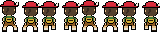 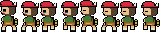 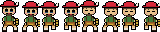 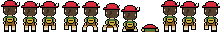 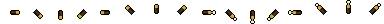 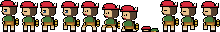 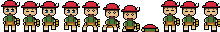 | [`assets/sprites/common/characters/alois-drunk-north.strip.png`](assets/sprites/common/characters/alois-drunk-north.strip.png) — **20×32 · 8 Frames (Strip 160×32)** [`assets/sprites/common/characters/alois-drunk-north.anim.json`](assets/sprites/common/characters/alois-drunk-north.anim.json) [`assets/sprites/common/characters/alois-drunk-side.strip.png`](assets/sprites/common/characters/alois-drunk-side.strip.png) — **20×32 · 8 Frames (Strip 160×32)** [`assets/sprites/common/characters/alois-drunk-side.anim.json`](assets/sprites/common/characters/alois-drunk-side.anim.json) [`assets/sprites/common/characters/alois-drunk-south.strip.png`](assets/sprites/common/characters/alois-drunk-south.strip.png) — **20×32 · 8 Frames (Strip 160×32)** [`assets/sprites/common/characters/alois-drunk-south.anim.json`](assets/sprites/common/characters/alois-drunk-south.anim.json) [`assets/sprites/common/characters/alois-north.strip.png`](assets/sprites/common/characters/alois-north.strip.png) — **20×32 · 11 Frames (Strip 220×32)** [`assets/sprites/common/characters/alois-north.anim.json`](assets/sprites/common/characters/alois-north.anim.json) [`assets/sprites/common/characters/alois-schlauch.strip.png`](assets/sprites/common/characters/alois-schlauch.strip.png) — **24×24 · 16 Frames (Strip 384×24)** [`assets/sprites/common/characters/alois-schlauch.anim.json`](assets/sprites/common/characters/alois-schlauch.anim.json) [`assets/sprites/common/characters/alois-side.strip.png`](assets/sprites/common/characters/alois-side.strip.png) — **20×32 · 11 Frames (Strip 220×32)** [`assets/sprites/common/characters/alois-side.anim.json`](assets/sprites/common/characters/alois-side.anim.json) [`assets/sprites/common/characters/alois-south.strip.png`](assets/sprites/common/characters/alois-south.strip.png) — **20×32 · 11 Frames (Strip 220×32)** [`assets/sprites/common/characters/alois-south.anim.json`](assets/sprites/common/characters/alois-south.anim.json) | [`src/content/characters/alois.ts`](src/content/characters/alois.ts) |
| ❌ fehlt | König Ludwig II | `ludwig` | `ludwig-south.strip.png` | – | erwartet: `assets/sprites/common/characters/ludwig-south.strip.png` | [`src/content/characters/koenig-ludwig.ts`](src/content/characters/koenig-ludwig.ts) |
| ❌ fehlt | Resi | `resi` | `resi-south.strip.png` | – | erwartet: `assets/sprites/common/characters/resi-south.strip.png` | [`src/content/characters/resi.ts`](src/content/characters/resi.ts) |

## Gegner

| Status | Name | ID | Dateiname | Floor | Sprite(s) | Datei(en) | Definition |
|---|---|---|---|---|---|---|---|
| ✅ | Bachforelle | `bachforelle` | `bachforelle-shadow-north.png` `bachforelle-shadow-south.png` `bachforelle-shadow.png` `bachforelle.png` | floor-3-wald |  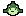   | [`assets/sprites/floor-3-wald/characters/bachforelle-shadow-north.png`](assets/sprites/floor-3-wald/characters/bachforelle-shadow-north.png) — **26×16** [`assets/sprites/floor-3-wald/characters/bachforelle-shadow-south.png`](assets/sprites/floor-3-wald/characters/bachforelle-shadow-south.png) — **26×16** [`assets/sprites/floor-3-wald/characters/bachforelle-shadow.png`](assets/sprites/floor-3-wald/characters/bachforelle-shadow.png) — **26×16** [`assets/sprites/floor-3-wald/characters/bachforelle.png`](assets/sprites/floor-3-wald/characters/bachforelle.png) — **14×16** | [`src/content/enemies/bachforelle.ts`](src/content/enemies/bachforelle.ts) |
| ✅ | Bauer | `bauer` | `bauer-north.strip.png` `bauer-side.strip.png` `bauer-south.strip.png` `bauer.png` | floor-2-rural | 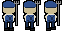 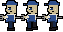 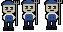  | [`assets/sprites/floor-2-rural/characters/bauer-north.strip.png`](assets/sprites/floor-2-rural/characters/bauer-north.strip.png) — **21×32 · 3 Frames (Strip 63×32)** [`assets/sprites/floor-2-rural/characters/bauer-north.anim.json`](assets/sprites/floor-2-rural/characters/bauer-north.anim.json) [`assets/sprites/floor-2-rural/characters/bauer-side.strip.png`](assets/sprites/floor-2-rural/characters/bauer-side.strip.png) — **21×32 · 3 Frames (Strip 63×32)** [`assets/sprites/floor-2-rural/characters/bauer-side.anim.json`](assets/sprites/floor-2-rural/characters/bauer-side.anim.json) [`assets/sprites/floor-2-rural/characters/bauer-south.strip.png`](assets/sprites/floor-2-rural/characters/bauer-south.strip.png) — **21×32 · 3 Frames (Strip 63×32)** [`assets/sprites/floor-2-rural/characters/bauer-south.anim.json`](assets/sprites/floor-2-rural/characters/bauer-south.anim.json) [`assets/sprites/floor-2-rural/characters/bauer.png`](assets/sprites/floor-2-rural/characters/bauer.png) — **21×32** | [`src/content/enemies/bauer.ts`](src/content/enemies/bauer.ts) |
| ✅ | Bierratte | `bierratte` | `bierratte-north.strip.png` `bierratte-side.strip.png` `bierratte-south.strip.png` `bierratte.png` | floor-1-cellar | 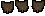 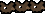 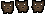 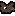 | [`assets/sprites/floor-1-cellar/characters/bierratte-north.strip.png`](assets/sprites/floor-1-cellar/characters/bierratte-north.strip.png) — **15×16 · 3 Frames (Strip 45×16)** [`assets/sprites/floor-1-cellar/characters/bierratte-north.anim.json`](assets/sprites/floor-1-cellar/characters/bierratte-north.anim.json) [`assets/sprites/floor-1-cellar/characters/bierratte-side.strip.png`](assets/sprites/floor-1-cellar/characters/bierratte-side.strip.png) — **15×16 · 3 Frames (Strip 45×16)** [`assets/sprites/floor-1-cellar/characters/bierratte-side.anim.json`](assets/sprites/floor-1-cellar/characters/bierratte-side.anim.json) [`assets/sprites/floor-1-cellar/characters/bierratte-south.strip.png`](assets/sprites/floor-1-cellar/characters/bierratte-south.strip.png) — **15×16 · 3 Frames (Strip 45×16)** [`assets/sprites/floor-1-cellar/characters/bierratte-south.anim.json`](assets/sprites/floor-1-cellar/characters/bierratte-south.anim.json) [`assets/sprites/floor-1-cellar/characters/bierratte.png`](assets/sprites/floor-1-cellar/characters/bierratte.png) — **15×16** | [`src/content/enemies/bierratte.ts`](src/content/enemies/bierratte.ts) |
| ✅ | Blaskapellist | `blaskapellist` | `blaskapellist-north.strip.png` `blaskapellist-side.strip.png` `blaskapellist-south.strip.png` `blaskapellist.png` | floor-2-rural | 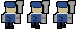 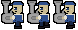 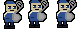  | [`assets/sprites/floor-2-rural/characters/blaskapellist-north.strip.png`](assets/sprites/floor-2-rural/characters/blaskapellist-north.strip.png) — **26×30 · 3 Frames (Strip 78×30)** [`assets/sprites/floor-2-rural/characters/blaskapellist-north.anim.json`](assets/sprites/floor-2-rural/characters/blaskapellist-north.anim.json) [`assets/sprites/floor-2-rural/characters/blaskapellist-side.strip.png`](assets/sprites/floor-2-rural/characters/blaskapellist-side.strip.png) — **26×30 · 3 Frames (Strip 78×30)** [`assets/sprites/floor-2-rural/characters/blaskapellist-side.anim.json`](assets/sprites/floor-2-rural/characters/blaskapellist-side.anim.json) [`assets/sprites/floor-2-rural/characters/blaskapellist-south.strip.png`](assets/sprites/floor-2-rural/characters/blaskapellist-south.strip.png) — **26×30 · 3 Frames (Strip 78×30)** [`assets/sprites/floor-2-rural/characters/blaskapellist-south.anim.json`](assets/sprites/floor-2-rural/characters/blaskapellist-south.anim.json) [`assets/sprites/floor-2-rural/characters/blaskapellist.png`](assets/sprites/floor-2-rural/characters/blaskapellist.png) — **26×30** | [`src/content/enemies/blaskapellist.ts`](src/content/enemies/blaskapellist.ts) |
| ✅ | Boar | `boar` | `boar-north.strip.png` `boar-south.strip.png` `boar.strip.png` | floor-3-wald | 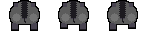 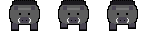  | [`assets/sprites/floor-3-wald/characters/boar-north.strip.png`](assets/sprites/floor-3-wald/characters/boar-north.strip.png) — **49×31 · 3 Frames (Strip 147×31)** [`assets/sprites/floor-3-wald/characters/boar-north.anim.json`](assets/sprites/floor-3-wald/characters/boar-north.anim.json) [`assets/sprites/floor-3-wald/characters/boar-south.strip.png`](assets/sprites/floor-3-wald/characters/boar-south.strip.png) — **49×31 · 3 Frames (Strip 147×31)** [`assets/sprites/floor-3-wald/characters/boar-south.anim.json`](assets/sprites/floor-3-wald/characters/boar-south.anim.json) [`assets/sprites/floor-3-wald/characters/boar.strip.png`](assets/sprites/floor-3-wald/characters/boar.strip.png) — **49×31 · 3 Frames (Strip 147×31)** [`assets/sprites/floor-3-wald/characters/boar.anim.json`](assets/sprites/floor-3-wald/characters/boar.anim.json) | [`src/content/enemies/boar.ts`](src/content/enemies/boar.ts) |
| ✅ | Böllerschmeißer | `boellerschmeisser` | `boellerschmeisser-north.strip.png` `boellerschmeisser-side.strip.png` `boellerschmeisser-south.strip.png` `boellerschmeisser.png` | floor-2-rural | 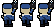 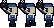 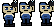 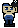 | [`assets/sprites/floor-2-rural/characters/boellerschmeisser-north.strip.png`](assets/sprites/floor-2-rural/characters/boellerschmeisser-north.strip.png) — **18×28 · 3 Frames (Strip 54×28)** [`assets/sprites/floor-2-rural/characters/boellerschmeisser-north.anim.json`](assets/sprites/floor-2-rural/characters/boellerschmeisser-north.anim.json) [`assets/sprites/floor-2-rural/characters/boellerschmeisser-side.strip.png`](assets/sprites/floor-2-rural/characters/boellerschmeisser-side.strip.png) — **18×28 · 3 Frames (Strip 54×28)** [`assets/sprites/floor-2-rural/characters/boellerschmeisser-side.anim.json`](assets/sprites/floor-2-rural/characters/boellerschmeisser-side.anim.json) [`assets/sprites/floor-2-rural/characters/boellerschmeisser-south.strip.png`](assets/sprites/floor-2-rural/characters/boellerschmeisser-south.strip.png) — **18×28 · 3 Frames (Strip 54×28)** [`assets/sprites/floor-2-rural/characters/boellerschmeisser-south.anim.json`](assets/sprites/floor-2-rural/characters/boellerschmeisser-south.anim.json) [`assets/sprites/floor-2-rural/characters/boellerschmeisser.png`](assets/sprites/floor-2-rural/characters/boellerschmeisser.png) — **18×28** | [`src/content/enemies/boellerschmeisser.ts`](src/content/enemies/boellerschmeisser.ts) |
| ✅ | Gockel | `gockel` | `gockel-north.strip.png` `gockel-side.strip.png` `gockel-south.strip.png` `gockel.png` | floor-2-rural | 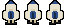 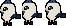 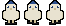  | [`assets/sprites/floor-2-rural/characters/gockel-north.strip.png`](assets/sprites/floor-2-rural/characters/gockel-north.strip.png) — **22×26 · 3 Frames (Strip 66×26)** [`assets/sprites/floor-2-rural/characters/gockel-north.anim.json`](assets/sprites/floor-2-rural/characters/gockel-north.anim.json) [`assets/sprites/floor-2-rural/characters/gockel-side.strip.png`](assets/sprites/floor-2-rural/characters/gockel-side.strip.png) — **22×26 · 3 Frames (Strip 66×26)** [`assets/sprites/floor-2-rural/characters/gockel-side.anim.json`](assets/sprites/floor-2-rural/characters/gockel-side.anim.json) [`assets/sprites/floor-2-rural/characters/gockel-south.strip.png`](assets/sprites/floor-2-rural/characters/gockel-south.strip.png) — **22×26 · 3 Frames (Strip 66×26)** [`assets/sprites/floor-2-rural/characters/gockel-south.anim.json`](assets/sprites/floor-2-rural/characters/gockel-south.anim.json) [`assets/sprites/floor-2-rural/characters/gockel.png`](assets/sprites/floor-2-rural/characters/gockel.png) — **22×26** | [`src/content/enemies/gockel.ts`](src/content/enemies/gockel.ts) |
| ✅ | Kaninchen | `kaninchen` | `kaninchen-north.strip.png` `kaninchen-south.strip.png` `kaninchen.strip.png` | floor-3-wald |  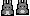  | [`assets/sprites/floor-3-wald/characters/kaninchen-north.strip.png`](assets/sprites/floor-3-wald/characters/kaninchen-north.strip.png) — **15×16 · 2 Frames (Strip 30×16)** [`assets/sprites/floor-3-wald/characters/kaninchen-north.anim.json`](assets/sprites/floor-3-wald/characters/kaninchen-north.anim.json) [`assets/sprites/floor-3-wald/characters/kaninchen-south.strip.png`](assets/sprites/floor-3-wald/characters/kaninchen-south.strip.png) — **15×16 · 2 Frames (Strip 30×16)** [`assets/sprites/floor-3-wald/characters/kaninchen-south.anim.json`](assets/sprites/floor-3-wald/characters/kaninchen-south.anim.json) [`assets/sprites/floor-3-wald/characters/kaninchen.strip.png`](assets/sprites/floor-3-wald/characters/kaninchen.strip.png) — **15×16 · 2 Frames (Strip 30×16)** [`assets/sprites/floor-3-wald/characters/kaninchen.anim.json`](assets/sprites/floor-3-wald/characters/kaninchen.anim.json) | [`src/content/enemies/kaninchen.ts`](src/content/enemies/kaninchen.ts) |
| ✅ | Kuh | `kuh` | `kuh-north.strip.png` `kuh-side.strip.png` `kuh-south.strip.png` `kuh.png` | floor-2-rural | 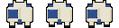 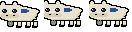 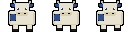  | [`assets/sprites/floor-2-rural/characters/kuh-north.strip.png`](assets/sprites/floor-2-rural/characters/kuh-north.strip.png) — **44×32 · 3 Frames (Strip 132×32)** [`assets/sprites/floor-2-rural/characters/kuh-north.anim.json`](assets/sprites/floor-2-rural/characters/kuh-north.anim.json) [`assets/sprites/floor-2-rural/characters/kuh-side.strip.png`](assets/sprites/floor-2-rural/characters/kuh-side.strip.png) — **44×32 · 3 Frames (Strip 132×32)** [`assets/sprites/floor-2-rural/characters/kuh-side.anim.json`](assets/sprites/floor-2-rural/characters/kuh-side.anim.json) [`assets/sprites/floor-2-rural/characters/kuh-south.strip.png`](assets/sprites/floor-2-rural/characters/kuh-south.strip.png) — **44×32 · 3 Frames (Strip 132×32)** [`assets/sprites/floor-2-rural/characters/kuh-south.anim.json`](assets/sprites/floor-2-rural/characters/kuh-south.anim.json) [`assets/sprites/floor-2-rural/characters/kuh.png`](assets/sprites/floor-2-rural/characters/kuh.png) — **44×32** | [`src/content/enemies/kuh.ts`](src/content/enemies/kuh.ts) |
| ✅ | Mountain hare | `mountain-hare` | `mountain-hare-north.strip.png` `mountain-hare-side.strip.png` `mountain-hare-south.strip.png` `mountain-hare.strip.png` | floor-4-alpen |     | [`assets/sprites/floor-4-alpen/characters/mountain-hare-north.strip.png`](assets/sprites/floor-4-alpen/characters/mountain-hare-north.strip.png) — **15×16 · 2 Frames (Strip 30×16)** [`assets/sprites/floor-4-alpen/characters/mountain-hare-north.anim.json`](assets/sprites/floor-4-alpen/characters/mountain-hare-north.anim.json) [`assets/sprites/floor-4-alpen/characters/mountain-hare-side.strip.png`](assets/sprites/floor-4-alpen/characters/mountain-hare-side.strip.png) — **15×16 · 2 Frames (Strip 30×16)** [`assets/sprites/floor-4-alpen/characters/mountain-hare-side.anim.json`](assets/sprites/floor-4-alpen/characters/mountain-hare-side.anim.json) [`assets/sprites/floor-4-alpen/characters/mountain-hare-south.strip.png`](assets/sprites/floor-4-alpen/characters/mountain-hare-south.strip.png) — **15×16 · 2 Frames (Strip 30×16)** [`assets/sprites/floor-4-alpen/characters/mountain-hare-south.anim.json`](assets/sprites/floor-4-alpen/characters/mountain-hare-south.anim.json) [`assets/sprites/floor-4-alpen/characters/mountain-hare.strip.png`](assets/sprites/floor-4-alpen/characters/mountain-hare.strip.png) — **15×16 · 2 Frames (Strip 30×16)** [`assets/sprites/floor-4-alpen/characters/mountain-hare.anim.json`](assets/sprites/floor-4-alpen/characters/mountain-hare.anim.json) | [`src/content/enemies/mountain-hare.ts`](src/content/enemies/mountain-hare.ts) |
| ✅ | Murmeltier | `murmeltier` | `murmeltier-shadow.png` `murmeltier.png` | floor-4-alpen |  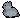 | [`assets/sprites/floor-4-alpen/characters/murmeltier-shadow.png`](assets/sprites/floor-4-alpen/characters/murmeltier-shadow.png) — **24×16** [`assets/sprites/floor-4-alpen/characters/murmeltier.png`](assets/sprites/floor-4-alpen/characters/murmeltier.png) — **20×18** | [`src/content/enemies/murmeltier.ts`](src/content/enemies/murmeltier.ts) |
| ✅ | Rescue dog | `rescue-dog` | `rescue-dog-north.strip.png` `rescue-dog-side.strip.png` `rescue-dog-south.strip.png` `rescue-dog.strip.png` | floor-4-alpen | 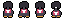  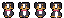  | [`assets/sprites/floor-4-alpen/characters/rescue-dog-north.strip.png`](assets/sprites/floor-4-alpen/characters/rescue-dog-north.strip.png) — **16×18 · 4 Frames (Strip 64×18)** [`assets/sprites/floor-4-alpen/characters/rescue-dog-north.anim.json`](assets/sprites/floor-4-alpen/characters/rescue-dog-north.anim.json) [`assets/sprites/floor-4-alpen/characters/rescue-dog-side.strip.png`](assets/sprites/floor-4-alpen/characters/rescue-dog-side.strip.png) — **24×18 · 4 Frames (Strip 96×18)** [`assets/sprites/floor-4-alpen/characters/rescue-dog-side.anim.json`](assets/sprites/floor-4-alpen/characters/rescue-dog-side.anim.json) [`assets/sprites/floor-4-alpen/characters/rescue-dog-south.strip.png`](assets/sprites/floor-4-alpen/characters/rescue-dog-south.strip.png) — **16×18 · 4 Frames (Strip 64×18)** [`assets/sprites/floor-4-alpen/characters/rescue-dog-south.anim.json`](assets/sprites/floor-4-alpen/characters/rescue-dog-south.anim.json) [`assets/sprites/floor-4-alpen/characters/rescue-dog.strip.png`](assets/sprites/floor-4-alpen/characters/rescue-dog.strip.png) — **24×18 · 4 Frames (Strip 96×18)** [`assets/sprites/floor-4-alpen/characters/rescue-dog.anim.json`](assets/sprites/floor-4-alpen/characters/rescue-dog.anim.json) | [`src/content/enemies/rescue-dog.ts`](src/content/enemies/rescue-dog.ts) |
| ✅ | Wirt | `shopkeeper` | `shopkeeper.strip.png` `shopkeeper-stand.png` | common | 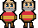 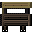 | [`assets/sprites/common/characters/shopkeeper.strip.png`](assets/sprites/common/characters/shopkeeper.strip.png) — **22×32 · 2 Frames (Strip 44×32)** [`assets/sprites/common/characters/shopkeeper.anim.json`](assets/sprites/common/characters/shopkeeper.anim.json) [`assets/sprites/common/tiles/shopkeeper-stand.png`](assets/sprites/common/tiles/shopkeeper-stand.png) — **32×32** | [`src/content/enemies/shopkeeper.ts`](src/content/enemies/shopkeeper.ts) |
| ✅ | Skier | `skier` | `skier-north.strip.png` `skier-side.strip.png` `skier-south.strip.png` `skier.strip.png` | floor-4-alpen | 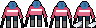  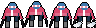  | [`assets/sprites/floor-4-alpen/characters/skier-north.strip.png`](assets/sprites/floor-4-alpen/characters/skier-north.strip.png) — **24×28 · 4 Frames (Strip 96×28)** [`assets/sprites/floor-4-alpen/characters/skier-north.anim.json`](assets/sprites/floor-4-alpen/characters/skier-north.anim.json) [`assets/sprites/floor-4-alpen/characters/skier-side.strip.png`](assets/sprites/floor-4-alpen/characters/skier-side.strip.png) — **32×28 · 4 Frames (Strip 128×28)** [`assets/sprites/floor-4-alpen/characters/skier-side.anim.json`](assets/sprites/floor-4-alpen/characters/skier-side.anim.json) [`assets/sprites/floor-4-alpen/characters/skier-south.strip.png`](assets/sprites/floor-4-alpen/characters/skier-south.strip.png) — **24×28 · 4 Frames (Strip 96×28)** [`assets/sprites/floor-4-alpen/characters/skier-south.anim.json`](assets/sprites/floor-4-alpen/characters/skier-south.anim.json) [`assets/sprites/floor-4-alpen/characters/skier.strip.png`](assets/sprites/floor-4-alpen/characters/skier.strip.png) — **32×28 · 4 Frames (Strip 128×28)** [`assets/sprites/floor-4-alpen/characters/skier.anim.json`](assets/sprites/floor-4-alpen/characters/skier.anim.json) | [`src/content/enemies/skier.ts`](src/content/enemies/skier.ts) |
| ✅ | Specht | `specht` | `specht-dive.png` `specht-fly-back.strip.png` `specht-fly-front.strip.png` `specht-fly-side.strip.png` `specht-landed.png` `specht.png` | floor-3-wald |  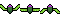 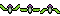 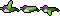 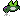  | [`assets/sprites/floor-3-wald/characters/specht-dive.png`](assets/sprites/floor-3-wald/characters/specht-dive.png) — **20×16** [`assets/sprites/floor-3-wald/characters/specht-fly-back.strip.png`](assets/sprites/floor-3-wald/characters/specht-fly-back.strip.png) — **20×16 · 3 Frames (Strip 60×16)** [`assets/sprites/floor-3-wald/characters/specht-fly-back.anim.json`](assets/sprites/floor-3-wald/characters/specht-fly-back.anim.json) [`assets/sprites/floor-3-wald/characters/specht-fly-front.strip.png`](assets/sprites/floor-3-wald/characters/specht-fly-front.strip.png) — **20×16 · 3 Frames (Strip 60×16)** [`assets/sprites/floor-3-wald/characters/specht-fly-front.anim.json`](assets/sprites/floor-3-wald/characters/specht-fly-front.anim.json) [`assets/sprites/floor-3-wald/characters/specht-fly-side.strip.png`](assets/sprites/floor-3-wald/characters/specht-fly-side.strip.png) — **20×16 · 3 Frames (Strip 60×16)** [`assets/sprites/floor-3-wald/characters/specht-fly-side.anim.json`](assets/sprites/floor-3-wald/characters/specht-fly-side.anim.json) [`assets/sprites/floor-3-wald/characters/specht-landed.png`](assets/sprites/floor-3-wald/characters/specht-landed.png) — **20×16** [`assets/sprites/floor-3-wald/characters/specht.png`](assets/sprites/floor-3-wald/characters/specht.png) — **16×20** | [`src/content/enemies/specht.ts`](src/content/enemies/specht.ts) |
| ✅ | Tourist | `tourist` | `tourist.png` | floor-4-alpen |  | [`assets/sprites/floor-4-alpen/characters/tourist.png`](assets/sprites/floor-4-alpen/characters/tourist.png) — **20×30** | [`src/content/enemies/the-gondola.ts`](src/content/enemies/the-gondola.ts) |
| ✅ | Zecke | `zecke` | `zecke.png` | floor-3-wald |  | [`assets/sprites/floor-3-wald/characters/zecke.png`](assets/sprites/floor-3-wald/characters/zecke.png) — **10×16** | [`src/content/enemies/zecke.ts`](src/content/enemies/zecke.ts) |

## Minibosse

| Status | Name | ID | Dateiname | Floor | Sprite(s) | Datei(en) | Definition |
|---|---|---|---|---|---|---|---|
| ✅ | Bieber | `bieber` | `bieber-log-east.strip.png` `bieber-log-west.strip.png` `bieber.strip.png` | floor-3-wald | 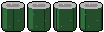  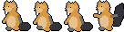 | [`assets/sprites/floor-3-wald/characters/bieber-log-east.strip.png`](assets/sprites/floor-3-wald/characters/bieber-log-east.strip.png) — **26×32 · 4 Frames (Strip 104×32)** [`assets/sprites/floor-3-wald/characters/bieber-log-east.anim.json`](assets/sprites/floor-3-wald/characters/bieber-log-east.anim.json) [`assets/sprites/floor-3-wald/characters/bieber-log-west.strip.png`](assets/sprites/floor-3-wald/characters/bieber-log-west.strip.png) — **26×32 · 4 Frames (Strip 104×32)** [`assets/sprites/floor-3-wald/characters/bieber-log-west.anim.json`](assets/sprites/floor-3-wald/characters/bieber-log-west.anim.json) [`assets/sprites/floor-3-wald/characters/bieber.strip.png`](assets/sprites/floor-3-wald/characters/bieber.strip.png) — **34×36 · 4 Frames (Strip 136×36)** [`assets/sprites/floor-3-wald/characters/bieber.anim.json`](assets/sprites/floor-3-wald/characters/bieber.anim.json) | [`src/content/enemies/bieber.ts`](src/content/enemies/bieber.ts) |
| ✅ | Der Rattenkönig | `der-rattenkoenig` | `der-rattenkoenig-north.strip.png` `der-rattenkoenig-side.strip.png` `der-rattenkoenig-south.strip.png` `der-rattenkoenig.png` | floor-1-cellar | 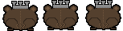 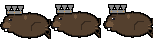 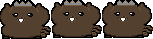 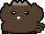 | [`assets/sprites/floor-1-cellar/characters/der-rattenkoenig-north.strip.png`](assets/sprites/floor-1-cellar/characters/der-rattenkoenig-north.strip.png) — **51×39 · 3 Frames (Strip 153×39)** [`assets/sprites/floor-1-cellar/characters/der-rattenkoenig-north.anim.json`](assets/sprites/floor-1-cellar/characters/der-rattenkoenig-north.anim.json) [`assets/sprites/floor-1-cellar/characters/der-rattenkoenig-side.strip.png`](assets/sprites/floor-1-cellar/characters/der-rattenkoenig-side.strip.png) — **51×39 · 3 Frames (Strip 153×39)** [`assets/sprites/floor-1-cellar/characters/der-rattenkoenig-side.anim.json`](assets/sprites/floor-1-cellar/characters/der-rattenkoenig-side.anim.json) [`assets/sprites/floor-1-cellar/characters/der-rattenkoenig-south.strip.png`](assets/sprites/floor-1-cellar/characters/der-rattenkoenig-south.strip.png) — **51×39 · 3 Frames (Strip 153×39)** [`assets/sprites/floor-1-cellar/characters/der-rattenkoenig-south.anim.json`](assets/sprites/floor-1-cellar/characters/der-rattenkoenig-south.anim.json) [`assets/sprites/floor-1-cellar/characters/der-rattenkoenig.png`](assets/sprites/floor-1-cellar/characters/der-rattenkoenig.png) — **51×39** | [`src/content/enemies/der-rattenkoenig.ts`](src/content/enemies/der-rattenkoenig.ts) |
| ✅ | Die Blaskapelle (Tuba) | `die-blaskapelle-tuba` | `die-blaskapelle-tuba-north.strip.png` `die-blaskapelle-tuba-side.strip.png` `die-blaskapelle-tuba-south.strip.png` `die-blaskapelle-tuba.png` | floor-2-rural |  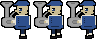 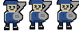  | [`assets/sprites/floor-2-rural/characters/die-blaskapelle-tuba-north.strip.png`](assets/sprites/floor-2-rural/characters/die-blaskapelle-tuba-north.strip.png) — **33×40 · 3 Frames (Strip 99×40)** [`assets/sprites/floor-2-rural/characters/die-blaskapelle-tuba-north.anim.json`](assets/sprites/floor-2-rural/characters/die-blaskapelle-tuba-north.anim.json) [`assets/sprites/floor-2-rural/characters/die-blaskapelle-tuba-side.strip.png`](assets/sprites/floor-2-rural/characters/die-blaskapelle-tuba-side.strip.png) — **33×40 · 3 Frames (Strip 99×40)** [`assets/sprites/floor-2-rural/characters/die-blaskapelle-tuba-side.anim.json`](assets/sprites/floor-2-rural/characters/die-blaskapelle-tuba-side.anim.json) [`assets/sprites/floor-2-rural/characters/die-blaskapelle-tuba-south.strip.png`](assets/sprites/floor-2-rural/characters/die-blaskapelle-tuba-south.strip.png) — **33×40 · 3 Frames (Strip 99×40)** [`assets/sprites/floor-2-rural/characters/die-blaskapelle-tuba-south.anim.json`](assets/sprites/floor-2-rural/characters/die-blaskapelle-tuba-south.anim.json) [`assets/sprites/floor-2-rural/characters/die-blaskapelle-tuba.png`](assets/sprites/floor-2-rural/characters/die-blaskapelle-tuba.png) — **33×40** | [`src/content/enemies/die-blaskapelle.ts`](src/content/enemies/die-blaskapelle.ts) |
| ✅ | Die Blaskapelle (Trompete) | `die-blaskapelle-trompete` | `die-blaskapelle-trompete-north.strip.png` `die-blaskapelle-trompete-side.strip.png` `die-blaskapelle-trompete-south.strip.png` `die-blaskapelle-trompete.png` | floor-2-rural |     | [`assets/sprites/floor-2-rural/characters/die-blaskapelle-trompete-north.strip.png`](assets/sprites/floor-2-rural/characters/die-blaskapelle-trompete-north.strip.png) — **37×40 · 3 Frames (Strip 111×40)** [`assets/sprites/floor-2-rural/characters/die-blaskapelle-trompete-north.anim.json`](assets/sprites/floor-2-rural/characters/die-blaskapelle-trompete-north.anim.json) [`assets/sprites/floor-2-rural/characters/die-blaskapelle-trompete-side.strip.png`](assets/sprites/floor-2-rural/characters/die-blaskapelle-trompete-side.strip.png) — **37×40 · 3 Frames (Strip 111×40)** [`assets/sprites/floor-2-rural/characters/die-blaskapelle-trompete-side.anim.json`](assets/sprites/floor-2-rural/characters/die-blaskapelle-trompete-side.anim.json) [`assets/sprites/floor-2-rural/characters/die-blaskapelle-trompete-south.strip.png`](assets/sprites/floor-2-rural/characters/die-blaskapelle-trompete-south.strip.png) — **37×40 · 3 Frames (Strip 111×40)** [`assets/sprites/floor-2-rural/characters/die-blaskapelle-trompete-south.anim.json`](assets/sprites/floor-2-rural/characters/die-blaskapelle-trompete-south.anim.json) [`assets/sprites/floor-2-rural/characters/die-blaskapelle-trompete.png`](assets/sprites/floor-2-rural/characters/die-blaskapelle-trompete.png) — **37×40** | [`src/content/enemies/die-blaskapelle.ts`](src/content/enemies/die-blaskapelle.ts) |
| ✅ | Die Blaskapelle (Posaune) | `die-blaskapelle-posaune` | `die-blaskapelle-posaune-north.strip.png` `die-blaskapelle-posaune-side.strip.png` `die-blaskapelle-posaune-south.strip.png` `die-blaskapelle-posaune.png` | floor-2-rural |     | [`assets/sprites/floor-2-rural/characters/die-blaskapelle-posaune-north.strip.png`](assets/sprites/floor-2-rural/characters/die-blaskapelle-posaune-north.strip.png) — **38×40 · 3 Frames (Strip 114×40)** [`assets/sprites/floor-2-rural/characters/die-blaskapelle-posaune-north.anim.json`](assets/sprites/floor-2-rural/characters/die-blaskapelle-posaune-north.anim.json) [`assets/sprites/floor-2-rural/characters/die-blaskapelle-posaune-side.strip.png`](assets/sprites/floor-2-rural/characters/die-blaskapelle-posaune-side.strip.png) — **38×40 · 3 Frames (Strip 114×40)** [`assets/sprites/floor-2-rural/characters/die-blaskapelle-posaune-side.anim.json`](assets/sprites/floor-2-rural/characters/die-blaskapelle-posaune-side.anim.json) [`assets/sprites/floor-2-rural/characters/die-blaskapelle-posaune-south.strip.png`](assets/sprites/floor-2-rural/characters/die-blaskapelle-posaune-south.strip.png) — **38×40 · 3 Frames (Strip 114×40)** [`assets/sprites/floor-2-rural/characters/die-blaskapelle-posaune-south.anim.json`](assets/sprites/floor-2-rural/characters/die-blaskapelle-posaune-south.anim.json) [`assets/sprites/floor-2-rural/characters/die-blaskapelle-posaune.png`](assets/sprites/floor-2-rural/characters/die-blaskapelle-posaune.png) — **38×40** | [`src/content/enemies/die-blaskapelle.ts`](src/content/enemies/die-blaskapelle.ts) |

## Bosse

| Status | Name | ID | Dateiname | Floor | Sprite(s) | Datei(en) | Definition |
|---|---|---|---|---|---|---|---|
| ✅ | Der Stier | `der-stier` | `der-stier-north.strip.png` `der-stier-side.strip.png` `der-stier-south.strip.png` `der-stier.strip.png` | floor-2-rural |     | [`assets/sprites/floor-2-rural/bosses/der-stier-north.strip.png`](assets/sprites/floor-2-rural/bosses/der-stier-north.strip.png) — **116×100 · 12 Frames (Strip 1392×100)** [`assets/sprites/floor-2-rural/bosses/der-stier-north.anim.json`](assets/sprites/floor-2-rural/bosses/der-stier-north.anim.json) [`assets/sprites/floor-2-rural/bosses/der-stier-side.strip.png`](assets/sprites/floor-2-rural/bosses/der-stier-side.strip.png) — **116×100 · 12 Frames (Strip 1392×100)** [`assets/sprites/floor-2-rural/bosses/der-stier-side.anim.json`](assets/sprites/floor-2-rural/bosses/der-stier-side.anim.json) [`assets/sprites/floor-2-rural/bosses/der-stier-south.strip.png`](assets/sprites/floor-2-rural/bosses/der-stier-south.strip.png) — **116×100 · 12 Frames (Strip 1392×100)** [`assets/sprites/floor-2-rural/bosses/der-stier-south.anim.json`](assets/sprites/floor-2-rural/bosses/der-stier-south.anim.json) [`assets/sprites/floor-2-rural/bosses/der-stier.strip.png`](assets/sprites/floor-2-rural/bosses/der-stier.strip.png) — **116×100 · 12 Frames (Strip 1392×100)** [`assets/sprites/floor-2-rural/bosses/der-stier.anim.json`](assets/sprites/floor-2-rural/bosses/der-stier.anim.json) | [`src/content/enemies/der-stier.ts`](src/content/enemies/der-stier.ts) |
| ✅ | Der Stier (Maibaum-Dieb) | `der-stier-maibaum-dieb` | `der-stier-maibaum-dieb.strip.png` | floor-2-rural |  | [`assets/sprites/floor-2-rural/bosses/der-stier-maibaum-dieb.strip.png`](assets/sprites/floor-2-rural/bosses/der-stier-maibaum-dieb.strip.png) — **24×34 · 7 Frames (Strip 168×34)** [`assets/sprites/floor-2-rural/bosses/der-stier-maibaum-dieb.anim.json`](assets/sprites/floor-2-rural/bosses/der-stier-maibaum-dieb.anim.json) | [`src/content/enemies/der-stier.ts`](src/content/enemies/der-stier.ts) |
| ✅ | The First Human | `the-first-human` | `the-first-human-phase-two.strip.png` `the-first-human.strip.png` | floor-4-alpen |   | [`assets/sprites/floor-4-alpen/bosses/the-first-human-phase-two.strip.png`](assets/sprites/floor-4-alpen/bosses/the-first-human-phase-two.strip.png) — **96×108 · 14 Frames (Strip 1344×108)** [`assets/sprites/floor-4-alpen/bosses/the-first-human-phase-two.anim.json`](assets/sprites/floor-4-alpen/bosses/the-first-human-phase-two.anim.json) [`assets/sprites/floor-4-alpen/bosses/the-first-human.strip.png`](assets/sprites/floor-4-alpen/bosses/the-first-human.strip.png) — **96×108 · 14 Frames (Strip 1344×108)** [`assets/sprites/floor-4-alpen/bosses/the-first-human.anim.json`](assets/sprites/floor-4-alpen/bosses/the-first-human.anim.json) | [`src/content/enemies/the-first-human.ts`](src/content/enemies/the-first-human.ts) |
| ✅ | Waldradler | `waldradler` | `waldradler.strip.png` | floor-3-wald |  | [`assets/sprites/floor-3-wald/bosses/waldradler.strip.png`](assets/sprites/floor-3-wald/bosses/waldradler.strip.png) — **62×48 · 12 Frames (Strip 744×48)** [`assets/sprites/floor-3-wald/bosses/waldradler.anim.json`](assets/sprites/floor-3-wald/bosses/waldradler.anim.json) | [`src/content/enemies/waldradler.ts`](src/content/enemies/waldradler.ts) |

## Items

| Status | Name | ID | Dateiname | Sprite(s) | Datei(en) | Definition |
|---|---|---|---|---|---|---|
| ✅ | Almabtrieb | `almabtrieb` | `item-almabtrieb.png` |  | [`assets/sprites/common/characters/item-almabtrieb.png`](assets/sprites/common/characters/item-almabtrieb.png) — **24×24** | [`src/content/items/almabtrieb.ts`](src/content/items/almabtrieb.ts) |
| ✅ | Apfelkuchen (mit Rosinen) | `apfelkuchen-mit-rosinen` | `item-apfelkuchen-mit-rosinen.png` |  | [`assets/sprites/common/characters/item-apfelkuchen-mit-rosinen.png`](assets/sprites/common/characters/item-apfelkuchen-mit-rosinen.png) — **24×24** | [`src/content/items/apfelkuchen-mit-rosinen.ts`](src/content/items/apfelkuchen-mit-rosinen.ts) |
| ✅ | Apfelkuchen | `apfelkuchen` | `item-apfelkuchen.png` |  | [`assets/sprites/common/characters/item-apfelkuchen.png`](assets/sprites/common/characters/item-apfelkuchen.png) — **24×24** | [`src/content/items/apfelkuchen.ts`](src/content/items/apfelkuchen.ts) |
| ✅ | Apfelstrudel | `apfelstrudel` | `item-apfelstrudel.png` |  | [`assets/sprites/common/characters/item-apfelstrudel.png`](assets/sprites/common/characters/item-apfelstrudel.png) — **24×24** | [`src/content/items/apfelstrudel.ts`](src/content/items/apfelstrudel.ts) |
| ✅ | Bauern-Mistgabel | `bauern-mistgabel` | `item-bauern-mistgabel.png` |  | [`assets/sprites/common/characters/item-bauern-mistgabel.png`](assets/sprites/common/characters/item-bauern-mistgabel.png) — **24×24** | [`src/content/items/bauern-mistgabel.ts`](src/content/items/bauern-mistgabel.ts) |
| ✅ | Bierbank | `bierbank` | `item-bierbank.png` |  | [`assets/sprites/common/characters/item-bierbank.png`](assets/sprites/common/characters/item-bierbank.png) — **24×24** | [`src/content/items/bierbank.ts`](src/content/items/bierbank.ts) |
| ✅ | Bierbauch | `bierbauch` | `item-bierbauch.png` |  | [`assets/sprites/common/characters/item-bierbauch.png`](assets/sprites/common/characters/item-bierbauch.png) — **24×24** | [`src/content/items/bierbauch.ts`](src/content/items/bierbauch.ts) |
| ✅ | Bierdeckel | `bierdeckel` | `item-bierdeckel.png` |  | [`assets/sprites/common/characters/item-bierdeckel.png`](assets/sprites/common/characters/item-bierdeckel.png) — **24×24** | [`src/content/items/bierdeckel.ts`](src/content/items/bierdeckel.ts) |
| ✅ | Bierkrug | `bierkrug` | `item-bierkrug.png` |  | [`assets/sprites/common/characters/item-bierkrug.png`](assets/sprites/common/characters/item-bierkrug.png) — **24×24** | [`src/content/items/bierkrug.ts`](src/content/items/bierkrug.ts) |
| ✅ | Blaskapelle | `blaskapelle` | `item-blaskapelle.png` |  | [`assets/sprites/common/characters/item-blaskapelle.png`](assets/sprites/common/characters/item-blaskapelle.png) — **24×24** | [`src/content/items/blaskapelle.ts`](src/content/items/blaskapelle.ts) |
| ✅ | Blutwurz | `blutwurz` | `item-blutwurz.png` |  | [`assets/sprites/common/characters/item-blutwurz.png`](assets/sprites/common/characters/item-blutwurz.png) — **24×24** | [`src/content/items/blutwurz.ts`](src/content/items/blutwurz.ts) |
| ✅ | Böllerschmeißer | `boellerschmeisser` | `item-boellerschmeisser.png` |  | [`assets/sprites/common/characters/item-boellerschmeisser.png`](assets/sprites/common/characters/item-boellerschmeisser.png) — **24×24** | [`src/content/items/boellerschmeisser.ts`](src/content/items/boellerschmeisser.ts) |
| ✅ | Bratwurst | `bratwurst` | `item-bratwurst.png` |  | [`assets/sprites/common/characters/item-bratwurst.png`](assets/sprites/common/characters/item-bratwurst.png) — **24×24** | [`src/content/items/bratwurst.ts`](src/content/items/bratwurst.ts) |
| ✅ | Braumeister-Hammer | `braumeister-hammer` | `item-braumeister-hammer.png` |  | [`assets/sprites/common/characters/item-braumeister-hammer.png`](assets/sprites/common/characters/item-braumeister-hammer.png) — **24×24** | [`src/content/items/braumeister-hammer.ts`](src/content/items/braumeister-hammer.ts) |
| ✅ | Braumeister-Schürze | `braumeister-schuerze` | `item-braumeister-schuerze.png` |  | [`assets/sprites/common/characters/item-braumeister-schuerze.png`](assets/sprites/common/characters/item-braumeister-schuerze.png) — **24×24** | [`src/content/items/braumeister-schuerze.ts`](src/content/items/braumeister-schuerze.ts) |
| ✅ | Braumeister-Visier | `braumeister-visier` | `item-braumeister-visier.png` |  | [`assets/sprites/common/characters/item-braumeister-visier.png`](assets/sprites/common/characters/item-braumeister-visier.png) — **24×24** | [`src/content/items/braumeister-visier.ts`](src/content/items/braumeister-visier.ts) |
| ✅ | Brezn | `brezn` | `item-brezn.png` |  | [`assets/sprites/common/characters/item-brezn.png`](assets/sprites/common/characters/item-brezn.png) — **24×24** | [`src/content/items/brezn.ts`](src/content/items/brezn.ts) |
| ✅ | Brotzeitbrett | `brotzeitbrett` | `item-brotzeitbrett.png` |  | [`assets/sprites/common/characters/item-brotzeitbrett.png`](assets/sprites/common/characters/item-brotzeitbrett.png) — **24×24** | [`src/content/items/brotzeitbrett.ts`](src/content/items/brotzeitbrett.ts) |
| ✅ | Colaweizen | `colaweizen` | `item-colaweizen.png` |  | [`assets/sprites/common/characters/item-colaweizen.png`](assets/sprites/common/characters/item-colaweizen.png) — **24×24** | [`src/content/items/colaweizen.ts`](src/content/items/colaweizen.ts) |
| ✅ | Der Ordner | `der-ordner` | `item-der-ordner.png` |  | [`assets/sprites/common/characters/item-der-ordner.png`](assets/sprites/common/characters/item-der-ordner.png) — **24×24** | [`src/content/items/der-ordner.ts`](src/content/items/der-ordner.ts) |
| ✅ | Der Rosinenklauber | `der-rosinenklauber` | `item-der-rosinenklauber.png` |  | [`assets/sprites/common/characters/item-der-rosinenklauber.png`](assets/sprites/common/characters/item-der-rosinenklauber.png) — **24×24** | [`src/content/items/der-rosinenklauber.ts`](src/content/items/der-rosinenklauber.ts) |
| ✅ | Dotsch | `dotsch` | `item-dotsch.png` |  | [`assets/sprites/common/characters/item-dotsch.png`](assets/sprites/common/characters/item-dotsch.png) — **24×24** | [`src/content/items/dotsch.ts`](src/content/items/dotsch.ts) |
| ✅ | Feierabendbier | `feierabendbier` | `item-feierabendbier.png` |  | [`assets/sprites/common/characters/item-feierabendbier.png`](assets/sprites/common/characters/item-feierabendbier.png) — **24×24** | [`src/content/items/feierabendbier.ts`](src/content/items/feierabendbier.ts) |
| ✅ | Feuerwehrhelm | `feuerwehrhelm` | `item-feuerwehrhelm.png` |  | [`assets/sprites/common/characters/item-feuerwehrhelm.png`](assets/sprites/common/characters/item-feuerwehrhelm.png) — **24×24** | [`src/content/items/feuerwehrhelm.ts`](src/content/items/feuerwehrhelm.ts) |
| ✅ | Fingerhakeln | `fingerhakeln` | `item-fingerhakeln.png` |  | [`assets/sprites/common/characters/item-fingerhakeln.png`](assets/sprites/common/characters/item-fingerhakeln.png) — **24×24** | [`src/content/items/fingerhakeln.ts`](src/content/items/fingerhakeln.ts) |
| ✅ | Gartenzwerg-Hut | `gartenzwerg-hut` | `item-gartenzwerg-hut.png` |  | [`assets/sprites/common/characters/item-gartenzwerg-hut.png`](assets/sprites/common/characters/item-gartenzwerg-hut.png) — **24×24** | [`src/content/items/gartenzwerg-hut.ts`](src/content/items/gartenzwerg-hut.ts) |
| ✅ | Gugelhupf | `gugelhupf` | `item-gugelhupf.png` |  | [`assets/sprites/common/characters/item-gugelhupf.png`](assets/sprites/common/characters/item-gugelhupf.png) — **24×24** | [`src/content/items/gugelhupf.ts`](src/content/items/gugelhupf.ts) |
| ✅ | Haferlschuh | `haferlschuh` | `item-haferlschuh.png` |  | [`assets/sprites/common/characters/item-haferlschuh.png`](assets/sprites/common/characters/item-haferlschuh.png) — **24×24** | [`src/content/items/haferlschuh.ts`](src/content/items/haferlschuh.ts) |
| ✅ | Hendlgeruch | `hendlgeruch` | `item-hendlgeruch.png` |  | [`assets/sprites/common/characters/item-hendlgeruch.png`](assets/sprites/common/characters/item-hendlgeruch.png) — **24×24** | [`src/content/items/hendlgeruch.ts`](src/content/items/hendlgeruch.ts) |
| ✅ | Homebrew | `homebrew` | `item-homebrew.png` |  | [`assets/sprites/common/characters/item-homebrew.png`](assets/sprites/common/characters/item-homebrew.png) — **24×24** | [`src/content/items/homebrew.ts`](src/content/items/homebrew.ts) |
| ✅ | Käsekuchen | `kaesekuchen` | `item-kaesekuchen.png` |  | [`assets/sprites/common/characters/item-kaesekuchen.png`](assets/sprites/common/characters/item-kaesekuchen.png) — **24×24** | [`src/content/items/kaesekuchen.ts`](src/content/items/kaesekuchen.ts) |
| ✅ | Kartoffelsalat | `kartoffelsalat` | `item-kartoffelsalat.png` |  | [`assets/sprites/common/characters/item-kartoffelsalat.png`](assets/sprites/common/characters/item-kartoffelsalat.png) — **24×24** | [`src/content/items/kartoffelsalat.ts`](src/content/items/kartoffelsalat.ts) |
| ✅ | Karussell | `karussell` | `item-karussell.png` |  | [`assets/sprites/common/characters/item-karussell.png`](assets/sprites/common/characters/item-karussell.png) — **24×24** | [`src/content/items/karussell.ts`](src/content/items/karussell.ts) |
| ✅ | Kletzenbrot | `kletzenbrot` | `item-kletzenbrot.png` |  | [`assets/sprites/common/characters/item-kletzenbrot.png`](assets/sprites/common/characters/item-kletzenbrot.png) — **24×24** | [`src/content/items/kletzenbrot.ts`](src/content/items/kletzenbrot.ts) |
| ✅ | Konterbier | `konterbier` | `item-konterbier.png` |  | [`assets/sprites/common/characters/item-konterbier.png`](assets/sprites/common/characters/item-konterbier.png) — **24×24** | [`src/content/items/konterbier.ts`](src/content/items/konterbier.ts) |
| ✅ | Kraftbier | `kraftbier` | `item-kraftbier.png` |  | [`assets/sprites/common/characters/item-kraftbier.png`](assets/sprites/common/characters/item-kraftbier.png) — **24×24** | [`src/content/items/kraftbier.ts`](src/content/items/kraftbier.ts) |
| ✅ | Krapfen | `krapfen` | `item-krapfen.png` |  | [`assets/sprites/common/characters/item-krapfen.png`](assets/sprites/common/characters/item-krapfen.png) — **24×24** | [`src/content/items/krapfen.ts`](src/content/items/krapfen.ts) |
| ✅ | Leberkas | `leberkas` | `item-leberkas.png` |  | [`assets/sprites/common/characters/item-leberkas.png`](assets/sprites/common/characters/item-leberkas.png) — **24×24** | [`src/content/items/leberkas.ts`](src/content/items/leberkas.ts) |
| ✅ | Lebkuchenherz | `lebkuchenherz` | `item-lebkuchenherz.png` |  | [`assets/sprites/common/characters/item-lebkuchenherz.png`](assets/sprites/common/characters/item-lebkuchenherz.png) — **24×24** | [`src/content/items/lebkuchenherz.ts`](src/content/items/lebkuchenherz.ts) |
| ✅ | Lederhosn | `lederhosn` | `item-lederhosn.png` |  | [`assets/sprites/common/characters/item-lederhosn.png`](assets/sprites/common/characters/item-lederhosn.png) — **24×24** | [`src/content/items/lederhosn.ts`](src/content/items/lederhosn.ts) |
| ✅ | Ludwigs Schwan | `ludwigs-schwan` | `item-ludwigs-schwan.png` |  | [`assets/sprites/common/characters/item-ludwigs-schwan.png`](assets/sprites/common/characters/item-ludwigs-schwan.png) — **24×24** | [`src/content/items/ludwigs-schwan.ts`](src/content/items/ludwigs-schwan.ts) |
| ✅ | Luftballon | `luftballon` | `item-luftballon.png` |  | [`assets/sprites/common/characters/item-luftballon.png`](assets/sprites/common/characters/item-luftballon.png) — **24×24** | [`src/content/items/luftballon.ts`](src/content/items/luftballon.ts) |
| ✅ | Maß | `mass` | `item-mass.png` |  | [`assets/sprites/common/characters/item-mass.png`](assets/sprites/common/characters/item-mass.png) — **24×24** | [`src/content/items/mass.ts`](src/content/items/mass.ts) |
| ✅ | Müll | `muell` | `item-muell.png` |  | [`assets/sprites/common/characters/item-muell.png`](assets/sprites/common/characters/item-muell.png) — **24×24** | [`src/content/items/muell.ts`](src/content/items/muell.ts) |
| ✅ | Neuschwanstein-Bauplan | `neuschwanstein-bauplan` | `item-neuschwanstein-bauplan.png` |  | [`assets/sprites/common/characters/item-neuschwanstein-bauplan.png`](assets/sprites/common/characters/item-neuschwanstein-bauplan.png) — **24×24** | [`src/content/items/neuschwanstein-bauplan.ts`](src/content/items/neuschwanstein-bauplan.ts) |
| ✅ | Obazda | `obazda` | `item-obazda.png` |  | [`assets/sprites/common/characters/item-obazda.png`](assets/sprites/common/characters/item-obazda.png) — **24×24** | [`src/content/items/obazda.ts`](src/content/items/obazda.ts) |
| ✅ | Pfeitinger Ultrabräu | `pfeitinger-ultrabraeu` | `item-pfeitinger-ultrabraeu.png` |  | [`assets/sprites/common/characters/item-pfeitinger-ultrabraeu.png`](assets/sprites/common/characters/item-pfeitinger-ultrabraeu.png) — **24×24** | [`src/content/items/pfeitinger-ultrabraeu.ts`](src/content/items/pfeitinger-ultrabraeu.ts) |
| ✅ | Platzangst | `platzangst` | `item-platzangst.png` |  | [`assets/sprites/common/characters/item-platzangst.png`](assets/sprites/common/characters/item-platzangst.png) — **24×24** | [`src/content/items/platzangst.ts`](src/content/items/platzangst.ts) |
| ✅ | Radi | `radi` | `item-radi.png` |  | [`assets/sprites/common/characters/item-radi.png`](assets/sprites/common/characters/item-radi.png) — **24×24** | [`src/content/items/radi.ts`](src/content/items/radi.ts) |
| ✅ | Radler | `radler` | `item-radler.png` |  | [`assets/sprites/common/characters/item-radler.png`](assets/sprites/common/characters/item-radler.png) — **24×24** | [`src/content/items/radler.ts`](src/content/items/radler.ts) |
| ✅ | Reinheitsgebot 1516 | `reinheitsgebot-1516` | `item-reinheitsgebot-1516.png` |  | [`assets/sprites/common/characters/item-reinheitsgebot-1516.png`](assets/sprites/common/characters/item-reinheitsgebot-1516.png) — **24×24** | [`src/content/items/reinheitsgebot-1516.ts`](src/content/items/reinheitsgebot-1516.ts) |
| ✅ | Riesenrad | `riesenrad` | `item-riesenrad.png` |  | [`assets/sprites/common/characters/item-riesenrad.png`](assets/sprites/common/characters/item-riesenrad.png) — **24×24** | [`src/content/items/riesenrad.ts`](src/content/items/riesenrad.ts) |
| ✅ | Rolling R | `rolling-r` | `item-rolling-r.png` |  | [`assets/sprites/common/characters/item-rolling-r.png`](assets/sprites/common/characters/item-rolling-r.png) — **24×24** | [`src/content/items/rolling-r.ts`](src/content/items/rolling-r.ts) |
| ✅ | Rosinenbrot | `rosinenbrot` | `item-rosinenbrot.png` |  | [`assets/sprites/common/characters/item-rosinenbrot.png`](assets/sprites/common/characters/item-rosinenbrot.png) — **24×24** | [`src/content/items/rosinenbrot.ts`](src/content/items/rosinenbrot.ts) |
| ✅ | Rosinenschnaps | `rosinenschnaps` | `item-rosinenschnaps.png` |  | [`assets/sprites/common/characters/item-rosinenschnaps.png`](assets/sprites/common/characters/item-rosinenschnaps.png) — **24×24** | [`src/content/items/rosinenschnaps.ts`](src/content/items/rosinenschnaps.ts) |
| ✅ | Rosinenschnecke | `rosinenschnecke` | `item-rosinenschnecke.png` |  | [`assets/sprites/common/characters/item-rosinenschnecke.png`](assets/sprites/common/characters/item-rosinenschnecke.png) — **24×24** | [`src/content/items/rosinenschnecke.ts`](src/content/items/rosinenschnecke.ts) |
| ✅ | Rosswurst | `rosswurst` | `item-rosswurst.png` |  | [`assets/sprites/common/characters/item-rosswurst.png`](assets/sprites/common/characters/item-rosswurst.png) — **24×24** | [`src/content/items/rosswurst.ts`](src/content/items/rosswurst.ts) |
| ✅ | Roter Stier | `roter-stier` | `item-roter-stier.png` |  | [`assets/sprites/common/characters/item-roter-stier.png`](assets/sprites/common/characters/item-roter-stier.png) — **24×24** | [`src/content/items/roter-stier.ts`](src/content/items/roter-stier.ts) |
| ✅ | Ruhige Hand | `ruhige-hand` | `item-ruhige-hand.png` |  | [`assets/sprites/common/characters/item-ruhige-hand.png`](assets/sprites/common/characters/item-ruhige-hand.png) — **24×24** | [`src/content/items/ruhige-hand.ts`](src/content/items/ruhige-hand.ts) |
| ✅ | Rumtopf | `rumtopf` | `item-rumtopf.png` |  | [`assets/sprites/common/characters/item-rumtopf.png`](assets/sprites/common/characters/item-rumtopf.png) — **24×24** | [`src/content/items/rumtopf.ts`](src/content/items/rumtopf.ts) |
| ✅ | Sauwetter | `sauwetter` | `item-sauwetter.png` |  | [`assets/sprites/common/characters/item-sauwetter.png`](assets/sprites/common/characters/item-sauwetter.png) — **24×24** | [`src/content/items/sauwetter.ts`](src/content/items/sauwetter.ts) |
| ✅ | Schlüsselbund | `schluesselbund` | `item-schluesselbund.png` |  | [`assets/sprites/common/characters/item-schluesselbund.png`](assets/sprites/common/characters/item-schluesselbund.png) — **24×24** | [`src/content/items/schluesselbund.ts`](src/content/items/schluesselbund.ts) |
| ✅ | Schnupftabak | `schnupftabak` | `item-schnupftabak.png` |  | [`assets/sprites/common/characters/item-schnupftabak.png`](assets/sprites/common/characters/item-schnupftabak.png) — **24×24** | [`src/content/items/schnupftabak.ts`](src/content/items/schnupftabak.ts) |
| ✅ | Schuhplattler | `schuhplattler` | `item-schuhplattler.png` |  | [`assets/sprites/common/characters/item-schuhplattler.png`](assets/sprites/common/characters/item-schuhplattler.png) — **24×24** | [`src/content/items/schuhplattler.ts`](src/content/items/schuhplattler.ts) |
| ✅ | Schweinsbraten | `schweinsbraten` | `item-schweinsbraten.png` |  | [`assets/sprites/common/characters/item-schweinsbraten.png`](assets/sprites/common/characters/item-schweinsbraten.png) — **24×24** | [`src/content/items/schweinsbraten.ts`](src/content/items/schweinsbraten.ts) |
| ✅ | Semmel | `semmel` | `item-semmel.png` |  | [`assets/sprites/common/characters/item-semmel.png`](assets/sprites/common/characters/item-semmel.png) — **24×24** | [`src/content/items/semmel.ts`](src/content/items/semmel.ts) |
| ✅ | Semmelknödel | `semmelknoedel` | `item-semmelknoedel.png` |  | [`assets/sprites/common/characters/item-semmelknoedel.png`](assets/sprites/common/characters/item-semmelknoedel.png) — **24×24** | [`src/content/items/semmelknoedel.ts`](src/content/items/semmelknoedel.ts) |
| ✅ | Sixpack | `sixpack` | `item-sixpack.png` |  | [`assets/sprites/common/characters/item-sixpack.png`](assets/sprites/common/characters/item-sixpack.png) — **24×24** | [`src/content/items/sixpack.ts`](src/content/items/sixpack.ts) |
| ✅ | Spezi | `spezi` | `item-spezi.png` |  | [`assets/sprites/common/characters/item-spezi.png`](assets/sprites/common/characters/item-spezi.png) — **24×24** | [`src/content/items/spezi.ts`](src/content/items/spezi.ts) |
| ✅ | Steckerlfisch | `steckerlfisch` | `item-steckerlfisch.png` |  | [`assets/sprites/common/characters/item-steckerlfisch.png`](assets/sprites/common/characters/item-steckerlfisch.png) — **24×24** | [`src/content/items/steckerlfisch.ts`](src/content/items/steckerlfisch.ts) |
| ✅ | Steinkrug | `steinkrug` | `item-steinkrug.png` |  | [`assets/sprites/common/characters/item-steinkrug.png`](assets/sprites/common/characters/item-steinkrug.png) — **24×24** | [`src/content/items/steinkrug.ts`](src/content/items/steinkrug.ts) |
| ✅ | Studentenfutter | `studentenfutter` | `item-studentenfutter.png` |  | [`assets/sprites/common/characters/item-studentenfutter.png`](assets/sprites/common/characters/item-studentenfutter.png) — **24×24** | [`src/content/items/studentenfutter.ts`](src/content/items/studentenfutter.ts) |
| ✅ | Sudordnung 1493 | `sudordnung-1493` | `item-sudordnung-1493.png` |  | [`assets/sprites/common/characters/item-sudordnung-1493.png`](assets/sprites/common/characters/item-sudordnung-1493.png) — **24×24** | [`src/content/items/sudordnung-1493.ts`](src/content/items/sudordnung-1493.ts) |
| ✅ | The Patriot | `the-patriot` | `item-the-patriot.png` |  | [`assets/sprites/common/characters/item-the-patriot.png`](assets/sprites/common/characters/item-the-patriot.png) — **24×24** | [`src/content/items/the-patriot.ts`](src/content/items/the-patriot.ts) |
| ✅ | Traktor-Auspuff | `traktor-auspuff` | `item-traktor-auspuff.png` |  | [`assets/sprites/common/characters/item-traktor-auspuff.png`](assets/sprites/common/characters/item-traktor-auspuff.png) — **24×24** | [`src/content/items/traktor-auspuff.ts`](src/content/items/traktor-auspuff.ts) |
| ✅ | Waller-Kopf | `waller-kopf` | `item-waller-kopf.png` |  | [`assets/sprites/common/characters/item-waller-kopf.png`](assets/sprites/common/characters/item-waller-kopf.png) — **24×24** | [`src/content/items/waller-kopf.ts`](src/content/items/waller-kopf.ts) |
| ✅ | Watschn | `watschn` | `item-watschn.png` |  | [`assets/sprites/common/characters/item-watschn.png`](assets/sprites/common/characters/item-watschn.png) — **24×24** | [`src/content/items/watschn.ts`](src/content/items/watschn.ts) |
| ✅ | Weißwurst | `weisswurst` | `item-weisswurst.png` |  | [`assets/sprites/common/characters/item-weisswurst.png`](assets/sprites/common/characters/item-weisswurst.png) — **24×24** | [`src/content/items/weisswurst.ts`](src/content/items/weisswurst.ts) |
| ✅ | Zwetschgendatschi | `zwetschgendatschi` | `item-zwetschgendatschi.png` |  | [`assets/sprites/common/characters/item-zwetschgendatschi.png`](assets/sprites/common/characters/item-zwetschgendatschi.png) — **24×24** | [`src/content/items/zwetschgendatschi.ts`](src/content/items/zwetschgendatschi.ts) |

## Pickups

| Status | Name | ID | Dateiname | Sprite(s) | Datei(en) | Definition |
|---|---|---|---|---|---|---|
| ✅ | Maß | `mass-full` | `pickup-mass-full@2x.png` |  | [`assets/sprites/common/characters/pickup-mass-full@2x.png`](assets/sprites/common/characters/pickup-mass-full@2x.png) — **24×24 (@2x, 48×48 px)** | [`src/content/pickups/pickups.ts`](src/content/pickups/pickups.ts) |
| ✅ | Halbe Maß | `mass-half` | `pickup-mass-half@2x.png` |  | [`assets/sprites/common/characters/pickup-mass-half@2x.png`](assets/sprites/common/characters/pickup-mass-half@2x.png) — **24×24 (@2x, 48×48 px)** | [`src/content/pickups/pickups.ts`](src/content/pickups/pickups.ts) |
| ✅ | Bratwurst | `bratwurst-full` | `pickup-bratwurst-full.png` |  | [`assets/sprites/common/characters/pickup-bratwurst-full.png`](assets/sprites/common/characters/pickup-bratwurst-full.png) — **24×24** | [`src/content/pickups/pickups.ts`](src/content/pickups/pickups.ts) |
| ✅ | Halbe Bratwurst | `bratwurst-half` | `pickup-bratwurst-half.png` |  | [`assets/sprites/common/characters/pickup-bratwurst-half.png`](assets/sprites/common/characters/pickup-bratwurst-half.png) — **24×24** | [`src/content/pickups/pickups.ts`](src/content/pickups/pickups.ts) |
| ✅ | Weißwurst | `weisswurst-full` | `pickup-weisswurst-full.png` |  | [`assets/sprites/common/characters/pickup-weisswurst-full.png`](assets/sprites/common/characters/pickup-weisswurst-full.png) — **24×24** | [`src/content/pickups/pickups.ts`](src/content/pickups/pickups.ts) |
| ✅ | Halbe Weißwurst | `weisswurst-half` | `pickup-weisswurst-half.png` |  | [`assets/sprites/common/characters/pickup-weisswurst-half.png`](assets/sprites/common/characters/pickup-weisswurst-half.png) — **24×24** | [`src/content/pickups/pickups.ts`](src/content/pickups/pickups.ts) |
| ✅ | Blutwurst | `blutwurst-full` | `pickup-blutwurst-full.png` |  | [`assets/sprites/common/characters/pickup-blutwurst-full.png`](assets/sprites/common/characters/pickup-blutwurst-full.png) — **24×24** | [`src/content/pickups/pickups.ts`](src/content/pickups/pickups.ts) |
| ✅ | Halbe Blutwurst | `blutwurst-half` | `pickup-blutwurst-half.png` |  | [`assets/sprites/common/characters/pickup-blutwurst-half.png`](assets/sprites/common/characters/pickup-blutwurst-half.png) — **24×24** | [`src/content/pickups/pickups.ts`](src/content/pickups/pickups.ts) |
| ✅ | Biermarke | `biermarke-1` | `pickup-biermarke-1.png` |  | [`assets/sprites/common/characters/pickup-biermarke-1.png`](assets/sprites/common/characters/pickup-biermarke-1.png) — **24×24** | [`src/content/pickups/pickups.ts`](src/content/pickups/pickups.ts) |
| ✅ | Biermarke | `biermarke-5` | `pickup-biermarke-5.png` |  | [`assets/sprites/common/characters/pickup-biermarke-5.png`](assets/sprites/common/characters/pickup-biermarke-5.png) — **24×24** | [`src/content/pickups/pickups.ts`](src/content/pickups/pickups.ts) |
| ✅ | Biermarke | `biermarke-10` | `pickup-biermarke-10.png` |  | [`assets/sprites/common/characters/pickup-biermarke-10.png`](assets/sprites/common/characters/pickup-biermarke-10.png) — **24×24** | [`src/content/pickups/pickups.ts`](src/content/pickups/pickups.ts) |
| ✅ | Bierfassl | `bierfassl` | `pickup-bierfassl@3x.png` |  | [`assets/sprites/common/characters/pickup-bierfassl@3x.png`](assets/sprites/common/characters/pickup-bierfassl@3x.png) — **16×16 (@3x, 48×48 px)** | [`src/content/pickups/pickups.ts`](src/content/pickups/pickups.ts) |
| ✅ | Bierfassl-Packerl | `bierfassl-pack` | `pickup-bierfassl-pack@3x.png` |  | [`assets/sprites/common/characters/pickup-bierfassl-pack@3x.png`](assets/sprites/common/characters/pickup-bierfassl-pack@3x.png) — **22×17 (@3x, 66×51 px)** | [`src/content/pickups/pickups.ts`](src/content/pickups/pickups.ts) |
| ✅ | Kellerschlüssel | `kellerschluessel` | `pickup-kellerschluessel.png` |  | [`assets/sprites/common/characters/pickup-kellerschluessel.png`](assets/sprites/common/characters/pickup-kellerschluessel.png) — **24×24** | [`src/content/pickups/pickups.ts`](src/content/pickups/pickups.ts) |
| ✅ | Schlüsselbund | `kellerschluessel-ring` | `pickup-kellerschluessel-ring.png` |  | [`assets/sprites/common/characters/pickup-kellerschluessel-ring.png`](assets/sprites/common/characters/pickup-kellerschluessel-ring.png) — **24×24** | [`src/content/pickups/pickups.ts`](src/content/pickups/pickups.ts) |
| ✅ | Meisterschlüssel | `meisterschluessel` | `pickup-meisterschluessel.png` |  | [`assets/sprites/common/characters/pickup-meisterschluessel.png`](assets/sprites/common/characters/pickup-meisterschluessel.png) — **24×24** | [`src/content/pickups/pickups.ts`](src/content/pickups/pickups.ts) |
| ✅ | Chest | `chest` | `pickup-chest.png` |  | [`assets/sprites/common/characters/pickup-chest.png`](assets/sprites/common/characters/pickup-chest.png) — **24×18** | [`src/content/pickups/pickups.ts`](src/content/pickups/pickups.ts) |
| ✅ | Locked Chest | `locked-chest` | `pickup-locked-chest.png` |  | [`assets/sprites/common/characters/pickup-locked-chest.png`](assets/sprites/common/characters/pickup-locked-chest.png) — **24×18** | [`src/content/pickups/pickups.ts`](src/content/pickups/pickups.ts) |
| ✅ | Chest | `chest-open` | `pickup-chest-open.png` |  | [`assets/sprites/common/characters/pickup-chest-open.png`](assets/sprites/common/characters/pickup-chest-open.png) — **24×18** | [`src/content/pickups/pickups.ts`](src/content/pickups/pickups.ts) |
| ✅ | Locked Chest | `locked-chest-open` | `pickup-locked-chest-open.png` |  | [`assets/sprites/common/characters/pickup-locked-chest-open.png`](assets/sprites/common/characters/pickup-locked-chest-open.png) — **24×18** | [`src/content/pickups/pickups.ts`](src/content/pickups/pickups.ts) |
| ✅ | Leberkas-Semmel | `leberkas-semmel` | `pickup-leberkas-semmel.png` |  | [`assets/sprites/common/characters/pickup-leberkas-semmel.png`](assets/sprites/common/characters/pickup-leberkas-semmel.png) — **24×24** | [`src/content/pickups/pickups.ts`](src/content/pickups/pickups.ts) |

## Farbpalette

Gegen diese Farben prüft die Art-Pipeline jedes Sprite (`tools/art/palette.mjs`).

- Ein Sprite eines **Floors** darf dessen fünf Floor-Farben plus die neutralen Farben verwenden.
- Ein Sprite in **`common`** darf alle Farben aller Floors verwenden.
- Jede Farbe ist in **fünf Schattierungen** erlaubt (rechte Spalte; die mittlere ist die Farbe selbst).
- **Hintergrund** (Wände, Böden, Deko ohne Funktion) nutzt gedämpfte Varianten, damit er hinter Gegnern
  und Items zurücktritt.

### Neutrale Farben (auf jedem Floor erlaubt)

| Farbe | Feld | Hex | Schattierungen (dunkel → hell) |
|---|---|---|---|
| Outline (Schwarz) |  | `#000000` |  `#000000`  `#000000`  `#000000`  `#171717`  `#2e2e2e` |
| Fast-Schwarz |  | `#1c1a1f` |  `#000000`  `#050506`  `#1c1a1f`  `#332f38`  `#494451` |
| Mittelgrau |  | `#8a8a8a` |  `#5c5c5c`  `#737373`  `#8a8a8a`  `#a1a1a1`  `#b8b8b8` |
| Weiß (Treffer-Blitz) |  | `#ffffff` |  `#d1d1d1`  `#e8e8e8`  `#ffffff`  `#ffffff`  `#ffffff` |
|  |  | `#e8c28c` |  `#d99940`  `#e0ae66`  `#e8c28c`  `#f0d6b2`  `#f7ebd9` |

Im Hintergrund werden die neutralen Farben gedeckelt:

| Farbe | Feld | Hex | Schattierungen (dunkel → hell) |
|---|---|---|---|
| Outline (Schwarz) · Hintergrund |  | `#000000` |  `#000000`  `#000000`  `#000000`  `#171717`  `#2e2e2e` |
| Fast-Schwarz · Hintergrund |  | `#1c1a1f` |  `#000000`  `#050506`  `#1c1a1f`  `#332f38`  `#494451` |
| Mittelgrau · Hintergrund |  | `#666666` |  `#383838`  `#4f4f4f`  `#666666`  `#7d7d7d`  `#949494` |
| Weiß (Treffer-Blitz) · Hintergrund |  | `#666666` |  `#383838`  `#4f4f4f`  `#666666`  `#7d7d7d`  `#949494` |
|  · Hintergrund |  | `#856b47` |  `#493b27`  `#675337`  `#856b47`  `#a38357`  `#b49973` |

### Floor 1 — Der Keller (`floor-1-cellar`)

**Vordergrund** (Figuren, Items, Pickups, Projektile — alles, womit man interagiert)

| Farbe | Feld | Hex | Schattierungen (dunkel → hell) |
|---|---|---|---|
| Farbe 1 |  | `#3c3e40` |  `#101011`  `#262728`  `#3c3e40`  `#525558`  `#686c6f` |
| Farbe 2 |  | `#4a4d50` |  `#1e1f20`  `#343638`  `#4a4d50`  `#606468`  `#767b80` |
| Farbe 3 |  | `#5b5f63` |  `#2f3133`  `#45484b`  `#5b5f63`  `#71767b`  `#888d92` |
| Farbe 4 |  | `#54402e` |  `#19130e`  `#36291e`  `#54402e`  `#72573e`  `#8f6d4e` |
| Farbe 5 |  | `#d99a3f` |  `#9d6a1f`  `#c38327`  `#d99a3f`  `#e1ae65`  `#e8c28c` |

**Hintergrund** (Wände, Böden, Deko)

| Farbe | Feld | Hex | Schattierungen (dunkel → hell) |
|---|---|---|---|
| Farbe 1 · Hintergrund |  | `#272727` |  `#000000`  `#101010`  `#272727`  `#3e3e3e`  `#555555` |
| Farbe 2 · Hintergrund |  | `#363636` |  `#080808`  `#1f1f1f`  `#363636`  `#4d4d4d`  `#646464` |
| Farbe 3 · Hintergrund |  | `#484848` |  `#1a1a1a`  `#313131`  `#484848`  `#5f5f5f`  `#767676` |
| Farbe 4 · Hintergrund |  | `#322922` |  `#000000`  `#17130f`  `#322922`  `#4d3f35`  `#695647` |
| Farbe 5 · Hintergrund |  | `#856c47` |  `#493b27`  `#675437`  `#856c47`  `#a38457`  `#b49a73` |

### Floor 2 — Dorf & Acker (`floor-2-rural`)

**Vordergrund** (Figuren, Items, Pickups, Projektile — alles, womit man interagiert)

| Farbe | Feld | Hex | Schattierungen (dunkel → hell) |
|---|---|---|---|
| Farbe 1 |  | `#3f7a3a` |  `#1f3c1c`  `#2f5b2b`  `#3f7a3a`  `#4f9949`  `#64b25e` |
| Farbe 2 |  | `#7fbf6a` |  `#52903e`  `#64b04b`  `#7fbf6a`  `#9bcd8a`  `#b6dbaa` |
| Farbe 3 |  | `#6ab0d9` |  `#2f86b8`  `#459dd0`  `#6ab0d9`  `#8fc3e2`  `#b3d7ec` |
| Farbe 4 |  | `#2e4f8c` |  `#172847`  `#233c69`  `#2e4f8c`  `#3962af`  `#5079c6` |
| Farbe 5 |  | `#e8e2d0` |  `#cabc92`  `#d9cfb1`  `#e8e2d0`  `#f7f5ef`  `#ffffff` |

**Hintergrund** (Wände, Böden, Deko)

| Farbe | Feld | Hex | Schattierungen (dunkel → hell) |
|---|---|---|---|
| Farbe 1 · Hintergrund |  | `#355432` |  `#111a10`  `#233721`  `#355432`  `#477143`  `#598e54` |
| Farbe 2 · Hintergrund |  | `#568448` |  `#2f4928`  `#436638`  `#568448`  `#69a258`  `#83b374` |
| Farbe 3 · Hintergrund |  | `#476e85` |  `#273c49`  `#375567`  `#476e85`  `#5787a3`  `#739cb4` |
| Farbe 4 · Hintergrund |  | `#31405b` |  `#11161f`  `#212b3d`  `#31405b`  `#415579`  `#516a97` |
| Farbe 5 · Hintergrund |  | `#7f724d` |  `#463f2a`  `#62583c`  `#7f724d`  `#9c8c5e`  `#aea17a` |

### Floor 3 — Der Wald (`floor-3-wald`)

**Vordergrund** (Figuren, Items, Pickups, Projektile — alles, womit man interagiert)

| Farbe | Feld | Hex | Schattierungen (dunkel → hell) |
|---|---|---|---|
| Farbe 1 |  | `#16261a` |  `#000000`  `#050906`  `#16261a`  `#27432e`  `#386042` |
| Farbe 2 |  | `#234d2b` |  `#060e08`  `#152d19`  `#234d2b`  `#316d3d`  `#408c4e` |
| Farbe 3 |  | `#3d6b3a` |  `#1b2f1a`  `#2c4d2a`  `#3d6b3a`  `#4e894a`  `#5fa65b` |
| Farbe 4 |  | `#9fe066` |  `#70c327`  `#87d840`  `#9fe066`  `#b7e88c`  `#cfefb2` |
| Farbe 5 |  | `#c060d9` |  `#962bb3`  `#b13bd0`  `#c060d9`  `#cf85e2`  `#ddaaeb` |

**Hintergrund** (Wände, Böden, Deko)

| Farbe | Feld | Hex | Schattierungen (dunkel → hell) |
|---|---|---|---|
| Farbe 1 · Hintergrund |  | `#060806` |  `#000000`  `#000000`  `#060806`  `#1a221a`  `#2d3c2d` |
| Farbe 2 · Hintergrund |  | `#182a1b` |  `#000000`  `#070d08`  `#182a1b`  `#29472e`  `#396441` |
| Farbe 3 · Hintergrund |  | `#314730` |  `#0b100b`  `#1e2c1d`  `#314730`  `#446243`  `#577e55` |
| Farbe 4 · Hintergrund |  | `#648547` |  `#374927`  `#4e6737`  `#648547`  `#7aa357`  `#92b473` |
| Farbe 5 · Hintergrund |  | `#784785` |  `#422749`  `#5d3767`  `#784785`  `#9357a3`  `#a773b4` |

### Floor 4 — Die Alpen (`floor-4-alpen`)

**Vordergrund** (Figuren, Items, Pickups, Projektile — alles, womit man interagiert)

| Farbe | Feld | Hex | Schattierungen (dunkel → hell) |
|---|---|---|---|
| Farbe 1 |  | `#eef2f5` |  `#b4c6d3`  `#d1dce4`  `#eef2f5`  `#ffffff`  `#ffffff` |
| Farbe 2 |  | `#b9c4cc` |  `#8497a5`  `#9eaeb9`  `#b9c4cc`  `#d4dadf`  `#eef1f3` |
| Farbe 3 |  | `#6e7680` |  `#44484f`  `#595f67`  `#6e7680`  `#858d96`  `#9ea4ac` |
| Farbe 4 |  | `#e893a8` |  `#d8476b`  `#e06d8a`  `#e893a8`  `#f0b9c6`  `#f8dfe5` |
| Farbe 5 |  | `#274b6b` |  `#0e1c28`  `#1b3349`  `#274b6b`  `#33638d`  `#407aae` |

**Hintergrund** (Wände, Böden, Deko)

| Farbe | Feld | Hex | Schattierungen (dunkel → hell) |
|---|---|---|---|
| Farbe 1 · Hintergrund |  | `#576775` |  `#303940`  `#43505b`  `#576775`  `#6b7e8f`  `#8495a4` |
| Farbe 2 · Hintergrund |  | `#5f676d` |  `#34393c`  `#4a5054`  `#5f676d`  `#747e86`  `#8d959b` |
| Farbe 3 · Hintergrund |  | `#606060` |  `#323232`  `#494949`  `#606060`  `#777777`  `#8e8e8e` |
| Farbe 4 · Hintergrund |  | `#854757` |  `#492730`  `#673743`  `#854757`  `#a3576b`  `#b47384` |
| Farbe 5 · Hintergrund |  | `#233341` |  `#030405`  `#131c23`  `#233341`  `#334a5f`  `#43627d` |

### Floor 5 — Schloss Neuschwanstein (`floor-5-schloss`)

**Vordergrund** (Figuren, Items, Pickups, Projektile — alles, womit man interagiert)

| Farbe | Feld | Hex | Schattierungen (dunkel → hell) |
|---|---|---|---|
| Farbe 1 |  | `#1f3a70` |  `#0b1528`  `#15274c`  `#1f3a70`  `#294d94`  `#335fb8` |
| Farbe 2 |  | `#3a5ba0` |  `#22355d`  `#2e487e`  `#3a5ba0`  `#4a70be`  `#6c8aca` |
| Farbe 3 |  | `#d4af37` |  `#90761f`  `#b69427`  `#d4af37`  `#dcbe5d`  `#e4cd83` |
| Farbe 4 |  | `#f4d78a` |  `#ecba36`  `#f0c960`  `#f4d78a`  `#f8e5b4`  `#fcf4de` |
| Farbe 5 |  | `#7a1f2b` |  `#310c11`  `#55161e`  `#7a1f2b`  `#9f2838`  `#c33245` |

**Hintergrund** (Wände, Böden, Deko)

| Farbe | Feld | Hex | Schattierungen (dunkel → hell) |
|---|---|---|---|
| Farbe 1 · Hintergrund |  | `#222c3f` |  `#020203`  `#121721`  `#222c3f`  `#32415d`  `#42567b` |
| Farbe 2 · Hintergrund |  | `#3c4d70` |  `#1c2434`  `#2c3852`  `#3c4d70`  `#4c628e`  `#5f77a9` |
| Farbe 3 · Hintergrund |  | `#857647` |  `#494127`  `#675b37`  `#857647`  `#a39157`  `#b4a573` |
| Farbe 4 · Hintergrund |  | `#857447` |  `#494027`  `#675a37`  `#857447`  `#a38e57`  `#b4a373` |
| Farbe 5 · Hintergrund |  | `#46252a` |  `#0a0506`  `#281518`  `#46252a`  `#64353c`  `#82454e` |

### Floor 6 — Die Brauerei (`floor-6-brauerei`)

**Vordergrund** (Figuren, Items, Pickups, Projektile — alles, womit man interagiert)

| Farbe | Feld | Hex | Schattierungen (dunkel → hell) |
|---|---|---|---|
| Farbe 1 |  | `#6d747a` |  `#42464a`  `#575d62`  `#6d747a`  `#848b91`  `#9ca2a7` |
| Farbe 2 |  | `#494f54` |  `#1e2123`  `#34383b`  `#494f54`  `#5e666d`  `#747d85` |
| Farbe 3 |  | `#e0b400` |  `#846a00`  `#b28f00`  `#e0b400`  `#ffd00f`  `#ffd93d` |
| Farbe 4 |  | `#4a2f18` |  `#050302`  `#27190d`  `#4a2f18`  `#6d4523`  `#8f5b2e` |
| Farbe 5 |  | `#8a5a24` |  `#412b11`  `#66421b`  `#8a5a24`  `#ae722d`  `#cc893d` |

**Hintergrund** (Wände, Böden, Deko)

| Farbe | Feld | Hex | Schattierungen (dunkel → hell) |
|---|---|---|---|
| Farbe 1 · Hintergrund |  | `#5d5d5d` |  `#2f2f2f`  `#464646`  `#5d5d5d`  `#747474`  `#8b8b8b` |
| Farbe 2 · Hintergrund |  | `#383838` |  `#0a0a0a`  `#212121`  `#383838`  `#4f4f4f`  `#666666` |
| Farbe 3 · Hintergrund |  | `#74693e` |  `#38331e`  `#564e2e`  `#74693e`  `#92844e`  `#ab9c62` |
| Farbe 4 · Hintergrund |  | `#221912` |  `#000000`  `#040302`  `#221912`  `#402f22`  `#5e4532` |
| Farbe 5 · Hintergrund |  | `#54412d` |  `#18130d`  `#362a1d`  `#54412d`  `#72583d`  `#906f4d` |

### Floor 7 — Die Wiesn (`floor-7-wiesn`)

**Vordergrund** (Figuren, Items, Pickups, Projektile — alles, womit man interagiert)

| Farbe | Feld | Hex | Schattierungen (dunkel → hell) |
|---|---|---|---|
| Farbe 1 |  | `#d92b3c` |  `#8f1a25`  `#b6212f`  `#d92b3c`  `#e05260`  `#e77984` |
| Farbe 2 |  | `#f2a900` |  `#966900`  `#c48900`  `#f2a900`  `#ffbc21`  `#ffca4f` |
| Farbe 3 |  | `#2fb8c4` |  `#1d727a`  `#26959f`  `#2fb8c4`  `#4dc9d4`  `#72d4dd` |
| Farbe 4 |  | `#b23bd9` |  `#7c1e9a`  `#9a25c1`  `#b23bd9`  `#c161e0`  `#d088e8` |
| Farbe 5 |  | `#f5f0e6` |  `#dbc9a4`  `#e8dcc5`  `#f5f0e6`  `#ffffff`  `#ffffff` |

**Hintergrund** (Wände, Böden, Deko)

| Farbe | Feld | Hex | Schattierungen (dunkel → hell) |
|---|---|---|---|
| Farbe 1 · Hintergrund |  | `#85474d` |  `#49272a`  `#67373c`  `#85474d`  `#a3575e`  `#b4737a` |
| Farbe 2 · Hintergrund |  | `#7f6e45` |  `#443a25`  `#615435`  `#7f6e45`  `#9d8855`  `#b19e6f` |
| Farbe 3 · Hintergrund |  | `#457b80` |  `#254244`  `#355e62`  `#457b80`  `#55989e`  `#6facb2` |
| Farbe 4 · Hintergrund |  | `#754785` |  `#402749`  `#5b3767`  `#754785`  `#8f57a3`  `#a473b4` |
| Farbe 5 · Hintergrund |  | `#857047` |  `#493e27`  `#675737`  `#857047`  `#a38957`  `#b49e73` |

## Weitere Sprites (Tiles, Projektile, VFX, ohne Objekt-Zuordnung)

### common / bosses

| Dateiname | Größe | Datei | Sprite |
|---|---|---|---|
| `boss-shadow.png` | 48×24 | [`assets/sprites/common/bosses/boss-shadow.png`](assets/sprites/common/bosses/boss-shadow.png) |  |

### common / characters

| Dateiname | Größe | Datei | Sprite |
|---|---|---|---|
| `actor-shadow.png` | 24×16 | [`assets/sprites/common/characters/actor-shadow.png`](assets/sprites/common/characters/actor-shadow.png) |  |
| `der-ordner-north.strip.png` | 18×26 · 4 Frames (Strip 72×26) | [`assets/sprites/common/characters/der-ordner-north.strip.png`](assets/sprites/common/characters/der-ordner-north.strip.png) |  |
| `der-ordner-side.strip.png` | 18×26 · 4 Frames (Strip 72×26) | [`assets/sprites/common/characters/der-ordner-side.strip.png`](assets/sprites/common/characters/der-ordner-side.strip.png) |  |
| `der-ordner-south.strip.png` | 18×26 · 4 Frames (Strip 72×26) | [`assets/sprites/common/characters/der-ordner-south.strip.png`](assets/sprites/common/characters/der-ordner-south.strip.png) |  |
| `hat-hendl.png` | 22×16 | [`assets/sprites/common/characters/hat-hendl.png`](assets/sprites/common/characters/hat-hendl.png) |  |
| `hat-waller.png` | 24×20 | [`assets/sprites/common/characters/hat-waller.png`](assets/sprites/common/characters/hat-waller.png) |  |
| `pickup-schwarzbier.png` | 24×24 | [`assets/sprites/common/characters/pickup-schwarzbier.png`](assets/sprites/common/characters/pickup-schwarzbier.png) |  |
| `pickup-weissbier.png` | 24×24 | [`assets/sprites/common/characters/pickup-weissbier.png`](assets/sprites/common/characters/pickup-weissbier.png) |  |

### common / projectiles

| Dateiname | Größe | Datei | Sprite |
|---|---|---|---|
| `beer-burning.png` | 8×8 | [`assets/sprites/common/projectiles/beer-burning.png`](assets/sprites/common/projectiles/beer-burning.png) |  |
| `beer-freezing.png` | 8×8 | [`assets/sprites/common/projectiles/beer-freezing.png`](assets/sprites/common/projectiles/beer-freezing.png) |  |
| `beer-piercing.png` | 8×8 | [`assets/sprites/common/projectiles/beer-piercing.png`](assets/sprites/common/projectiles/beer-piercing.png) |  |
| `beer-poison.png` | 8×8 | [`assets/sprites/common/projectiles/beer-poison.png`](assets/sprites/common/projectiles/beer-poison.png) |  |
| `beer-spectral.png` | 8×8 | [`assets/sprites/common/projectiles/beer-spectral.png`](assets/sprites/common/projectiles/beer-spectral.png) |  |
| `beer.png` | 8×8 | [`assets/sprites/common/projectiles/beer.png`](assets/sprites/common/projectiles/beer.png) |  |

### common / tiles

| Dateiname | Größe | Datei | Sprite |
|---|---|---|---|
| `boss-plate.png` | 32×32 | [`assets/sprites/common/tiles/boss-plate.png`](assets/sprites/common/tiles/boss-plate.png) |  |
| `crate-neu.png` | 32×32 | [`assets/sprites/common/tiles/crate-neu.png`](assets/sprites/common/tiles/crate-neu.png) |  |
| `crate-opa.png` | 32×32 | [`assets/sprites/common/tiles/crate-opa.png`](assets/sprites/common/tiles/crate-opa.png) |  |
| `crate-stack.png` | 32×32 | [`assets/sprites/common/tiles/crate-stack.png`](assets/sprites/common/tiles/crate-stack.png) |  |
| `door-closed.png` | 32×32 | [`assets/sprites/common/tiles/door-closed.png`](assets/sprites/common/tiles/door-closed.png) |  |
| `door-locked.png` | 32×32 | [`assets/sprites/common/tiles/door-locked.png`](assets/sprites/common/tiles/door-locked.png) |  |
| `door-open.png` | 32×32 | [`assets/sprites/common/tiles/door-open.png`](assets/sprites/common/tiles/door-open.png) |  |
| `minimap-boss.png` | 32×32 | [`assets/sprites/common/tiles/minimap-boss.png`](assets/sprites/common/tiles/minimap-boss.png) |  |
| `minimap-shop.png` | 32×32 | [`assets/sprites/common/tiles/minimap-shop.png`](assets/sprites/common/tiles/minimap-shop.png) |  |
| `minimap-treasure.png` | 32×32 | [`assets/sprites/common/tiles/minimap-treasure.png`](assets/sprites/common/tiles/minimap-treasure.png) |  |
| `pedestal.png` | 32×32 | [`assets/sprites/common/tiles/pedestal.png`](assets/sprites/common/tiles/pedestal.png) |  |

### common / vfx

| Dateiname | Größe | Datei | Sprite |
|---|---|---|---|
| `dust.png` | 4×4 | [`assets/sprites/common/vfx/dust.png`](assets/sprites/common/vfx/dust.png) |  |
| `ember.png` | 3×3 | [`assets/sprites/common/vfx/ember.png`](assets/sprites/common/vfx/ember.png) |  |
| `flash.png` | 8×8 | [`assets/sprites/common/vfx/flash.png`](assets/sprites/common/vfx/flash.png) |  |
| `foam.png` | 4×4 | [`assets/sprites/common/vfx/foam.png`](assets/sprites/common/vfx/foam.png) |  |
| `glint.png` | 5×5 | [`assets/sprites/common/vfx/glint.png`](assets/sprites/common/vfx/glint.png) |  |
| `ring.png` | 48×48 | [`assets/sprites/common/vfx/ring.png`](assets/sprites/common/vfx/ring.png) |  |
| `shard.png` | 4×4 | [`assets/sprites/common/vfx/shard.png`](assets/sprites/common/vfx/shard.png) |  |
| `spark.png` | 5×5 | [`assets/sprites/common/vfx/spark.png`](assets/sprites/common/vfx/spark.png) |  |
| `splash.png` | 4×4 | [`assets/sprites/common/vfx/splash.png`](assets/sprites/common/vfx/splash.png) |  |
| `spore.png` | 5×5 | [`assets/sprites/common/vfx/spore.png`](assets/sprites/common/vfx/spore.png) |  |

### floor-1-cellar / bosses

| Dateiname | Größe | Datei | Sprite |
|---|---|---|---|
| `grosse-kellerassel-north.strip.png` | 140×86 · 12 Frames (Strip 1680×86) | [`assets/sprites/floor-1-cellar/bosses/grosse-kellerassel-north.strip.png`](assets/sprites/floor-1-cellar/bosses/grosse-kellerassel-north.strip.png) |  |
| `grosse-kellerassel-side.strip.png` | 140×86 · 12 Frames (Strip 1680×86) | [`assets/sprites/floor-1-cellar/bosses/grosse-kellerassel-side.strip.png`](assets/sprites/floor-1-cellar/bosses/grosse-kellerassel-side.strip.png) |  |
| `grosse-kellerassel-south.strip.png` | 140×86 · 12 Frames (Strip 1680×86) | [`assets/sprites/floor-1-cellar/bosses/grosse-kellerassel-south.strip.png`](assets/sprites/floor-1-cellar/bosses/grosse-kellerassel-south.strip.png) |  |
| `grosse-kellerassel.strip.png` | 140×86 · 12 Frames (Strip 1680×86) | [`assets/sprites/floor-1-cellar/bosses/grosse-kellerassel.strip.png`](assets/sprites/floor-1-cellar/bosses/grosse-kellerassel.strip.png) |  |

### floor-1-cellar / characters

| Dateiname | Größe | Datei | Sprite |
|---|---|---|---|
| `die-zapfhahn-orgel.png` | 38×33 | [`assets/sprites/floor-1-cellar/characters/die-zapfhahn-orgel.png`](assets/sprites/floor-1-cellar/characters/die-zapfhahn-orgel.png) |  |
| `fasssplitter.png` | 9×16 | [`assets/sprites/floor-1-cellar/characters/fasssplitter.png`](assets/sprites/floor-1-cellar/characters/fasssplitter.png) |  |
| `kellerassel-north.strip.png` | 26×18 · 3 Frames (Strip 78×18) | [`assets/sprites/floor-1-cellar/characters/kellerassel-north.strip.png`](assets/sprites/floor-1-cellar/characters/kellerassel-north.strip.png) |  |
| `kellerassel-segment.png` | 20×16 | [`assets/sprites/floor-1-cellar/characters/kellerassel-segment.png`](assets/sprites/floor-1-cellar/characters/kellerassel-segment.png) |  |
| `kellerassel-side.strip.png` | 26×18 · 3 Frames (Strip 78×18) | [`assets/sprites/floor-1-cellar/characters/kellerassel-side.strip.png`](assets/sprites/floor-1-cellar/characters/kellerassel-side.strip.png) |  |
| `kellerassel-south.strip.png` | 26×18 · 3 Frames (Strip 78×18) | [`assets/sprites/floor-1-cellar/characters/kellerassel-south.strip.png`](assets/sprites/floor-1-cellar/characters/kellerassel-south.strip.png) |  |
| `kellerassel.strip.png` | 26×18 · 7 Frames (Strip 182×18) | [`assets/sprites/floor-1-cellar/characters/kellerassel.strip.png`](assets/sprites/floor-1-cellar/characters/kellerassel.strip.png) |  |
| `rollfass-north.strip.png` | 32×17 · 3 Frames (Strip 96×17) | [`assets/sprites/floor-1-cellar/characters/rollfass-north.strip.png`](assets/sprites/floor-1-cellar/characters/rollfass-north.strip.png) |  |
| `rollfass-side.strip.png` | 32×17 · 3 Frames (Strip 96×17) | [`assets/sprites/floor-1-cellar/characters/rollfass-side.strip.png`](assets/sprites/floor-1-cellar/characters/rollfass-side.strip.png) |  |
| `rollfass-south.strip.png` | 32×17 · 3 Frames (Strip 96×17) | [`assets/sprites/floor-1-cellar/characters/rollfass-south.strip.png`](assets/sprites/floor-1-cellar/characters/rollfass-south.strip.png) |  |
| `rollfass.png` | 32×17 | [`assets/sprites/floor-1-cellar/characters/rollfass.png`](assets/sprites/floor-1-cellar/characters/rollfass.png) |  |
| `schimmelfleck.png` | 20×16 | [`assets/sprites/floor-1-cellar/characters/schimmelfleck.png`](assets/sprites/floor-1-cellar/characters/schimmelfleck.png) |  |
| `schimmelspore.png` | 12×16 | [`assets/sprites/floor-1-cellar/characters/schimmelspore.png`](assets/sprites/floor-1-cellar/characters/schimmelspore.png) |  |
| `zapfhahn-north.strip.png` | 36×40 · 5 Frames (Strip 180×40) | [`assets/sprites/floor-1-cellar/characters/zapfhahn-north.strip.png`](assets/sprites/floor-1-cellar/characters/zapfhahn-north.strip.png) |  |
| `zapfhahn-side.strip.png` | 36×40 · 5 Frames (Strip 180×40) | [`assets/sprites/floor-1-cellar/characters/zapfhahn-side.strip.png`](assets/sprites/floor-1-cellar/characters/zapfhahn-side.strip.png) |  |
| `zapfhahn-south.strip.png` | 36×40 · 5 Frames (Strip 180×40) | [`assets/sprites/floor-1-cellar/characters/zapfhahn-south.strip.png`](assets/sprites/floor-1-cellar/characters/zapfhahn-south.strip.png) |  |
| `zapfhahn.png` | 36×40 | [`assets/sprites/floor-1-cellar/characters/zapfhahn.png`](assets/sprites/floor-1-cellar/characters/zapfhahn.png) |  |

### floor-1-cellar / projectiles

| Dateiname | Größe | Datei | Sprite |
|---|---|---|---|
| `spore.png` | 8×8 | [`assets/sprites/floor-1-cellar/projectiles/spore.png`](assets/sprites/floor-1-cellar/projectiles/spore.png) |  |
| `tap-drip.png` | 8×8 | [`assets/sprites/floor-1-cellar/projectiles/tap-drip.png`](assets/sprites/floor-1-cellar/projectiles/tap-drip.png) |  |

### floor-1-cellar / tiles

| Dateiname | Größe | Datei | Sprite |
|---|---|---|---|
| `cellar-barrel.png` | 32×32 | [`assets/sprites/floor-1-cellar/tiles/cellar-barrel.png`](assets/sprites/floor-1-cellar/tiles/cellar-barrel.png) |  |
| `cellar-boulder-1.png` | 32×40 | [`assets/sprites/floor-1-cellar/tiles/cellar-boulder-1.png`](assets/sprites/floor-1-cellar/tiles/cellar-boulder-1.png) |  |
| `cellar-boulder-2.png` | 32×40 | [`assets/sprites/floor-1-cellar/tiles/cellar-boulder-2.png`](assets/sprites/floor-1-cellar/tiles/cellar-boulder-2.png) |  |
| `cellar-boulder-3.png` | 32×40 | [`assets/sprites/floor-1-cellar/tiles/cellar-boulder-3.png`](assets/sprites/floor-1-cellar/tiles/cellar-boulder-3.png) |  |
| `cellar-boulder-4.png` | 32×40 | [`assets/sprites/floor-1-cellar/tiles/cellar-boulder-4.png`](assets/sprites/floor-1-cellar/tiles/cellar-boulder-4.png) |  |
| `cellar-bulb.png` | 32×32 | [`assets/sprites/floor-1-cellar/tiles/cellar-bulb.png`](assets/sprites/floor-1-cellar/tiles/cellar-bulb.png) |  |
| `cellar-floor.png` | 32×32 | [`assets/sprites/floor-1-cellar/tiles/cellar-floor.png`](assets/sprites/floor-1-cellar/tiles/cellar-floor.png) |  |
| `cellar-wall-lip-corner.png` | 32×32 | [`assets/sprites/floor-1-cellar/tiles/cellar-wall-lip-corner.png`](assets/sprites/floor-1-cellar/tiles/cellar-wall-lip-corner.png) |  |
| `cellar-wall-lip.png` | 32×32 | [`assets/sprites/floor-1-cellar/tiles/cellar-wall-lip.png`](assets/sprites/floor-1-cellar/tiles/cellar-wall-lip.png) |  |
| `cellar-wall.png` | 32×32 | [`assets/sprites/floor-1-cellar/tiles/cellar-wall.png`](assets/sprites/floor-1-cellar/tiles/cellar-wall.png) |  |

### floor-2-rural / characters

| Dateiname | Größe | Datei | Sprite |
|---|---|---|---|
| `der-ladewagen-north.strip.png` | 40×31 · 3 Frames (Strip 120×31) | [`assets/sprites/floor-2-rural/characters/der-ladewagen-north.strip.png`](assets/sprites/floor-2-rural/characters/der-ladewagen-north.strip.png) |  |
| `der-ladewagen-side.strip.png` | 40×31 · 3 Frames (Strip 120×31) | [`assets/sprites/floor-2-rural/characters/der-ladewagen-side.strip.png`](assets/sprites/floor-2-rural/characters/der-ladewagen-side.strip.png) |  |
| `der-ladewagen-south.strip.png` | 40×31 · 3 Frames (Strip 120×31) | [`assets/sprites/floor-2-rural/characters/der-ladewagen-south.strip.png`](assets/sprites/floor-2-rural/characters/der-ladewagen-south.strip.png) |  |
| `der-ladewagen.png` | 40×31 | [`assets/sprites/floor-2-rural/characters/der-ladewagen.png`](assets/sprites/floor-2-rural/characters/der-ladewagen.png) |  |
| `gartenzwerg-north.strip.png` | 18×26 · 3 Frames (Strip 54×26) | [`assets/sprites/floor-2-rural/characters/gartenzwerg-north.strip.png`](assets/sprites/floor-2-rural/characters/gartenzwerg-north.strip.png) |  |
| `gartenzwerg-side.strip.png` | 18×26 · 3 Frames (Strip 54×26) | [`assets/sprites/floor-2-rural/characters/gartenzwerg-side.strip.png`](assets/sprites/floor-2-rural/characters/gartenzwerg-side.strip.png) |  |
| `gartenzwerg-south.strip.png` | 18×26 · 3 Frames (Strip 54×26) | [`assets/sprites/floor-2-rural/characters/gartenzwerg-south.strip.png`](assets/sprites/floor-2-rural/characters/gartenzwerg-south.strip.png) |  |
| `gartenzwerg.png` | 18×26 | [`assets/sprites/floor-2-rural/characters/gartenzwerg.png`](assets/sprites/floor-2-rural/characters/gartenzwerg.png) |  |
| `traktor-north.strip.png` | 31×22 · 3 Frames (Strip 93×22) | [`assets/sprites/floor-2-rural/characters/traktor-north.strip.png`](assets/sprites/floor-2-rural/characters/traktor-north.strip.png) |  |
| `traktor-side.strip.png` | 31×22 · 3 Frames (Strip 93×22) | [`assets/sprites/floor-2-rural/characters/traktor-side.strip.png`](assets/sprites/floor-2-rural/characters/traktor-side.strip.png) |  |
| `traktor-south.strip.png` | 31×22 · 3 Frames (Strip 93×22) | [`assets/sprites/floor-2-rural/characters/traktor-south.strip.png`](assets/sprites/floor-2-rural/characters/traktor-south.strip.png) |  |
| `traktor.png` | 31×22 | [`assets/sprites/floor-2-rural/characters/traktor.png`](assets/sprites/floor-2-rural/characters/traktor.png) |  |

### floor-2-rural / projectiles

| Dateiname | Größe | Datei | Sprite |
|---|---|---|---|
| `blas-note.png` | 8×8 | [`assets/sprites/floor-2-rural/projectiles/blas-note.png`](assets/sprites/floor-2-rural/projectiles/blas-note.png) |  |
| `boeller.png` | 8×8 | [`assets/sprites/floor-2-rural/projectiles/boeller.png`](assets/sprites/floor-2-rural/projectiles/boeller.png) |  |

### floor-2-rural / tiles

| Dateiname | Größe | Datei | Sprite |
|---|---|---|---|
| `rural-bandstand.png` | 32×32 | [`assets/sprites/floor-2-rural/tiles/rural-bandstand.png`](assets/sprites/floor-2-rural/tiles/rural-bandstand.png) |  |
| `rural-barrel.png` | 32×32 | [`assets/sprites/floor-2-rural/tiles/rural-barrel.png`](assets/sprites/floor-2-rural/tiles/rural-barrel.png) |  |
| `rural-bunting.png` | 32×32 | [`assets/sprites/floor-2-rural/tiles/rural-bunting.png`](assets/sprites/floor-2-rural/tiles/rural-bunting.png) |  |
| `rural-fence-post.png` | 32×32 | [`assets/sprites/floor-2-rural/tiles/rural-fence-post.png`](assets/sprites/floor-2-rural/tiles/rural-fence-post.png) |  |
| `rural-fieldstone-1.png` | 32×40 | [`assets/sprites/floor-2-rural/tiles/rural-fieldstone-1.png`](assets/sprites/floor-2-rural/tiles/rural-fieldstone-1.png) |  |
| `rural-fieldstone-2.png` | 32×40 | [`assets/sprites/floor-2-rural/tiles/rural-fieldstone-2.png`](assets/sprites/floor-2-rural/tiles/rural-fieldstone-2.png) |  |
| `rural-fieldstone-3.png` | 32×40 | [`assets/sprites/floor-2-rural/tiles/rural-fieldstone-3.png`](assets/sprites/floor-2-rural/tiles/rural-fieldstone-3.png) |  |
| `rural-fieldstone-4.png` | 32×40 | [`assets/sprites/floor-2-rural/tiles/rural-fieldstone-4.png`](assets/sprites/floor-2-rural/tiles/rural-fieldstone-4.png) |  |
| `rural-floor-1.png` | 32×32 | [`assets/sprites/floor-2-rural/tiles/rural-floor-1.png`](assets/sprites/floor-2-rural/tiles/rural-floor-1.png) |  |
| `rural-floor-2.png` | 32×32 | [`assets/sprites/floor-2-rural/tiles/rural-floor-2.png`](assets/sprites/floor-2-rural/tiles/rural-floor-2.png) |  |
| `rural-floor-3.png` | 32×32 | [`assets/sprites/floor-2-rural/tiles/rural-floor-3.png`](assets/sprites/floor-2-rural/tiles/rural-floor-3.png) |  |
| `rural-floor-4.png` | 32×32 | [`assets/sprites/floor-2-rural/tiles/rural-floor-4.png`](assets/sprites/floor-2-rural/tiles/rural-floor-4.png) |  |
| `rural-hay-bale.png` | 32×32 | [`assets/sprites/floor-2-rural/tiles/rural-hay-bale.png`](assets/sprites/floor-2-rural/tiles/rural-hay-bale.png) |  |
| `rural-maibaum-base.png` | 32×32 | [`assets/sprites/floor-2-rural/tiles/rural-maibaum-base.png`](assets/sprites/floor-2-rural/tiles/rural-maibaum-base.png) |  |
| `rural-maibaum-top.png` | 32×32 | [`assets/sprites/floor-2-rural/tiles/rural-maibaum-top.png`](assets/sprites/floor-2-rural/tiles/rural-maibaum-top.png) |  |
| `rural-market-stall.png` | 32×32 | [`assets/sprites/floor-2-rural/tiles/rural-market-stall.png`](assets/sprites/floor-2-rural/tiles/rural-market-stall.png) |  |
| `rural-tractor.png` | 32×32 | [`assets/sprites/floor-2-rural/tiles/rural-tractor.png`](assets/sprites/floor-2-rural/tiles/rural-tractor.png) |  |
| `rural-trough.png` | 32×32 | [`assets/sprites/floor-2-rural/tiles/rural-trough.png`](assets/sprites/floor-2-rural/tiles/rural-trough.png) |  |
| `rural-wall-lip-corner.png` | 32×32 | [`assets/sprites/floor-2-rural/tiles/rural-wall-lip-corner.png`](assets/sprites/floor-2-rural/tiles/rural-wall-lip-corner.png) |  |
| `rural-wall-lip.png` | 32×32 | [`assets/sprites/floor-2-rural/tiles/rural-wall-lip.png`](assets/sprites/floor-2-rural/tiles/rural-wall-lip.png) |  |
| `rural-wall.png` | 32×32 | [`assets/sprites/floor-2-rural/tiles/rural-wall.png`](assets/sprites/floor-2-rural/tiles/rural-wall.png) |  |
| `rural-well.png` | 32×32 | [`assets/sprites/floor-2-rural/tiles/rural-well.png`](assets/sprites/floor-2-rural/tiles/rural-well.png) |  |

### floor-3-wald / bosses

| Dateiname | Größe | Datei | Sprite |
|---|---|---|---|
| `waldradl.strip.png` | 40×40 · 12 Frames (Strip 480×40) | [`assets/sprites/floor-3-wald/bosses/waldradl.strip.png`](assets/sprites/floor-3-wald/bosses/waldradl.strip.png) |  |

### floor-3-wald / characters

| Dateiname | Größe | Datei | Sprite |
|---|---|---|---|
| `borkenkaefer.png` | 32×18 | [`assets/sprites/floor-3-wald/characters/borkenkaefer.png`](assets/sprites/floor-3-wald/characters/borkenkaefer.png) |  |
| `fliegenpilz.png` | 28×20 | [`assets/sprites/floor-3-wald/characters/fliegenpilz.png`](assets/sprites/floor-3-wald/characters/fliegenpilz.png) |  |

### floor-3-wald / tiles

| Dateiname | Größe | Datei | Sprite |
|---|---|---|---|
| `wald-barrel.png` | 32×32 | [`assets/sprites/floor-3-wald/tiles/wald-barrel.png`](assets/sprites/floor-3-wald/tiles/wald-barrel.png) |  |
| `wald-barricade.png` | 32×40 | [`assets/sprites/floor-3-wald/tiles/wald-barricade.png`](assets/sprites/floor-3-wald/tiles/wald-barricade.png) |  |
| `wald-fern.png` | 32×32 | [`assets/sprites/floor-3-wald/tiles/wald-fern.png`](assets/sprites/floor-3-wald/tiles/wald-fern.png) |  |
| `wald-floor-1.png` | 32×32 | [`assets/sprites/floor-3-wald/tiles/wald-floor-1.png`](assets/sprites/floor-3-wald/tiles/wald-floor-1.png) |  |
| `wald-floor-2.png` | 32×32 | [`assets/sprites/floor-3-wald/tiles/wald-floor-2.png`](assets/sprites/floor-3-wald/tiles/wald-floor-2.png) |  |
| `wald-floor-3.png` | 32×32 | [`assets/sprites/floor-3-wald/tiles/wald-floor-3.png`](assets/sprites/floor-3-wald/tiles/wald-floor-3.png) |  |
| `wald-floor-4.png` | 32×32 | [`assets/sprites/floor-3-wald/tiles/wald-floor-4.png`](assets/sprites/floor-3-wald/tiles/wald-floor-4.png) |  |
| `wald-glow-mushrooms.png` | 32×32 | [`assets/sprites/floor-3-wald/tiles/wald-glow-mushrooms.png`](assets/sprites/floor-3-wald/tiles/wald-glow-mushrooms.png) |  |
| `wald-lantern.png` | 16×16 | [`assets/sprites/floor-3-wald/tiles/wald-lantern.png`](assets/sprites/floor-3-wald/tiles/wald-lantern.png) |  |
| `wald-log-1.png` | 32×40 | [`assets/sprites/floor-3-wald/tiles/wald-log-1.png`](assets/sprites/floor-3-wald/tiles/wald-log-1.png) |  |
| `wald-log-2.png` | 32×40 | [`assets/sprites/floor-3-wald/tiles/wald-log-2.png`](assets/sprites/floor-3-wald/tiles/wald-log-2.png) |  |
| `wald-stump.png` | 32×40 | [`assets/sprites/floor-3-wald/tiles/wald-stump.png`](assets/sprites/floor-3-wald/tiles/wald-stump.png) |  |
| `wald-wall-lip-corner.png` | 32×32 | [`assets/sprites/floor-3-wald/tiles/wald-wall-lip-corner.png`](assets/sprites/floor-3-wald/tiles/wald-wall-lip-corner.png) |  |
| `wald-wall-lip.png` | 32×32 | [`assets/sprites/floor-3-wald/tiles/wald-wall-lip.png`](assets/sprites/floor-3-wald/tiles/wald-wall-lip.png) |  |
| `wald-wall.png` | 32×32 | [`assets/sprites/floor-3-wald/tiles/wald-wall.png`](assets/sprites/floor-3-wald/tiles/wald-wall.png) |  |

### floor-4-alpen / characters

| Dateiname | Größe | Datei | Sprite |
|---|---|---|---|
| `snow-cannon.strip.png` | 40×34 · 2 Frames (Strip 80×34) | [`assets/sprites/floor-4-alpen/characters/snow-cannon.strip.png`](assets/sprites/floor-4-alpen/characters/snow-cannon.strip.png) |  |
| `summit-cross.strip.png` | 32×46 · 3 Frames (Strip 96×46) | [`assets/sprites/floor-4-alpen/characters/summit-cross.strip.png`](assets/sprites/floor-4-alpen/characters/summit-cross.strip.png) |  |
| `the-gondola.png` | 36×40 | [`assets/sprites/floor-4-alpen/characters/the-gondola.png`](assets/sprites/floor-4-alpen/characters/the-gondola.png) |  |

### floor-4-alpen / projectiles

| Dateiname | Größe | Datei | Sprite |
|---|---|---|---|
| `arrow.png` | 8×8 | [`assets/sprites/floor-4-alpen/projectiles/arrow.png`](assets/sprites/floor-4-alpen/projectiles/arrow.png) |  |
| `flint.png` | 6×6 | [`assets/sprites/floor-4-alpen/projectiles/flint.png`](assets/sprites/floor-4-alpen/projectiles/flint.png) |  |
| `snow-clod.png` | 6×6 | [`assets/sprites/floor-4-alpen/projectiles/snow-clod.png`](assets/sprites/floor-4-alpen/projectiles/snow-clod.png) |  |

### floor-4-alpen / tiles

| Dateiname | Größe | Datei | Sprite |
|---|---|---|---|
| `alpen-barrel.png` | 32×32 | [`assets/sprites/floor-4-alpen/tiles/alpen-barrel.png`](assets/sprites/floor-4-alpen/tiles/alpen-barrel.png) |  |
| `alpen-boulder-1.png` | 32×40 | [`assets/sprites/floor-4-alpen/tiles/alpen-boulder-1.png`](assets/sprites/floor-4-alpen/tiles/alpen-boulder-1.png) |  |
| `alpen-boulder-2.png` | 32×40 | [`assets/sprites/floor-4-alpen/tiles/alpen-boulder-2.png`](assets/sprites/floor-4-alpen/tiles/alpen-boulder-2.png) |  |
| `alpen-boulder-3.png` | 32×40 | [`assets/sprites/floor-4-alpen/tiles/alpen-boulder-3.png`](assets/sprites/floor-4-alpen/tiles/alpen-boulder-3.png) |  |
| `alpen-cairn.png` | 32×32 | [`assets/sprites/floor-4-alpen/tiles/alpen-cairn.png`](assets/sprites/floor-4-alpen/tiles/alpen-cairn.png) |  |
| `alpen-fir.png` | 32×40 | [`assets/sprites/floor-4-alpen/tiles/alpen-fir.png`](assets/sprites/floor-4-alpen/tiles/alpen-fir.png) |  |
| `alpen-floor-1.png` | 32×32 | [`assets/sprites/floor-4-alpen/tiles/alpen-floor-1.png`](assets/sprites/floor-4-alpen/tiles/alpen-floor-1.png) |  |
| `alpen-floor-2.png` | 32×32 | [`assets/sprites/floor-4-alpen/tiles/alpen-floor-2.png`](assets/sprites/floor-4-alpen/tiles/alpen-floor-2.png) |  |
| `alpen-floor-3.png` | 32×32 | [`assets/sprites/floor-4-alpen/tiles/alpen-floor-3.png`](assets/sprites/floor-4-alpen/tiles/alpen-floor-3.png) |  |
| `alpen-floor-4.png` | 32×32 | [`assets/sprites/floor-4-alpen/tiles/alpen-floor-4.png`](assets/sprites/floor-4-alpen/tiles/alpen-floor-4.png) |  |
| `alpen-gipfelkreuz.png` | 32×40 | [`assets/sprites/floor-4-alpen/tiles/alpen-gipfelkreuz.png`](assets/sprites/floor-4-alpen/tiles/alpen-gipfelkreuz.png) |  |
| `alpen-huette.png` | 32×40 | [`assets/sprites/floor-4-alpen/tiles/alpen-huette.png`](assets/sprites/floor-4-alpen/tiles/alpen-huette.png) |  |
| `alpen-pylon.png` | 32×40 | [`assets/sprites/floor-4-alpen/tiles/alpen-pylon.png`](assets/sprites/floor-4-alpen/tiles/alpen-pylon.png) |  |
| `alpen-snowdrift.png` | 32×40 | [`assets/sprites/floor-4-alpen/tiles/alpen-snowdrift.png`](assets/sprites/floor-4-alpen/tiles/alpen-snowdrift.png) |  |
| `alpen-surround.png` | 32×32 | [`assets/sprites/floor-4-alpen/tiles/alpen-surround.png`](assets/sprites/floor-4-alpen/tiles/alpen-surround.png) |  |
| `alpen-wall-lip-corner.png` | 32×32 | [`assets/sprites/floor-4-alpen/tiles/alpen-wall-lip-corner.png`](assets/sprites/floor-4-alpen/tiles/alpen-wall-lip-corner.png) |  |
| `alpen-wall-lip.png` | 32×32 | [`assets/sprites/floor-4-alpen/tiles/alpen-wall-lip.png`](assets/sprites/floor-4-alpen/tiles/alpen-wall-lip.png) |  |
| `alpen-wall.png` | 32×32 | [`assets/sprites/floor-4-alpen/tiles/alpen-wall.png`](assets/sprites/floor-4-alpen/tiles/alpen-wall.png) |  |

## Floors ohne Sprites

- ❌ `floor-5-schloss`
- ❌ `floor-6-brauerei`
- ❌ `floor-7-wiesn`
