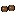

# Kellerbier — Sprite-Übersicht

> **Automatisch generiert** von `tools/art/sprite-overview.mjs` — nicht von Hand bearbeiten.
> Aktualisiert sich bei `npm run dev` automatisch, sobald sich etwas unter `assets/sprites/`
> oder `src/content/` ändert; manuell mit `npm run docs:sprites`.
> Die Bilder sind verlinkt, ein neu gezeichnetes PNG ist also sofort sichtbar.
>
> Zum Game Design Document: [Kellerbier — Game Design Document.md](Kellerbier%20%E2%80%94%20Game%20Design%20Document.md)

## Stand

| Kategorie | Mit Sprite | Gesamt | Fehlt |
|---|---|---|---|
| [Spielfiguren](#spielfiguren) | 1 | 3 | 2 |
| [Gegner](#gegner) | 15 | 15 | 0 |
| [Minibosse](#minibosse) | 6 | 6 | 0 |
| [Bosse](#bosse) | 4 | 4 | 0 |
| [Items](#items) | 62 | 62 | 0 |
| [Pickups](#pickups) | 20 | 20 | 0 |

## Spielfiguren

| Status | Name | ID | Dateiname | Sprite(s) | Datei(en) | Definition |
|---|---|---|---|---|---|---|
| ✅ | Alois | `alois` | `alois-drunk-north.strip.png` `alois-drunk-side.strip.png` `alois-drunk-south.strip.png` `alois-north.strip.png` `alois-schlauch.strip.png` `alois-side.strip.png` `alois-south.strip.png` |        | [`assets/sprites/common/characters/alois-drunk-north.strip.png`](assets/sprites/common/characters/alois-drunk-north.strip.png) — **20×32 · 4 Frames (Strip 80×32)** [`assets/sprites/common/characters/alois-drunk-north.anim.json`](assets/sprites/common/characters/alois-drunk-north.anim.json) [`assets/sprites/common/characters/alois-drunk-side.strip.png`](assets/sprites/common/characters/alois-drunk-side.strip.png) — **20×32 · 4 Frames (Strip 80×32)** [`assets/sprites/common/characters/alois-drunk-side.anim.json`](assets/sprites/common/characters/alois-drunk-side.anim.json) [`assets/sprites/common/characters/alois-drunk-south.strip.png`](assets/sprites/common/characters/alois-drunk-south.strip.png) — **20×32 · 4 Frames (Strip 80×32)** [`assets/sprites/common/characters/alois-drunk-south.anim.json`](assets/sprites/common/characters/alois-drunk-south.anim.json) [`assets/sprites/common/characters/alois-north.strip.png`](assets/sprites/common/characters/alois-north.strip.png) — **20×32 · 8 Frames (Strip 160×32)** [`assets/sprites/common/characters/alois-north.anim.json`](assets/sprites/common/characters/alois-north.anim.json) [`assets/sprites/common/characters/alois-schlauch.strip.png`](assets/sprites/common/characters/alois-schlauch.strip.png) — **24×24 · 16 Frames (Strip 384×24)** [`assets/sprites/common/characters/alois-schlauch.anim.json`](assets/sprites/common/characters/alois-schlauch.anim.json) [`assets/sprites/common/characters/alois-side.strip.png`](assets/sprites/common/characters/alois-side.strip.png) — **20×32 · 8 Frames (Strip 160×32)** [`assets/sprites/common/characters/alois-side.anim.json`](assets/sprites/common/characters/alois-side.anim.json) [`assets/sprites/common/characters/alois-south.strip.png`](assets/sprites/common/characters/alois-south.strip.png) — **20×32 · 8 Frames (Strip 160×32)** [`assets/sprites/common/characters/alois-south.anim.json`](assets/sprites/common/characters/alois-south.anim.json) | [`src/content/characters/alois.ts`](src/content/characters/alois.ts) |
| ❌ fehlt | König Ludwig II | `ludwig` | `ludwig-south.strip.png` | – | erwartet: `assets/sprites/common/characters/ludwig-south.strip.png` | [`src/content/characters/koenig-ludwig.ts`](src/content/characters/koenig-ludwig.ts) |
| ❌ fehlt | Resi | `resi` | `resi-south.strip.png` | – | erwartet: `assets/sprites/common/characters/resi-south.strip.png` | [`src/content/characters/resi.ts`](src/content/characters/resi.ts) |

## Gegner

| Status | Name | ID | Dateiname | Floor | Sprite(s) | Datei(en) | Definition |
|---|---|---|---|---|---|---|---|
| ✅ | Bauer | `bauer` | `bauer.png` | floor-2-rural |  | [`assets/sprites/floor-2-rural/characters/bauer.png`](assets/sprites/floor-2-rural/characters/bauer.png) — **21×32** | [`src/content/enemies/bauer.ts`](src/content/enemies/bauer.ts) |
| ✅ | Bierratte | `bierratte` | `bierratte.png` | floor-1-cellar |  | [`assets/sprites/floor-1-cellar/characters/bierratte.png`](assets/sprites/floor-1-cellar/characters/bierratte.png) — **15×16** | [`src/content/enemies/bierratte.ts`](src/content/enemies/bierratte.ts) |
| ✅ | Blaskapellist | `blaskapellist` | `blaskapellist.png` | floor-2-rural |  | [`assets/sprites/floor-2-rural/characters/blaskapellist.png`](assets/sprites/floor-2-rural/characters/blaskapellist.png) — **26×30** | [`src/content/enemies/blaskapellist.ts`](src/content/enemies/blaskapellist.ts) |
| ✅ | Böllerschmeißer | `boellerschmeisser` | `boellerschmeisser.png` | floor-2-rural |  | [`assets/sprites/floor-2-rural/characters/boellerschmeisser.png`](assets/sprites/floor-2-rural/characters/boellerschmeisser.png) — **18×28** | [`src/content/enemies/boellerschmeisser.ts`](src/content/enemies/boellerschmeisser.ts) |
| ✅ | Gartenzwerg | `gartenzwerg` | `gartenzwerg.png` | floor-2-rural |  | [`assets/sprites/floor-2-rural/characters/gartenzwerg.png`](assets/sprites/floor-2-rural/characters/gartenzwerg.png) — **18×26** | [`src/content/enemies/gartenzwerg.ts`](src/content/enemies/gartenzwerg.ts) |
| ✅ | Gockel | `gockel` | `gockel.png` | floor-2-rural |  | [`assets/sprites/floor-2-rural/characters/gockel.png`](assets/sprites/floor-2-rural/characters/gockel.png) — **22×26** | [`src/content/enemies/gockel.ts`](src/content/enemies/gockel.ts) |
| ✅ | Kellerassel | `kellerassel` | `kellerassel.strip.png` | floor-1-cellar |  | [`assets/sprites/floor-1-cellar/characters/kellerassel.strip.png`](assets/sprites/floor-1-cellar/characters/kellerassel.strip.png) — **26×18 · 7 Frames (Strip 182×18)** [`assets/sprites/floor-1-cellar/characters/kellerassel.anim.json`](assets/sprites/floor-1-cellar/characters/kellerassel.anim.json) | [`src/content/enemies/kellerassel.ts`](src/content/enemies/kellerassel.ts) |
| ✅ | Kuh | `kuh` | `kuh.png` | floor-2-rural |  | [`assets/sprites/floor-2-rural/characters/kuh.png`](assets/sprites/floor-2-rural/characters/kuh.png) — **44×32** | [`src/content/enemies/kuh.ts`](src/content/enemies/kuh.ts) |
| ✅ | Rollfass | `rollfass` | `rollfass.png` | floor-1-cellar |  | [`assets/sprites/floor-1-cellar/characters/rollfass.png`](assets/sprites/floor-1-cellar/characters/rollfass.png) — **32×17** | [`src/content/enemies/rollfass.ts`](src/content/enemies/rollfass.ts) |
| ✅ | Fasssplitter | `fasssplitter` | `fasssplitter.png` | floor-1-cellar |  | [`assets/sprites/floor-1-cellar/characters/fasssplitter.png`](assets/sprites/floor-1-cellar/characters/fasssplitter.png) — **9×16** | [`src/content/enemies/rollfass.ts`](src/content/enemies/rollfass.ts) |
| ✅ | Schimmelfleck | `schimmelfleck` | `schimmelfleck.png` | floor-1-cellar |  | [`assets/sprites/floor-1-cellar/characters/schimmelfleck.png`](assets/sprites/floor-1-cellar/characters/schimmelfleck.png) — **20×16** | [`src/content/enemies/schimmelfleck.ts`](src/content/enemies/schimmelfleck.ts) |
| ✅ | Schimmelspore | `schimmelspore` | `schimmelspore.png` | floor-1-cellar |  | [`assets/sprites/floor-1-cellar/characters/schimmelspore.png`](assets/sprites/floor-1-cellar/characters/schimmelspore.png) — **12×16** | [`src/content/enemies/schimmelfleck.ts`](src/content/enemies/schimmelfleck.ts) |
| ✅ | Wirt | `shopkeeper` | `shopkeeper.strip.png` `shopkeeper-stand.png` | common |   | [`assets/sprites/common/characters/shopkeeper.strip.png`](assets/sprites/common/characters/shopkeeper.strip.png) — **22×32 · 2 Frames (Strip 44×32)** [`assets/sprites/common/characters/shopkeeper.anim.json`](assets/sprites/common/characters/shopkeeper.anim.json) [`assets/sprites/common/tiles/shopkeeper-stand.png`](assets/sprites/common/tiles/shopkeeper-stand.png) — **32×32** | [`src/content/enemies/shopkeeper.ts`](src/content/enemies/shopkeeper.ts) |
| ✅ | Traktor | `traktor` | `traktor.png` | floor-2-rural |  | [`assets/sprites/floor-2-rural/characters/traktor.png`](assets/sprites/floor-2-rural/characters/traktor.png) — **31×22** | [`src/content/enemies/traktor.ts`](src/content/enemies/traktor.ts) |
| ✅ | Zapfhahn | `zapfhahn` | `zapfhahn.png` | floor-1-cellar |  | [`assets/sprites/floor-1-cellar/characters/zapfhahn.png`](assets/sprites/floor-1-cellar/characters/zapfhahn.png) — **10×26** | [`src/content/enemies/zapfhahn.ts`](src/content/enemies/zapfhahn.ts) |

## Minibosse

| Status | Name | ID | Dateiname | Floor | Sprite(s) | Datei(en) | Definition |
|---|---|---|---|---|---|---|---|
| ✅ | Der Ladewagen | `der-ladewagen` | `der-ladewagen.png` | floor-2-rural |  | [`assets/sprites/floor-2-rural/characters/der-ladewagen.png`](assets/sprites/floor-2-rural/characters/der-ladewagen.png) — **40×31** | [`src/content/enemies/der-ladewagen.ts`](src/content/enemies/der-ladewagen.ts) |
| ✅ | Der Rattenkönig | `der-rattenkoenig` | `der-rattenkoenig.png` | floor-1-cellar |  | [`assets/sprites/floor-1-cellar/characters/der-rattenkoenig.png`](assets/sprites/floor-1-cellar/characters/der-rattenkoenig.png) — **51×39** | [`src/content/enemies/der-rattenkoenig.ts`](src/content/enemies/der-rattenkoenig.ts) |
| ✅ | Die Blaskapelle (Tuba) | `die-blaskapelle-tuba` | `die-blaskapelle-tuba.png` | floor-2-rural |  | [`assets/sprites/floor-2-rural/characters/die-blaskapelle-tuba.png`](assets/sprites/floor-2-rural/characters/die-blaskapelle-tuba.png) — **33×40** | [`src/content/enemies/die-blaskapelle.ts`](src/content/enemies/die-blaskapelle.ts) |
| ✅ | Die Blaskapelle (Trompete) | `die-blaskapelle-trompete` | `die-blaskapelle-trompete.png` | floor-2-rural |  | [`assets/sprites/floor-2-rural/characters/die-blaskapelle-trompete.png`](assets/sprites/floor-2-rural/characters/die-blaskapelle-trompete.png) — **37×40** | [`src/content/enemies/die-blaskapelle.ts`](src/content/enemies/die-blaskapelle.ts) |
| ✅ | Die Blaskapelle (Posaune) | `die-blaskapelle-posaune` | `die-blaskapelle-posaune.png` | floor-2-rural |  | [`assets/sprites/floor-2-rural/characters/die-blaskapelle-posaune.png`](assets/sprites/floor-2-rural/characters/die-blaskapelle-posaune.png) — **38×40** | [`src/content/enemies/die-blaskapelle.ts`](src/content/enemies/die-blaskapelle.ts) |
| ✅ | Die Zapfhahn-Orgel | `die-zapfhahn-orgel` | `die-zapfhahn-orgel.png` | floor-1-cellar |  | [`assets/sprites/floor-1-cellar/characters/die-zapfhahn-orgel.png`](assets/sprites/floor-1-cellar/characters/die-zapfhahn-orgel.png) — **38×33** | [`src/content/enemies/die-zapfhahn-orgel.ts`](src/content/enemies/die-zapfhahn-orgel.ts) |

## Bosse

| Status | Name | ID | Dateiname | Floor | Sprite(s) | Datei(en) | Definition |
|---|---|---|---|---|---|---|---|
| ✅ | Der Stier | `der-stier` | `der-stier.strip.png` | floor-2-rural |  | [`assets/sprites/floor-2-rural/bosses/der-stier.strip.png`](assets/sprites/floor-2-rural/bosses/der-stier.strip.png) — **116×100 · 12 Frames (Strip 1392×100)** [`assets/sprites/floor-2-rural/bosses/der-stier.anim.json`](assets/sprites/floor-2-rural/bosses/der-stier.anim.json) | [`src/content/enemies/der-stier.ts`](src/content/enemies/der-stier.ts) |
| ✅ | Der Stier (Maibaum-Dieb) | `der-stier-maibaum-dieb` | `der-stier-maibaum-dieb.strip.png` | floor-2-rural |  | [`assets/sprites/floor-2-rural/bosses/der-stier-maibaum-dieb.strip.png`](assets/sprites/floor-2-rural/bosses/der-stier-maibaum-dieb.strip.png) — **24×34 · 7 Frames (Strip 168×34)** [`assets/sprites/floor-2-rural/bosses/der-stier-maibaum-dieb.anim.json`](assets/sprites/floor-2-rural/bosses/der-stier-maibaum-dieb.anim.json) | [`src/content/enemies/der-stier.ts`](src/content/enemies/der-stier.ts) |
| ✅ | Die Große Kellerassel | `grosse-kellerassel` | `grosse-kellerassel.strip.png` | floor-1-cellar |  | [`assets/sprites/floor-1-cellar/bosses/grosse-kellerassel.strip.png`](assets/sprites/floor-1-cellar/bosses/grosse-kellerassel.strip.png) — **140×86 · 12 Frames (Strip 1680×86)** [`assets/sprites/floor-1-cellar/bosses/grosse-kellerassel.anim.json`](assets/sprites/floor-1-cellar/bosses/grosse-kellerassel.anim.json) | [`src/content/enemies/grosse-kellerassel.ts`](src/content/enemies/grosse-kellerassel.ts) |
| ✅ | Kellerassel-Segment | `kellerassel-segment` | `kellerassel-segment.png` | floor-1-cellar |  | [`assets/sprites/floor-1-cellar/characters/kellerassel-segment.png`](assets/sprites/floor-1-cellar/characters/kellerassel-segment.png) — **20×16** | [`src/content/enemies/grosse-kellerassel.ts`](src/content/enemies/grosse-kellerassel.ts) |

## Items

| Status | Name | ID | Dateiname | Sprite(s) | Datei(en) | Definition |
|---|---|---|---|---|---|---|
| ✅ | Almabtrieb | `almabtrieb` | `item-almabtrieb.png` |  | [`assets/sprites/common/characters/item-almabtrieb.png`](assets/sprites/common/characters/item-almabtrieb.png) — **24×24** | [`src/content/items/almabtrieb.ts`](src/content/items/almabtrieb.ts) |
| ✅ | Apfelkuchen (mit Rosinen) | `apfelkuchen-mit-rosinen` | `item-apfelkuchen-mit-rosinen.png` |  | [`assets/sprites/common/characters/item-apfelkuchen-mit-rosinen.png`](assets/sprites/common/characters/item-apfelkuchen-mit-rosinen.png) — **24×24** | [`src/content/items/apfelkuchen-mit-rosinen.ts`](src/content/items/apfelkuchen-mit-rosinen.ts) |
| ✅ | Apfelkuchen | `apfelkuchen` | `item-apfelkuchen.png` |  | [`assets/sprites/common/characters/item-apfelkuchen.png`](assets/sprites/common/characters/item-apfelkuchen.png) — **24×24** | [`src/content/items/apfelkuchen.ts`](src/content/items/apfelkuchen.ts) |
| ✅ | Apfelstrudel | `apfelstrudel` | `item-apfelstrudel.png` |  | [`assets/sprites/common/characters/item-apfelstrudel.png`](assets/sprites/common/characters/item-apfelstrudel.png) — **24×24** | [`src/content/items/apfelstrudel.ts`](src/content/items/apfelstrudel.ts) |
| ✅ | Bauern-Mistgabel | `bauern-mistgabel` | `item-bauern-mistgabel.png` |  | [`assets/sprites/common/characters/item-bauern-mistgabel.png`](assets/sprites/common/characters/item-bauern-mistgabel.png) — **24×24** | [`src/content/items/bauern-mistgabel.ts`](src/content/items/bauern-mistgabel.ts) |
| ✅ | Bierbank | `bierbank` | `item-bierbank.png` |  | [`assets/sprites/common/characters/item-bierbank.png`](assets/sprites/common/characters/item-bierbank.png) — **24×24** | [`src/content/items/bierbank.ts`](src/content/items/bierbank.ts) |
| ✅ | Bierbauch | `bierbauch` | `item-bierbauch.png` |  | [`assets/sprites/common/characters/item-bierbauch.png`](assets/sprites/common/characters/item-bierbauch.png) — **24×24** | [`src/content/items/bierbauch.ts`](src/content/items/bierbauch.ts) |
| ✅ | Bierdeckel | `bierdeckel` | `item-bierdeckel.png` |  | [`assets/sprites/common/characters/item-bierdeckel.png`](assets/sprites/common/characters/item-bierdeckel.png) — **24×24** | [`src/content/items/bierdeckel.ts`](src/content/items/bierdeckel.ts) |
| ✅ | Bierkrug | `bierkrug` | `item-bierkrug.png` |  | [`assets/sprites/common/characters/item-bierkrug.png`](assets/sprites/common/characters/item-bierkrug.png) — **24×24** | [`src/content/items/bierkrug.ts`](src/content/items/bierkrug.ts) |
| ✅ | Blaskapelle | `blaskapelle` | `item-blaskapelle.png` |  | [`assets/sprites/common/characters/item-blaskapelle.png`](assets/sprites/common/characters/item-blaskapelle.png) — **24×24** | [`src/content/items/blaskapelle.ts`](src/content/items/blaskapelle.ts) |
| ✅ | Blutwurz | `blutwurz` | `item-blutwurz.png` |  | [`assets/sprites/common/characters/item-blutwurz.png`](assets/sprites/common/characters/item-blutwurz.png) — **24×24** | [`src/content/items/blutwurz.ts`](src/content/items/blutwurz.ts) |
| ✅ | Böllerschmeißer | `boellerschmeisser` | `item-boellerschmeisser.png` |  | [`assets/sprites/common/characters/item-boellerschmeisser.png`](assets/sprites/common/characters/item-boellerschmeisser.png) — **24×24** | [`src/content/items/boellerschmeisser.ts`](src/content/items/boellerschmeisser.ts) |
| ✅ | Braumeister-Hammer | `braumeister-hammer` | `item-braumeister-hammer.png` |  | [`assets/sprites/common/characters/item-braumeister-hammer.png`](assets/sprites/common/characters/item-braumeister-hammer.png) — **24×24** | [`src/content/items/braumeister-hammer.ts`](src/content/items/braumeister-hammer.ts) |
| ✅ | Braumeister-Schürze | `braumeister-schuerze` | `item-braumeister-schuerze.png` |  | [`assets/sprites/common/characters/item-braumeister-schuerze.png`](assets/sprites/common/characters/item-braumeister-schuerze.png) — **24×24** | [`src/content/items/braumeister-schuerze.ts`](src/content/items/braumeister-schuerze.ts) |
| ✅ | Braumeister-Visier | `braumeister-visier` | `item-braumeister-visier.png` |  | [`assets/sprites/common/characters/item-braumeister-visier.png`](assets/sprites/common/characters/item-braumeister-visier.png) — **24×24** | [`src/content/items/braumeister-visier.ts`](src/content/items/braumeister-visier.ts) |
| ✅ | Brezn | `brezn` | `item-brezn.png` |  | [`assets/sprites/common/characters/item-brezn.png`](assets/sprites/common/characters/item-brezn.png) — **24×24** | [`src/content/items/brezn.ts`](src/content/items/brezn.ts) |
| ✅ | Brotzeitbrett | `brotzeitbrett` | `item-brotzeitbrett.png` |  | [`assets/sprites/common/characters/item-brotzeitbrett.png`](assets/sprites/common/characters/item-brotzeitbrett.png) — **24×24** | [`src/content/items/brotzeitbrett.ts`](src/content/items/brotzeitbrett.ts) |
| ✅ | Colaweizen | `colaweizen` | `item-colaweizen.png` |  | [`assets/sprites/common/characters/item-colaweizen.png`](assets/sprites/common/characters/item-colaweizen.png) — **24×24** | [`src/content/items/colaweizen.ts`](src/content/items/colaweizen.ts) |
| ✅ | Der Ordner | `der-ordner` | `item-der-ordner.png` |  | [`assets/sprites/common/characters/item-der-ordner.png`](assets/sprites/common/characters/item-der-ordner.png) — **24×24** | [`src/content/items/der-ordner.ts`](src/content/items/der-ordner.ts) |
| ✅ | Der Rosinenklauber | `der-rosinenklauber` | `item-der-rosinenklauber.png` |  | [`assets/sprites/common/characters/item-der-rosinenklauber.png`](assets/sprites/common/characters/item-der-rosinenklauber.png) — **24×24** | [`src/content/items/der-rosinenklauber.ts`](src/content/items/der-rosinenklauber.ts) |
| ✅ | Feierabendbier | `feierabendbier` | `item-feierabendbier.png` |  | [`assets/sprites/common/characters/item-feierabendbier.png`](assets/sprites/common/characters/item-feierabendbier.png) — **24×24** | [`src/content/items/feierabendbier.ts`](src/content/items/feierabendbier.ts) |
| ✅ | Feuerwehrhelm | `feuerwehrhelm` | `item-feuerwehrhelm.png` |  | [`assets/sprites/common/characters/item-feuerwehrhelm.png`](assets/sprites/common/characters/item-feuerwehrhelm.png) — **24×24** | [`src/content/items/feuerwehrhelm.ts`](src/content/items/feuerwehrhelm.ts) |
| ✅ | Fingerhakeln | `fingerhakeln` | `item-fingerhakeln.png` |  | [`assets/sprites/common/characters/item-fingerhakeln.png`](assets/sprites/common/characters/item-fingerhakeln.png) — **24×24** | [`src/content/items/fingerhakeln.ts`](src/content/items/fingerhakeln.ts) |
| ✅ | Gartenzwerg-Hut | `gartenzwerg-hut` | `item-gartenzwerg-hut.png` |  | [`assets/sprites/common/characters/item-gartenzwerg-hut.png`](assets/sprites/common/characters/item-gartenzwerg-hut.png) — **24×24** | [`src/content/items/gartenzwerg-hut.ts`](src/content/items/gartenzwerg-hut.ts) |
| ✅ | Gugelhupf | `gugelhupf` | `item-gugelhupf.png` |  | [`assets/sprites/common/characters/item-gugelhupf.png`](assets/sprites/common/characters/item-gugelhupf.png) — **24×24** | [`src/content/items/gugelhupf.ts`](src/content/items/gugelhupf.ts) |
| ✅ | Haferlschuh | `haferlschuh` | `item-haferlschuh.png` |  | [`assets/sprites/common/characters/item-haferlschuh.png`](assets/sprites/common/characters/item-haferlschuh.png) — **24×24** | [`src/content/items/haferlschuh.ts`](src/content/items/haferlschuh.ts) |
| ✅ | Hendlgeruch | `hendlgeruch` | `item-hendlgeruch.png` |  | [`assets/sprites/common/characters/item-hendlgeruch.png`](assets/sprites/common/characters/item-hendlgeruch.png) — **24×24** | [`src/content/items/hendlgeruch.ts`](src/content/items/hendlgeruch.ts) |
| ✅ | Kartoffelsalat | `kartoffelsalat` | `item-kartoffelsalat.png` |  | [`assets/sprites/common/characters/item-kartoffelsalat.png`](assets/sprites/common/characters/item-kartoffelsalat.png) — **24×24** | [`src/content/items/kartoffelsalat.ts`](src/content/items/kartoffelsalat.ts) |
| ✅ | Karussell | `karussell` | `item-karussell.png` |  | [`assets/sprites/common/characters/item-karussell.png`](assets/sprites/common/characters/item-karussell.png) — **24×24** | [`src/content/items/karussell.ts`](src/content/items/karussell.ts) |
| ✅ | Kletzenbrot | `kletzenbrot` | `item-kletzenbrot.png` |  | [`assets/sprites/common/characters/item-kletzenbrot.png`](assets/sprites/common/characters/item-kletzenbrot.png) — **24×24** | [`src/content/items/kletzenbrot.ts`](src/content/items/kletzenbrot.ts) |
| ✅ | Konterbier | `konterbier` | `item-konterbier.png` |  | [`assets/sprites/common/characters/item-konterbier.png`](assets/sprites/common/characters/item-konterbier.png) — **24×24** | [`src/content/items/konterbier.ts`](src/content/items/konterbier.ts) |
| ✅ | Kraftbier | `kraftbier` | `item-kraftbier.png` |  | [`assets/sprites/common/characters/item-kraftbier.png`](assets/sprites/common/characters/item-kraftbier.png) — **24×24** | [`src/content/items/kraftbier.ts`](src/content/items/kraftbier.ts) |
| ✅ | Lebkuchenherz | `lebkuchenherz` | `item-lebkuchenherz.png` |  | [`assets/sprites/common/characters/item-lebkuchenherz.png`](assets/sprites/common/characters/item-lebkuchenherz.png) — **24×24** | [`src/content/items/lebkuchenherz.ts`](src/content/items/lebkuchenherz.ts) |
| ✅ | Lederhosn | `lederhosn` | `item-lederhosn.png` |  | [`assets/sprites/common/characters/item-lederhosn.png`](assets/sprites/common/characters/item-lederhosn.png) — **24×24** | [`src/content/items/lederhosn.ts`](src/content/items/lederhosn.ts) |
| ✅ | Ludwigs Schwan | `ludwigs-schwan` | `item-ludwigs-schwan.png` |  | [`assets/sprites/common/characters/item-ludwigs-schwan.png`](assets/sprites/common/characters/item-ludwigs-schwan.png) — **24×24** | [`src/content/items/ludwigs-schwan.ts`](src/content/items/ludwigs-schwan.ts) |
| ✅ | Luftballon | `luftballon` | `item-luftballon.png` |  | [`assets/sprites/common/characters/item-luftballon.png`](assets/sprites/common/characters/item-luftballon.png) — **24×24** | [`src/content/items/luftballon.ts`](src/content/items/luftballon.ts) |
| ✅ | Maß | `mass` | `item-mass.png` |  | [`assets/sprites/common/characters/item-mass.png`](assets/sprites/common/characters/item-mass.png) — **24×24** | [`src/content/items/mass.ts`](src/content/items/mass.ts) |
| ✅ | Neuschwanstein-Bauplan | `neuschwanstein-bauplan` | `item-neuschwanstein-bauplan.png` |  | [`assets/sprites/common/characters/item-neuschwanstein-bauplan.png`](assets/sprites/common/characters/item-neuschwanstein-bauplan.png) — **24×24** | [`src/content/items/neuschwanstein-bauplan.ts`](src/content/items/neuschwanstein-bauplan.ts) |
| ✅ | Obazda | `obazda` | `item-obazda.png` |  | [`assets/sprites/common/characters/item-obazda.png`](assets/sprites/common/characters/item-obazda.png) — **24×24** | [`src/content/items/obazda.ts`](src/content/items/obazda.ts) |
| ✅ | Platzangst | `platzangst` | `item-platzangst.png` |  | [`assets/sprites/common/characters/item-platzangst.png`](assets/sprites/common/characters/item-platzangst.png) — **24×24** | [`src/content/items/platzangst.ts`](src/content/items/platzangst.ts) |
| ✅ | Radler | `radler` | `item-radler.png` |  | [`assets/sprites/common/characters/item-radler.png`](assets/sprites/common/characters/item-radler.png) — **24×24** | [`src/content/items/radler.ts`](src/content/items/radler.ts) |
| ✅ | Reinheitsgebot 1516 | `reinheitsgebot-1516` | `item-reinheitsgebot-1516.png` |  | [`assets/sprites/common/characters/item-reinheitsgebot-1516.png`](assets/sprites/common/characters/item-reinheitsgebot-1516.png) — **24×24** | [`src/content/items/reinheitsgebot-1516.ts`](src/content/items/reinheitsgebot-1516.ts) |
| ✅ | Riesenrad | `riesenrad` | `item-riesenrad.png` |  | [`assets/sprites/common/characters/item-riesenrad.png`](assets/sprites/common/characters/item-riesenrad.png) — **24×24** | [`src/content/items/riesenrad.ts`](src/content/items/riesenrad.ts) |
| ✅ | Rosinenbrot | `rosinenbrot` | `item-rosinenbrot.png` |  | [`assets/sprites/common/characters/item-rosinenbrot.png`](assets/sprites/common/characters/item-rosinenbrot.png) — **24×24** | [`src/content/items/rosinenbrot.ts`](src/content/items/rosinenbrot.ts) |
| ✅ | Rosinenschnaps | `rosinenschnaps` | `item-rosinenschnaps.png` |  | [`assets/sprites/common/characters/item-rosinenschnaps.png`](assets/sprites/common/characters/item-rosinenschnaps.png) — **24×24** | [`src/content/items/rosinenschnaps.ts`](src/content/items/rosinenschnaps.ts) |
| ✅ | Rosinenschnecke | `rosinenschnecke` | `item-rosinenschnecke.png` |  | [`assets/sprites/common/characters/item-rosinenschnecke.png`](assets/sprites/common/characters/item-rosinenschnecke.png) — **24×24** | [`src/content/items/rosinenschnecke.ts`](src/content/items/rosinenschnecke.ts) |
| ✅ | Ruhige Hand | `ruhige-hand` | `item-ruhige-hand.png` |  | [`assets/sprites/common/characters/item-ruhige-hand.png`](assets/sprites/common/characters/item-ruhige-hand.png) — **24×24** | [`src/content/items/ruhige-hand.ts`](src/content/items/ruhige-hand.ts) |
| ✅ | Rumtopf | `rumtopf` | `item-rumtopf.png` |  | [`assets/sprites/common/characters/item-rumtopf.png`](assets/sprites/common/characters/item-rumtopf.png) — **24×24** | [`src/content/items/rumtopf.ts`](src/content/items/rumtopf.ts) |
| ✅ | Sauwetter | `sauwetter` | `item-sauwetter.png` |  | [`assets/sprites/common/characters/item-sauwetter.png`](assets/sprites/common/characters/item-sauwetter.png) — **24×24** | [`src/content/items/sauwetter.ts`](src/content/items/sauwetter.ts) |
| ✅ | Schlüsselbund | `schluesselbund` | `item-schluesselbund.png` |  | [`assets/sprites/common/characters/item-schluesselbund.png`](assets/sprites/common/characters/item-schluesselbund.png) — **24×24** | [`src/content/items/schluesselbund.ts`](src/content/items/schluesselbund.ts) |
| ✅ | Schuhplattler | `schuhplattler` | `item-schuhplattler.png` |  | [`assets/sprites/common/characters/item-schuhplattler.png`](assets/sprites/common/characters/item-schuhplattler.png) — **24×24** | [`src/content/items/schuhplattler.ts`](src/content/items/schuhplattler.ts) |
| ✅ | Semmelknödel | `semmelknoedel` | `item-semmelknoedel.png` |  | [`assets/sprites/common/characters/item-semmelknoedel.png`](assets/sprites/common/characters/item-semmelknoedel.png) — **24×24** | [`src/content/items/semmelknoedel.ts`](src/content/items/semmelknoedel.ts) |
| ✅ | Sixpack | `sixpack` | `item-sixpack.png` |  | [`assets/sprites/common/characters/item-sixpack.png`](assets/sprites/common/characters/item-sixpack.png) — **24×24** | [`src/content/items/sixpack.ts`](src/content/items/sixpack.ts) |
| ✅ | Spezi | `spezi` | `item-spezi.png` |  | [`assets/sprites/common/characters/item-spezi.png`](assets/sprites/common/characters/item-spezi.png) — **24×24** | [`src/content/items/spezi.ts`](src/content/items/spezi.ts) |
| ✅ | Steckerlfisch | `steckerlfisch` | `item-steckerlfisch.png` |  | [`assets/sprites/common/characters/item-steckerlfisch.png`](assets/sprites/common/characters/item-steckerlfisch.png) — **24×24** | [`src/content/items/steckerlfisch.ts`](src/content/items/steckerlfisch.ts) |
| ✅ | Steinkrug | `steinkrug` | `item-steinkrug.png` |  | [`assets/sprites/common/characters/item-steinkrug.png`](assets/sprites/common/characters/item-steinkrug.png) — **24×24** | [`src/content/items/steinkrug.ts`](src/content/items/steinkrug.ts) |
| ✅ | Studentenfutter | `studentenfutter` | `item-studentenfutter.png` |  | [`assets/sprites/common/characters/item-studentenfutter.png`](assets/sprites/common/characters/item-studentenfutter.png) — **24×24** | [`src/content/items/studentenfutter.ts`](src/content/items/studentenfutter.ts) |
| ✅ | Sudordnung 1493 | `sudordnung-1493` | `item-sudordnung-1493.png` |  | [`assets/sprites/common/characters/item-sudordnung-1493.png`](assets/sprites/common/characters/item-sudordnung-1493.png) — **24×24** | [`src/content/items/sudordnung-1493.ts`](src/content/items/sudordnung-1493.ts) |
| ✅ | Traktor-Auspuff | `traktor-auspuff` | `item-traktor-auspuff.png` |  | [`assets/sprites/common/characters/item-traktor-auspuff.png`](assets/sprites/common/characters/item-traktor-auspuff.png) — **24×24** | [`src/content/items/traktor-auspuff.ts`](src/content/items/traktor-auspuff.ts) |
| ✅ | Watschn | `watschn` | `item-watschn.png` |  | [`assets/sprites/common/characters/item-watschn.png`](assets/sprites/common/characters/item-watschn.png) — **24×24** | [`src/content/items/watschn.ts`](src/content/items/watschn.ts) |
| ✅ | Weißwurst | `weisswurst` | `item-weisswurst.png` |  | [`assets/sprites/common/characters/item-weisswurst.png`](assets/sprites/common/characters/item-weisswurst.png) — **24×24** | [`src/content/items/weisswurst.ts`](src/content/items/weisswurst.ts) |
| ✅ | Zwetschgendatschi | `zwetschgendatschi` | `item-zwetschgendatschi.png` |  | [`assets/sprites/common/characters/item-zwetschgendatschi.png`](assets/sprites/common/characters/item-zwetschgendatschi.png) — **24×24** | [`src/content/items/zwetschgendatschi.ts`](src/content/items/zwetschgendatschi.ts) |

## Pickups

| Status | Name | ID | Dateiname | Sprite(s) | Datei(en) | Definition |
|---|---|---|---|---|---|---|
| ✅ | Maß | `mass-full` | `pickup-mass-full.png` |  | [`assets/sprites/common/characters/pickup-mass-full.png`](assets/sprites/common/characters/pickup-mass-full.png) — **24×24** | [`src/content/pickups/pickups.ts`](src/content/pickups/pickups.ts) |
| ✅ | Halbe Maß | `mass-half` | `pickup-mass-half.png` |  | [`assets/sprites/common/characters/pickup-mass-half.png`](assets/sprites/common/characters/pickup-mass-half.png) — **24×24** | [`src/content/pickups/pickups.ts`](src/content/pickups/pickups.ts) |
| ✅ | Bratwurst | `bratwurst-full` | `pickup-bratwurst-full.png` |  | [`assets/sprites/common/characters/pickup-bratwurst-full.png`](assets/sprites/common/characters/pickup-bratwurst-full.png) — **24×24** | [`src/content/pickups/pickups.ts`](src/content/pickups/pickups.ts) |
| ✅ | Halbe Bratwurst | `bratwurst-half` | `pickup-bratwurst-half.png` |  | [`assets/sprites/common/characters/pickup-bratwurst-half.png`](assets/sprites/common/characters/pickup-bratwurst-half.png) — **24×24** | [`src/content/pickups/pickups.ts`](src/content/pickups/pickups.ts) |
| ✅ | Weißwurst | `weisswurst-full` | `pickup-weisswurst-full.png` |  | [`assets/sprites/common/characters/pickup-weisswurst-full.png`](assets/sprites/common/characters/pickup-weisswurst-full.png) — **24×24** | [`src/content/pickups/pickups.ts`](src/content/pickups/pickups.ts) |
| ✅ | Halbe Weißwurst | `weisswurst-half` | `pickup-weisswurst-half.png` |  | [`assets/sprites/common/characters/pickup-weisswurst-half.png`](assets/sprites/common/characters/pickup-weisswurst-half.png) — **24×24** | [`src/content/pickups/pickups.ts`](src/content/pickups/pickups.ts) |
| ✅ | Blutwurst | `blutwurst-full` | `pickup-blutwurst-full.png` |  | [`assets/sprites/common/characters/pickup-blutwurst-full.png`](assets/sprites/common/characters/pickup-blutwurst-full.png) — **24×24** | [`src/content/pickups/pickups.ts`](src/content/pickups/pickups.ts) |
| ✅ | Halbe Blutwurst | `blutwurst-half` | `pickup-blutwurst-half.png` |  | [`assets/sprites/common/characters/pickup-blutwurst-half.png`](assets/sprites/common/characters/pickup-blutwurst-half.png) — **24×24** | [`src/content/pickups/pickups.ts`](src/content/pickups/pickups.ts) |
| ✅ | Biermarke | `biermarke-1` | `pickup-biermarke-1.png` |  | [`assets/sprites/common/characters/pickup-biermarke-1.png`](assets/sprites/common/characters/pickup-biermarke-1.png) — **24×24** | [`src/content/pickups/pickups.ts`](src/content/pickups/pickups.ts) |
| ✅ | Biermarke | `biermarke-5` | `pickup-biermarke-5.png` |  | [`assets/sprites/common/characters/pickup-biermarke-5.png`](assets/sprites/common/characters/pickup-biermarke-5.png) — **24×24** | [`src/content/pickups/pickups.ts`](src/content/pickups/pickups.ts) |
| ✅ | Biermarke | `biermarke-10` | `pickup-biermarke-10.png` |  | [`assets/sprites/common/characters/pickup-biermarke-10.png`](assets/sprites/common/characters/pickup-biermarke-10.png) — **24×24** | [`src/content/pickups/pickups.ts`](src/content/pickups/pickups.ts) |
| ✅ | Bierfassl | `bierfassl` | `pickup-bierfassl.png` |  | [`assets/sprites/common/characters/pickup-bierfassl.png`](assets/sprites/common/characters/pickup-bierfassl.png) — **24×24** | [`src/content/pickups/pickups.ts`](src/content/pickups/pickups.ts) |
| ✅ | Bierfassl-Packerl | `bierfassl-pack` | `pickup-bierfassl-pack.png` |  | [`assets/sprites/common/characters/pickup-bierfassl-pack.png`](assets/sprites/common/characters/pickup-bierfassl-pack.png) — **24×24** | [`src/content/pickups/pickups.ts`](src/content/pickups/pickups.ts) |
| ✅ | Kellerschlüssel | `kellerschluessel` | `pickup-kellerschluessel.png` |  | [`assets/sprites/common/characters/pickup-kellerschluessel.png`](assets/sprites/common/characters/pickup-kellerschluessel.png) — **24×24** | [`src/content/pickups/pickups.ts`](src/content/pickups/pickups.ts) |
| ✅ | Schlüsselbund | `kellerschluessel-ring` | `pickup-kellerschluessel-ring.png` |  | [`assets/sprites/common/characters/pickup-kellerschluessel-ring.png`](assets/sprites/common/characters/pickup-kellerschluessel-ring.png) — **24×24** | [`src/content/pickups/pickups.ts`](src/content/pickups/pickups.ts) |
| ✅ | Meisterschlüssel | `meisterschluessel` | `pickup-meisterschluessel.png` |  | [`assets/sprites/common/characters/pickup-meisterschluessel.png`](assets/sprites/common/characters/pickup-meisterschluessel.png) — **24×24** | [`src/content/pickups/pickups.ts`](src/content/pickups/pickups.ts) |
| ✅ | Chest | `chest` | `pickup-chest.png` |  | [`assets/sprites/common/characters/pickup-chest.png`](assets/sprites/common/characters/pickup-chest.png) — **24×18** | [`src/content/pickups/pickups.ts`](src/content/pickups/pickups.ts) |
| ✅ | Locked Chest | `locked-chest` | `pickup-locked-chest.png` |  | [`assets/sprites/common/characters/pickup-locked-chest.png`](assets/sprites/common/characters/pickup-locked-chest.png) — **24×18** | [`src/content/pickups/pickups.ts`](src/content/pickups/pickups.ts) |
| ✅ | Chest | `chest-open` | `pickup-chest-open.png` |  | [`assets/sprites/common/characters/pickup-chest-open.png`](assets/sprites/common/characters/pickup-chest-open.png) — **24×18** | [`src/content/pickups/pickups.ts`](src/content/pickups/pickups.ts) |
| ✅ | Locked Chest | `locked-chest-open` | `pickup-locked-chest-open.png` |  | [`assets/sprites/common/characters/pickup-locked-chest-open.png`](assets/sprites/common/characters/pickup-locked-chest-open.png) — **24×18** | [`src/content/pickups/pickups.ts`](src/content/pickups/pickups.ts) |

## Weitere Sprites (Tiles, Projektile, VFX, ohne Objekt-Zuordnung)

### common / bosses

| Dateiname | Größe | Datei | Sprite |
|---|---|---|---|
| `boss-shadow.png` | 48×24 | [`assets/sprites/common/bosses/boss-shadow.png`](assets/sprites/common/bosses/boss-shadow.png) |  |

### common / characters

| Dateiname | Größe | Datei | Sprite |
|---|---|---|---|
| `actor-shadow.png` | 24×16 | [`assets/sprites/common/characters/actor-shadow.png`](assets/sprites/common/characters/actor-shadow.png) |  |
| `pickup-schwarzbier.png` | 24×24 | [`assets/sprites/common/characters/pickup-schwarzbier.png`](assets/sprites/common/characters/pickup-schwarzbier.png) |  |
| `pickup-weissbier.png` | 24×24 | [`assets/sprites/common/characters/pickup-weissbier.png`](assets/sprites/common/characters/pickup-weissbier.png) |  |

### common / projectiles

| Dateiname | Größe | Datei | Sprite |
|---|---|---|---|
| `beer-burning.png` | 8×8 | [`assets/sprites/common/projectiles/beer-burning.png`](assets/sprites/common/projectiles/beer-burning.png) |  |
| `beer-freezing.png` | 8×8 | [`assets/sprites/common/projectiles/beer-freezing.png`](assets/sprites/common/projectiles/beer-freezing.png) |  |
| `beer-piercing.png` | 8×8 | [`assets/sprites/common/projectiles/beer-piercing.png`](assets/sprites/common/projectiles/beer-piercing.png) |  |
| `beer-poison.png` | 8×8 | [`assets/sprites/common/projectiles/beer-poison.png`](assets/sprites/common/projectiles/beer-poison.png) |  |
| `beer-spectral.png` | 8×8 | [`assets/sprites/common/projectiles/beer-spectral.png`](assets/sprites/common/projectiles/beer-spectral.png) |  |
| `beer.png` | 8×8 | [`assets/sprites/common/projectiles/beer.png`](assets/sprites/common/projectiles/beer.png) |  |

### common / tiles

| Dateiname | Größe | Datei | Sprite |
|---|---|---|---|
| `boss-plate.png` | 32×32 | [`assets/sprites/common/tiles/boss-plate.png`](assets/sprites/common/tiles/boss-plate.png) |  |
| `crate-neu.png` | 32×32 | [`assets/sprites/common/tiles/crate-neu.png`](assets/sprites/common/tiles/crate-neu.png) |  |
| `crate-opa.png` | 32×32 | [`assets/sprites/common/tiles/crate-opa.png`](assets/sprites/common/tiles/crate-opa.png) |  |
| `crate-stack.png` | 32×32 | [`assets/sprites/common/tiles/crate-stack.png`](assets/sprites/common/tiles/crate-stack.png) |  |
| `door-closed.png` | 32×32 | [`assets/sprites/common/tiles/door-closed.png`](assets/sprites/common/tiles/door-closed.png) |  |
| `door-locked.png` | 32×32 | [`assets/sprites/common/tiles/door-locked.png`](assets/sprites/common/tiles/door-locked.png) |  |
| `door-open.png` | 32×32 | [`assets/sprites/common/tiles/door-open.png`](assets/sprites/common/tiles/door-open.png) |  |
| `minimap-boss.png` | 32×32 | [`assets/sprites/common/tiles/minimap-boss.png`](assets/sprites/common/tiles/minimap-boss.png) |  |
| `minimap-shop.png` | 32×32 | [`assets/sprites/common/tiles/minimap-shop.png`](assets/sprites/common/tiles/minimap-shop.png) |  |
| `minimap-treasure.png` | 32×32 | [`assets/sprites/common/tiles/minimap-treasure.png`](assets/sprites/common/tiles/minimap-treasure.png) |  |
| `pedestal.png` | 32×32 | [`assets/sprites/common/tiles/pedestal.png`](assets/sprites/common/tiles/pedestal.png) |  |

### common / vfx

| Dateiname | Größe | Datei | Sprite |
|---|---|---|---|
| `dust.png` | 4×4 | [`assets/sprites/common/vfx/dust.png`](assets/sprites/common/vfx/dust.png) |  |
| `ember.png` | 3×3 | [`assets/sprites/common/vfx/ember.png`](assets/sprites/common/vfx/ember.png) |  |
| `flash.png` | 8×8 | [`assets/sprites/common/vfx/flash.png`](assets/sprites/common/vfx/flash.png) |  |
| `foam.png` | 4×4 | [`assets/sprites/common/vfx/foam.png`](assets/sprites/common/vfx/foam.png) |  |
| `glint.png` | 5×5 | [`assets/sprites/common/vfx/glint.png`](assets/sprites/common/vfx/glint.png) |  |
| `ring.png` | 48×48 | [`assets/sprites/common/vfx/ring.png`](assets/sprites/common/vfx/ring.png) |  |
| `shard.png` | 4×4 | [`assets/sprites/common/vfx/shard.png`](assets/sprites/common/vfx/shard.png) |  |
| `spark.png` | 5×5 | [`assets/sprites/common/vfx/spark.png`](assets/sprites/common/vfx/spark.png) |  |
| `splash.png` | 4×4 | [`assets/sprites/common/vfx/splash.png`](assets/sprites/common/vfx/splash.png) |  |
| `spore.png` | 5×5 | [`assets/sprites/common/vfx/spore.png`](assets/sprites/common/vfx/spore.png) |  |

### floor-1-cellar / projectiles

| Dateiname | Größe | Datei | Sprite |
|---|---|---|---|
| `spore.png` | 8×8 | [`assets/sprites/floor-1-cellar/projectiles/spore.png`](assets/sprites/floor-1-cellar/projectiles/spore.png) |  |
| `tap-drip.png` | 8×8 | [`assets/sprites/floor-1-cellar/projectiles/tap-drip.png`](assets/sprites/floor-1-cellar/projectiles/tap-drip.png) |  |

### floor-1-cellar / tiles

| Dateiname | Größe | Datei | Sprite |
|---|---|---|---|
| `cellar-barrel.png` | 32×32 | [`assets/sprites/floor-1-cellar/tiles/cellar-barrel.png`](assets/sprites/floor-1-cellar/tiles/cellar-barrel.png) |  |
| `cellar-boulder-1.png` | 32×40 | [`assets/sprites/floor-1-cellar/tiles/cellar-boulder-1.png`](assets/sprites/floor-1-cellar/tiles/cellar-boulder-1.png) |  |
| `cellar-boulder-2.png` | 32×40 | [`assets/sprites/floor-1-cellar/tiles/cellar-boulder-2.png`](assets/sprites/floor-1-cellar/tiles/cellar-boulder-2.png) |  |
| `cellar-boulder-3.png` | 32×40 | [`assets/sprites/floor-1-cellar/tiles/cellar-boulder-3.png`](assets/sprites/floor-1-cellar/tiles/cellar-boulder-3.png) |  |
| `cellar-boulder-4.png` | 32×40 | [`assets/sprites/floor-1-cellar/tiles/cellar-boulder-4.png`](assets/sprites/floor-1-cellar/tiles/cellar-boulder-4.png) |  |
| `cellar-bulb.png` | 32×32 | [`assets/sprites/floor-1-cellar/tiles/cellar-bulb.png`](assets/sprites/floor-1-cellar/tiles/cellar-bulb.png) |  |
| `cellar-floor.png` | 32×32 | [`assets/sprites/floor-1-cellar/tiles/cellar-floor.png`](assets/sprites/floor-1-cellar/tiles/cellar-floor.png) |  |
| `cellar-wall-lip-corner.png` | 32×32 | [`assets/sprites/floor-1-cellar/tiles/cellar-wall-lip-corner.png`](assets/sprites/floor-1-cellar/tiles/cellar-wall-lip-corner.png) |  |
| `cellar-wall-lip.png` | 32×32 | [`assets/sprites/floor-1-cellar/tiles/cellar-wall-lip.png`](assets/sprites/floor-1-cellar/tiles/cellar-wall-lip.png) |  |
| `cellar-wall.png` | 32×32 | [`assets/sprites/floor-1-cellar/tiles/cellar-wall.png`](assets/sprites/floor-1-cellar/tiles/cellar-wall.png) |  |

### floor-2-rural / projectiles

| Dateiname | Größe | Datei | Sprite |
|---|---|---|---|
| `blas-note.png` | 8×8 | [`assets/sprites/floor-2-rural/projectiles/blas-note.png`](assets/sprites/floor-2-rural/projectiles/blas-note.png) |  |
| `boeller.png` | 8×8 | [`assets/sprites/floor-2-rural/projectiles/boeller.png`](assets/sprites/floor-2-rural/projectiles/boeller.png) |  |

### floor-2-rural / tiles

| Dateiname | Größe | Datei | Sprite |
|---|---|---|---|
| `rural-bandstand.png` | 32×32 | [`assets/sprites/floor-2-rural/tiles/rural-bandstand.png`](assets/sprites/floor-2-rural/tiles/rural-bandstand.png) |  |
| `rural-barrel.png` | 32×32 | [`assets/sprites/floor-2-rural/tiles/rural-barrel.png`](assets/sprites/floor-2-rural/tiles/rural-barrel.png) |  |
| `rural-bunting.png` | 32×32 | [`assets/sprites/floor-2-rural/tiles/rural-bunting.png`](assets/sprites/floor-2-rural/tiles/rural-bunting.png) |  |
| `rural-fence-post.png` | 32×32 | [`assets/sprites/floor-2-rural/tiles/rural-fence-post.png`](assets/sprites/floor-2-rural/tiles/rural-fence-post.png) |  |
| `rural-fieldstone-1.png` | 32×40 | [`assets/sprites/floor-2-rural/tiles/rural-fieldstone-1.png`](assets/sprites/floor-2-rural/tiles/rural-fieldstone-1.png) |  |
| `rural-fieldstone-2.png` | 32×40 | [`assets/sprites/floor-2-rural/tiles/rural-fieldstone-2.png`](assets/sprites/floor-2-rural/tiles/rural-fieldstone-2.png) |  |
| `rural-fieldstone-3.png` | 32×40 | [`assets/sprites/floor-2-rural/tiles/rural-fieldstone-3.png`](assets/sprites/floor-2-rural/tiles/rural-fieldstone-3.png) |  |
| `rural-fieldstone-4.png` | 32×40 | [`assets/sprites/floor-2-rural/tiles/rural-fieldstone-4.png`](assets/sprites/floor-2-rural/tiles/rural-fieldstone-4.png) |  |
| `rural-floor-1.png` | 32×32 | [`assets/sprites/floor-2-rural/tiles/rural-floor-1.png`](assets/sprites/floor-2-rural/tiles/rural-floor-1.png) |  |
| `rural-floor-2.png` | 32×32 | [`assets/sprites/floor-2-rural/tiles/rural-floor-2.png`](assets/sprites/floor-2-rural/tiles/rural-floor-2.png) |  |
| `rural-floor-3.png` | 32×32 | [`assets/sprites/floor-2-rural/tiles/rural-floor-3.png`](assets/sprites/floor-2-rural/tiles/rural-floor-3.png) |  |
| `rural-floor-4.png` | 32×32 | [`assets/sprites/floor-2-rural/tiles/rural-floor-4.png`](assets/sprites/floor-2-rural/tiles/rural-floor-4.png) |  |
| `rural-hay-bale.png` | 32×32 | [`assets/sprites/floor-2-rural/tiles/rural-hay-bale.png`](assets/sprites/floor-2-rural/tiles/rural-hay-bale.png) |  |
| `rural-maibaum-base.png` | 32×32 | [`assets/sprites/floor-2-rural/tiles/rural-maibaum-base.png`](assets/sprites/floor-2-rural/tiles/rural-maibaum-base.png) |  |
| `rural-maibaum-top.png` | 32×32 | [`assets/sprites/floor-2-rural/tiles/rural-maibaum-top.png`](assets/sprites/floor-2-rural/tiles/rural-maibaum-top.png) |  |
| `rural-market-stall.png` | 32×32 | [`assets/sprites/floor-2-rural/tiles/rural-market-stall.png`](assets/sprites/floor-2-rural/tiles/rural-market-stall.png) |  |
| `rural-tractor.png` | 32×32 | [`assets/sprites/floor-2-rural/tiles/rural-tractor.png`](assets/sprites/floor-2-rural/tiles/rural-tractor.png) |  |
| `rural-trough.png` | 32×32 | [`assets/sprites/floor-2-rural/tiles/rural-trough.png`](assets/sprites/floor-2-rural/tiles/rural-trough.png) |  |
| `rural-wall-lip-corner.png` | 32×32 | [`assets/sprites/floor-2-rural/tiles/rural-wall-lip-corner.png`](assets/sprites/floor-2-rural/tiles/rural-wall-lip-corner.png) |  |
| `rural-wall-lip.png` | 32×32 | [`assets/sprites/floor-2-rural/tiles/rural-wall-lip.png`](assets/sprites/floor-2-rural/tiles/rural-wall-lip.png) |  |
| `rural-wall.png` | 32×32 | [`assets/sprites/floor-2-rural/tiles/rural-wall.png`](assets/sprites/floor-2-rural/tiles/rural-wall.png) |  |
| `rural-well.png` | 32×32 | [`assets/sprites/floor-2-rural/tiles/rural-well.png`](assets/sprites/floor-2-rural/tiles/rural-well.png) |  |

## Floors ohne Sprites

- ❌ `floor-3-wald`
- ❌ `floor-4-alpen`
- ❌ `floor-5-schloss`
- ❌ `floor-6-brauerei`
- ❌ `floor-7-wiesn`
